# TA Recruitment System Prototype

This document defines the TA Recruitment System prototype for the first assessment, aligned with the deliverable expectations. It describes the end-to-end product design across the three primary user roles, covering interface structure, key interaction flows, and functional boundaries for each role. The content is presented in the sequence: **TA -> MO -> Admin**.

## Table of Contents

- [Part A - TA-Side Prototype Design](#part-a-ta-side-prototype-design)
  - [I. Login and Registration Prototype Design](#i-login-and-registration-prototype-design)
  - [II. TA Workspace Prototype Design](#ii-ta-workspace-prototype-design)
  - [III. Personal Profile Module Prototype Design](#iii-personal-profile-module-prototype-design)
  - [IV. Job Board Module Prototype Design](#iv-job-board-module-prototype-design)
  - [V. Application Status Module Prototype Design](#v-application-status-module-prototype-design)
  - [VI. Settings Center and Modal System Prototype Design](#vi-settings-center-and-modal-system-prototype-design)
  - [VII. Detail Modals and Auxiliary Function Prototype Design](#vii-detail-modals-and-auxiliary-function-prototype-design)
  - [VIII. Summary of Consistency Between the TA Prototype and Repository Implementation](#viii-summary-of-consistency-between-the-ta-prototype-and-repository-implementation)
- [Part B - MO-Side Prototype Design](#part-b-mo-side-prototype-design)
  - [1. Purpose and Scope](#1-purpose-and-scope)
  - [2. Alignment with Handout Requirements](#2-alignment-with-handout-requirements)
  - [3. Information Architecture and Navigation](#3-information-architecture-and-navigation)
  - [4. Visual Style and UX Principles](#4-visual-style-and-ux-principles)
  - [5. Screen-by-Screen Prototype Description](#5-screen-by-screen-prototype-description)
  - [6. End-to-End User Flow (MO)](#6-end-to-end-user-flow-mo)
  - [7. Data and Interaction Consistency](#7-data-and-interaction-consistency)
  - [8. Prototype Strengths and Reasonable Next Iterations](#8-prototype-strengths-and-reasonable-next-iterations)
  - [9. Conclusion](#9-conclusion)
- [Part C - Admin-Side Prototype Design and Detailed Explanation](#part-c-admin-side-prototype-design-and-detailed-explanation)
  - [1. Scope and Handout Alignment](#1-scope-and-handout-alignment)
  - [2. Entry Strategy and Role Positioning](#2-entry-strategy-and-role-positioning)
  - [3. Overall Admin Workspace Architecture](#3-overall-admin-workspace-architecture)
  - [4. Visual and Interaction Language](#4-visual-and-interaction-language)
  - [5. Dashboard Prototype](#5-dashboard-prototype)
  - [6. User Management Prototype](#6-user-management-prototype)
  - [7. Notice Management Prototype](#7-notice-management-prototype)
  - [8. Reserved Governance Routes](#8-reserved-governance-routes)
  - [9. End-to-End Admin Flow](#9-end-to-end-admin-flow)
  - [10. Mapping to Existing Repository Artifacts](#10-mapping-to-existing-repository-artifacts)
  - [11. Strengths, Gaps, and Next Sprint Priorities](#11-strengths-gaps-and-next-sprint-priorities)
  - [12. Conclusion](#12-conclusion)

---

## Part A - TA-Side Prototype Design

#### Overview and Design Notes for the TA-Side Prototype

This section is organized based on the prototype images referenced at the end of the document, together with the TA-side implementation that has already been completed in the current repository. The corresponding implementation entry points mainly include [`ta-home.jsp`](src/main/webapp/pages/ta/ta-home.jsp), [`ta-route-profile.jspf`](src/main/webapp/pages/ta/routes/ta-route-profile.jspf), [`ta-route-jobs.jspf`](src/main/webapp/pages/ta/routes/ta-route-jobs.jspf), [`ta-route-status.jspf`](src/main/webapp/pages/ta/routes/ta-route-status.jspf), [`ta-modals.jspf`](src/main/webapp/pages/ta/partials/ta-modals.jspf), [`profile.js`](src/main/webapp/assets/ta/js/modules/profile.js), [`job-board.js`](src/main/webapp/assets/ta/js/modules/job-board.js), [`status.js`](src/main/webapp/assets/ta/js/modules/status.js), [`onboarding.js`](src/main/webapp/assets/ta/js/modules/onboarding.js), and [`TaProfileSettingsServlet.java`](src/main/java/com/bupt/tarecruit/ta/controller/TaProfileSettingsServlet.java).

Overall, the TA-side prototype consists of two major stages:

1. Login/Registration Entry Stage: responsible for role identification, identity-based login, registration guidance, and theme switching.
2. Workspace Stage: responsible for personal profile maintenance, job browsing, application status tracking, and extended operations in the settings center.

From a visual-style perspective, the prototype adopts a design language of “glassmorphism + soft-glow background + rounded, high-shadow cards” under both light and dark themes. The system does not pursue complicated decoration; instead, it enhances the professionalism and technological feel of the recruitment system through high-contrast buttons, semi-transparent containers, uniformly rounded input fields, and localized gradient highlights. This visual direction has already formed a unified style across the login entry page [`index.jsp`](src/main/webapp/index.jsp), the shared script [`index.js`](src/main/webapp/assets/common/js/index.js), and the TA workspace style files.

---

#### I. Login and Registration Prototype Design

##### 1. Login Homepage Prototype Description

Corresponding images:

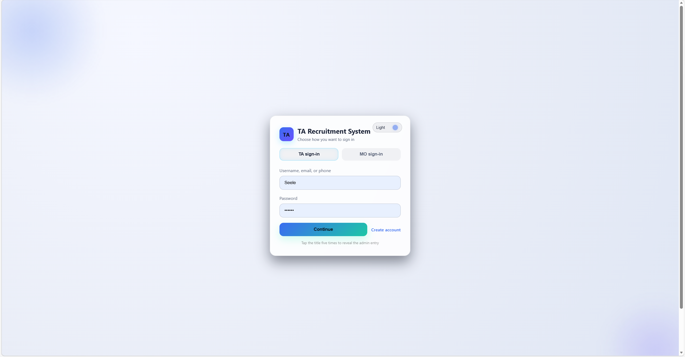
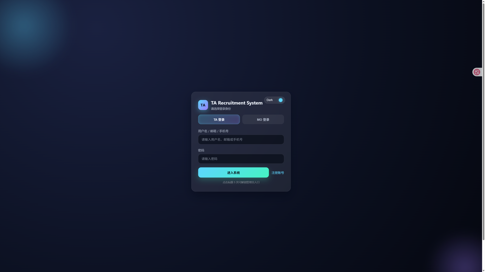
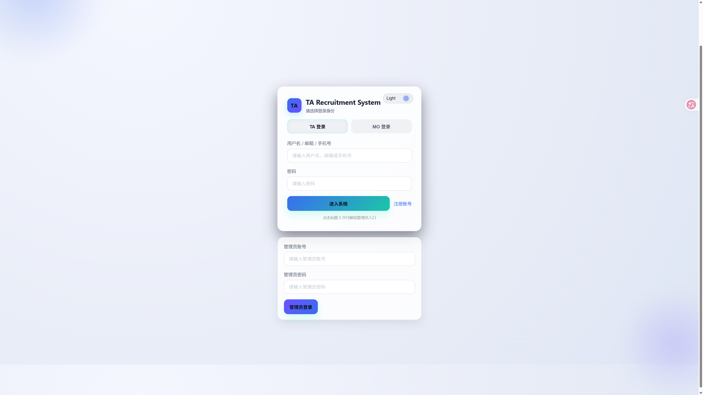
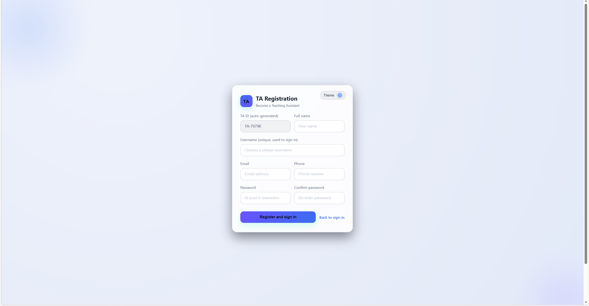
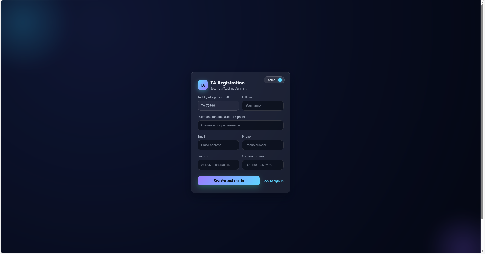

This part of the prototype corresponds to the system’s shared entry page. Its core goal is to allow both TAs and MOs to complete identity recognition and login within a unified entry point. Based on the images and the existing implementation, the login page can be divided into the following areas:

###### 1.1 Background Layer Design

- The page uses a full-screen soft gradient background, leaning toward misty blue-white in light mode and deep blue to black in dark mode.
- There are low-opacity light-spot decorations in the upper-left and lower-right corners, creating a sense of technology and spatial depth.
- The background decoration always stays beneath the content card and does not interfere with reading or form input.
- This design is consistent with the current login page’s implementation direction of a “dynamic ambient background,” corresponding to the login visual story in the product backlog.

###### 1.2 Central Login Card Design

The central card is the only main interactive container on the login page and has the following structure:

- A TA identity marker block in the upper-left corner, forming a memorable identity theme anchor.
- The central main title is “TA Recruitment System,” with the subtitle below reading “Please select your login identity.”
- A theme switch toggle is located in the upper-right corner, allowing instant switching between light and dark modes.
- The middle part of the card is the role-switching area, containing two tabs: TA Login and MO Login.
- The lower section contains the account and password input form.
- At the bottom are the primary action button “Enter System” and the secondary text button “Register Account.”

The functional mapping of this card has already been implemented in the shared frontend scripts: role switching, theme switching, login button state switching, error prompts, and registration entry control all have corresponding logic.

###### 1.3 Role-Switching Area Design

TA Login and MO Login use a parallel segmented-button style. The design goals include:

- Clearly indicating that the system has two types of users, avoiding identity confusion on first entry.
- Using the selected highlight state to indicate the identity context of the current form submission.
- The TA role provides the registration entry, while the MO role retains login capability only.
- All subsequent submission requests depend on this role context to determine the API path and logic branch.

From an interaction perspective, the TA tab is highlighted by default. After switching to MO, the interface still maintains the same form structure, but the registration entry is restricted or accompanied by a prompt. This design exactly corresponds to the product backlog description of the “TA-only registration entry guard.”

###### 1.4 Input Form Design

The login form contains two core fields:

- Username / Email / Phone Number
- Password

In the prototype, the fields use large rounded input boxes, light borders, generous whitespace, and a unified font size, with the following implications:

- The first field supports multi-identifier login, reducing the memory burden.
- The placeholder directly tells users which identity identifiers are supported, improving understandability.
- The password input box uses the same style as the account field, reinforcing form consistency.
- Form labels are placed above the input fields, which is suitable for quick scanning in a Chinese-language environment.

Combined with the current implementation, the login frontend already supports empty-value validation, error message echoing, button disabling during requests, and result feedback. Therefore, the prototype is not limited to static layout but already has a clear executable interaction model.

###### 1.5 Theme-Switching Design

The images show both light and dark login appearances. Their interaction design features include:

- The toggle is placed in the upper-right corner of the card to avoid interfering with the main flow.
- After switching, the background, card base color, input background, text color, and button glow effects all change immediately.
- The theme state needs to be persisted so that user preferences continue the next time the system is opened.
- Dark mode strengthens the technological feel, while light mode emphasizes readability and lightness.

This mechanism has already been implemented in the shared entry-page script and is one of the parts where the prototype and code are highly consistent.

##### 2. Hidden Admin Entry Prototype Description

The third screenshot in the corresponding images shows the state after the admin panel is expanded.

This design is not part of the main flow, but rather a “controlled exposed temporary entry.” Its prototype purpose has three layers:

- Ordinary users are not disturbed by unfinished admin capabilities when entering for the first time.
- Teachers or development testers can access the reserved area through a specific trigger method.
- During product demonstrations, the system can show that it has room for multi-end expansion without breaking the TA main path.

The expanded admin panel continues the style of the main card, but is placed below the login card as a secondary container and includes:

- Admin account input field
- Admin password input field
- Admin login button

##### 3. TA Registration Prototype Description

Corresponding image:

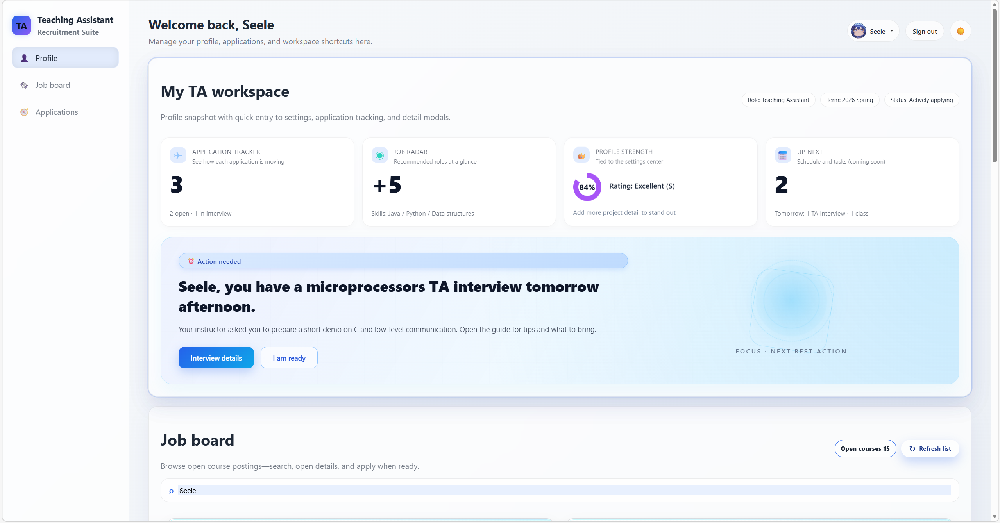

This prototype shows the interface state after a TA user switches from the login page to the registration page. The registration card maintains a unified visual system with the login card, but is clearly expanded at the field level to carry the basic information required for account initialization.

###### 3.1 Overall Structure of the Registration Card

The registration card includes the following information modules:

- TA identifier and title area
- Theme-switching control
- System-generated TA ID display area
- Name input field
- Username input field
- Email input field
- Phone number input field
- Password input field
- Confirm password input field
- Primary button “Complete Registration and Log In”
- Secondary button “Back to Login”

This layout balances both “field completeness” and “scanning efficiency”:

- The read-only TA ID is placed alongside the editable name, indicating that system coding is managed by the platform while personal identity is supplemented by the user.
- Email and phone number are arranged side by side, emphasizing that both are important contact methods.
- Password and confirm password are placed side by side to facilitate cross-checking during input.
- The primary button highlights the continuous flow of “log in directly after successful registration,” reducing the user’s cognitive cost for the next step.

###### 3.2 Design Significance of the Auto-Generated TA ID

The prototype deliberately retains the “TA ID auto-generated” field, and this design is very important:

- It indicates that a unified internal numbering system exists within the platform, facilitating later association of profile data, status, avatars, and settings.
- Users do not need to name the system identifier themselves, reducing the error rate.
- In the backend implementation, the TA ID is an important primary key for reading profile data, application status, and avatar resources.

The registration logic and subsequent settings-center logic in the current repository both revolve around the TA ID, so this prototype field is not decorative, but rather the core anchor point of the entire TA domain model.

###### 3.3 Validation Design of the Registration Form

From the prototype layout, it can be inferred that the validation rules of the registration page are very clear:

- Name, username, email, phone number, password, and confirm password are all required fields.
- The username is emphasized as “used for login,” meaning it must be unique.
- Email and phone number require format validation.
- The password must be at least 6 characters and must match the confirmation password.
- If registration fails, clear feedback should be provided on the current page rather than redirecting without notice.

The current repository already has corresponding form validation and backend handling for these rules, so they should be regarded in the document as a “design solution combining static prototype and dynamic validation.”

---

#### II. TA Workspace Prototype Design

From the repository implementation, the TA workspace is no longer an isolated single-page card, but a single-page workspace based on a shared layout. The page’s main entry point is [`ta-home.jsp`](src/main/webapp/pages/ta/ta-home.jsp), which organizes a complete TA usage space internally through partial includes and module scripts.

##### 1. Overall Workspace Architecture

Corresponding image:

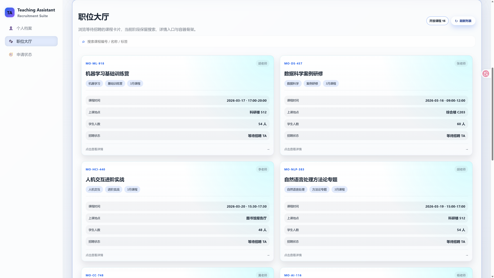

The TA workspace adopts the classic structure of “left navigation + top status bar + central routed content area + global modal layer + onboarding layer.”

###### 1.1 Left Navigation Area

See the corresponding implementation in [`ta-layout-sidebar.jspf`](src/main/webapp/pages/ta/partials/ta-layout-sidebar.jspf).

Corresponding image:

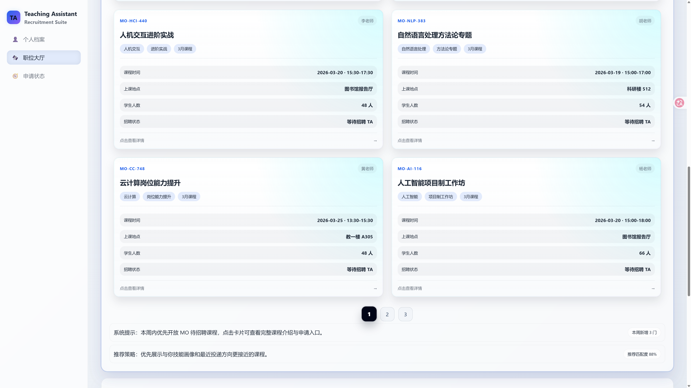

The left navigation area includes:

- Brand identity area: TA logo, the title Teaching Assistant, and the subtitle Recruitment Suite.
- Three first-level navigation buttons: Personal Profile, Job Board, and Application Status.

The design intentions are as follows:

- Keep the information architecture minimal, preserving only the three core paths most essential for TA users.
- Improve recognition speed through icons + Chinese labels.
- Emphasize the current route through the active state.
- Each navigation item can serve as an anchor point for onboarding guidance.

This structure is fully consistent with the principle described in the reuse documentation of “removing AI, chat, and current employment modules, and retaining only a three-module workspace.”

###### 1.2 Top Information Bar

See the corresponding implementation in [`ta-layout-topbar.jspf`](src/main/webapp/pages/ta/partials/ta-layout-topbar.jspf).

Corresponding image:

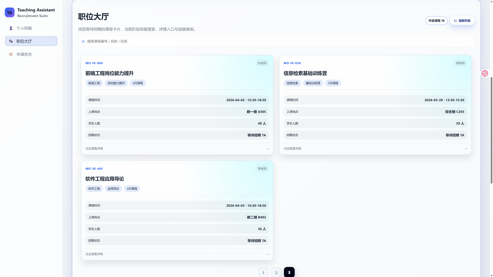

The top bar undertakes the following responsibilities:

- Left-side greeting: Welcome back + user name, strengthening the sense of a personal workspace.
- Secondary copy: indicating that this area is used to manage profiles, applications, and the settings entry.
- Right-side user trigger: showing avatar thumbnail, username, and dropdown indicator.
- Logout button.
- Theme switch button.

This design decouples global account actions from route content, so users can perform high-frequency global operations such as avatar/settings/logout at any time regardless of which module they are in.

###### 1.3 First-Login Welcome Card

See the corresponding implementation in [`ta-welcome-card.jspf`](src/main/webapp/pages/ta/partials/ta-welcome-card.jspf).

Corresponding image:

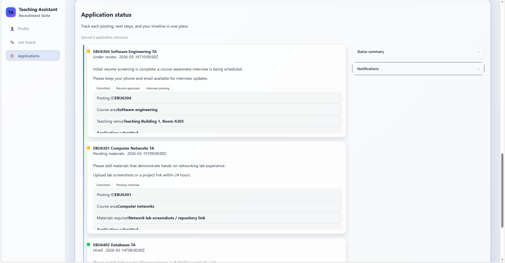

The welcome card is located above the routed content and is a “light reminder + light guidance” component. From a design perspective, it serves the following functions:

- Telling new users where to begin using the system.
- Providing a clickable entry that directly guides users to the settings center.
- Using a “New” badge to reinforce the state of first login or first entry into the workspace.
- Not taking over the main page content, while still being conspicuous enough to serve as a buffer layer before onboarding.

##### 2. Onboarding Prototype Design

See the corresponding implementation in [`ta-onboarding.jspf`](src/main/webapp/pages/ta/partials/ta-onboarding.jspf) and [`onboarding.js`](src/main/webapp/assets/ta/js/modules/onboarding.js).

Corresponding images:

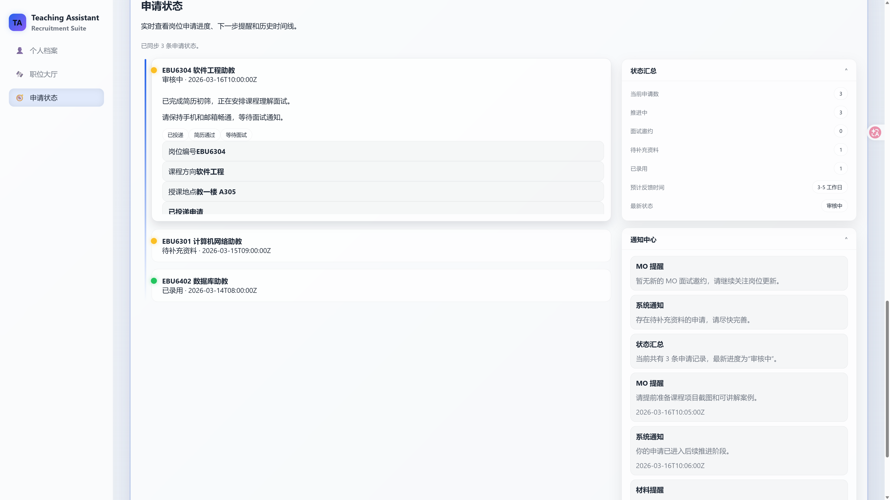

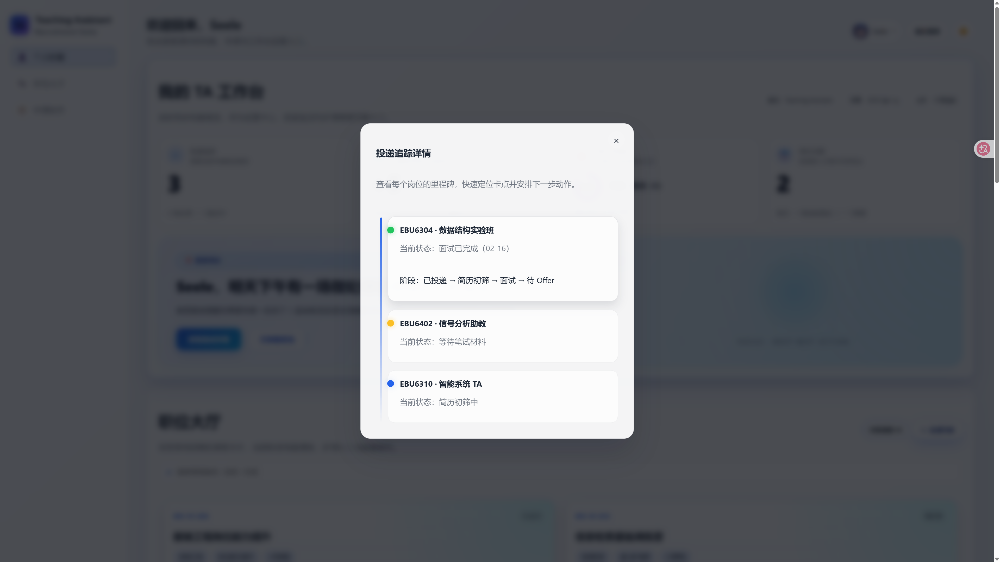

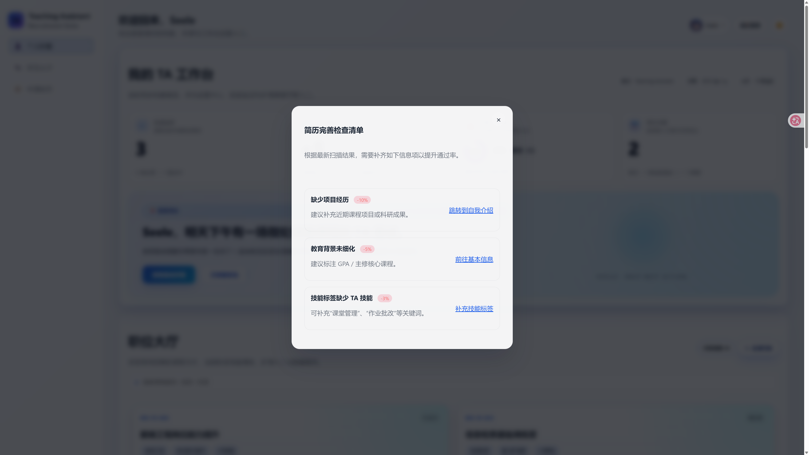

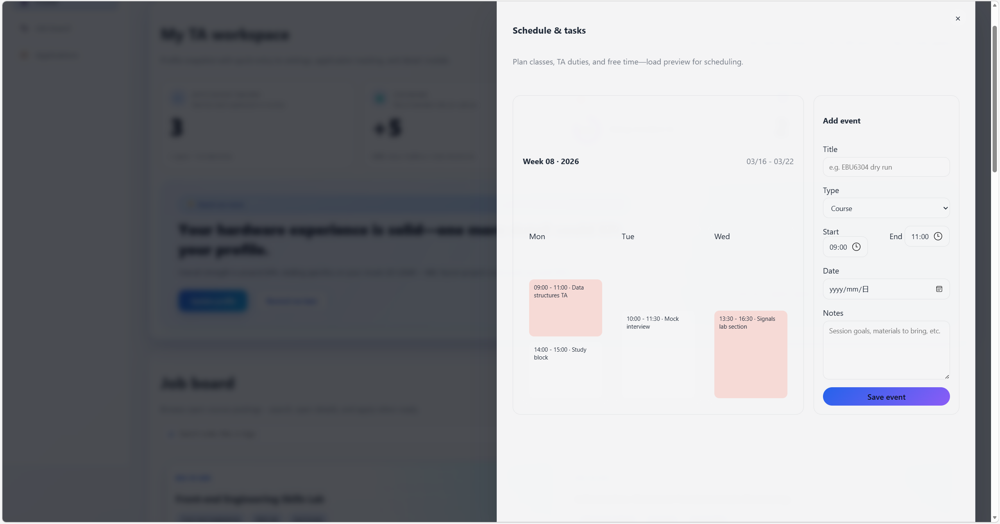

The onboarding in the prototype is not a simple popup, but a step-by-step guidance system of “highlighted target elements + positioned explanation card + Previous/Next/Skip.” Its design value is high for the following reasons:

- The TA module has many functions, and new users can easily get lost when entering for the first time.
- Gradually highlighting navigation and settings entries can significantly reduce the learning cost.
- The guidance is not pure textual explanation, but is directly bound to real operation positions on the page.
- It supports closing and state memory, avoiding repeated disturbance to users already familiar with the system.

Combined with the existing implementation, the current onboarding covers at least the following key nodes:

1. Personal Profile entry
2. Job Board entry
3. Application Status entry
4. Settings center entry in the upper-right corner

Each step includes:

- Current step number
- Title
- Description copy
- Highlight frame for the target element
- Guidance arrow
- Previous, Next, and Skip buttons

This indicates that the prototype design places great emphasis on “discoverability” and “progressive onboarding experience.”

---

#### III. Personal Profile Module Prototype Design

The Personal Profile module is mainly implemented in [`ta-route-profile.jspf`](src/main/webapp/pages/ta/routes/ta-route-profile.jspf), and completes deeper interactions through the settings-center modal, skill editing, avatar cropping, and profile-saving logic.

##### 1. Page Positioning

The Personal Profile page is not a traditional page that merely displays “resume fields,” but serves as the home page of the TA workspace. At the same time, it undertakes:

- User identity overview
- Summary of current application activity
- Recommended opportunities or competitiveness reminders
- Completion indicator
- Schedule-planning entry
- Prefixed guidance to the settings-center entry

Therefore, its prototype design adopts a hybrid form of “Dashboard + Profile Hub” rather than a pure form page.

##### 2. Top Overview Area Design

The top part of the page contains:

- Main title “My TA Workspace”
- Subtitle explaining the role of the workspace
- Three badges: identity, semester, and status

This design allows users to confirm the following as soon as they enter the page:

- Whether the current identity is correct
- The current recruitment cycle or semester context
- Whether the current overall status is active

This combination of “identity + semester + status” is very suitable for a campus recruitment system.

##### 3. Design of the Four Insight Cards

The four insight cards on the Personal Profile homepage are one of the most information-dense areas in the prototype.

###### 3.1 Application Tracking Card

- Purpose: quickly display the current total number of applications and key distribution.
- Typical fields: total applications, pending count, interview-in-progress count.
- Interaction: click to open the application-tracking detail modal.
- Value: exposes the core summary of the “Application Status module” in advance on the homepage, reducing repeated navigation.

###### 3.2 Job Radar Card

- Purpose: present the number of newly matched positions filtered by the system for the user.
- Typical fields: number of new recommendations, matched skill keywords.
- Interaction: click to open the recommended-position list modal.
- Value: proactively pushes the most noteworthy content from the “Job Board” to the user instead of relying only on passive search.

###### 3.3 Profile Completion Card

- Purpose: display personal profile completeness in the form of a ring chart and rating.
- Typical fields: completion percentage, rating, and completion suggestions.
- Interaction: click to open the resume-completion checklist modal.
- Value: turns the hidden issue of “whether the profile is complete” into an explicit indicator, encouraging users to keep supplementing information.

###### 3.4 To-Do Schedule Card

- Purpose: display the number of upcoming interviews, courses, or tasks.
- Typical fields: tomorrow’s schedule, number of interviews, number of classes.
- Interaction: click to open the schedule and task-planning drawer.
- Value: enables the recruitment system not only to record status, but also to take on lightweight schedule-coordination functions.

##### 4. Hero Recommendation Panel Design

The Hero Card below the homepage is a typical “best next action” design. In the current implementation, this area displays:

- A themed badge, such as “Competitiveness Improvement”
- A personalized title copy
- A detailed explanation pointing out areas where current profile data or experience can still be improved
- Two action buttons: a primary action and a secondary action
- Abstract visual decoration on the right

From the prototype perspective, this module undertakes the following responsibilities:

- Elevating the system from “information display” to “action suggester.”
- Explaining to users in natural language what the most worthwhile next step is.
- Using primary and secondary buttons to carry immediate action and deferred handling respectively.
- Making the homepage capable of “actively guiding behavior” in addition to statistics.

This is also one of the most product-oriented areas on the TA side.

---

#### IV. Job Board Module Prototype Design

The Job Board module corresponds to the implementation in [`ta-route-jobs.jspf`](src/main/webapp/pages/ta/routes/ta-route-jobs.jspf) and [`job-board.js`](src/main/webapp/assets/ta/js/modules/job-board.js). It is the core business page where TAs complete the process of “discover opportunities → view details → prepare to apply.”

##### 1. Overall Page Structure

Corresponding image:

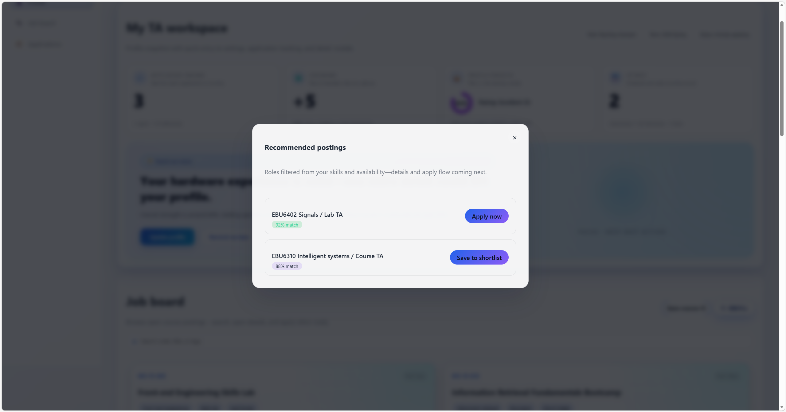

The Job Board consists of the following areas:

- Page title and explanatory copy
- Open-course-count badge
- Refresh-list button
- Search box
- Course-card grid
- Pagination area
- Bottom system prompt and recommendation-strategy prompt

This layout conforms to the design principles of a “high-frequency browsing page”: filtering entry first, results centered, and supporting explanations placed later.

##### 2. Search Area Design

The search box is located below the title and provides the following value:

- Supports search by course code, course name, and tag keywords.
- Helps users quickly narrow the candidate range.
- Uses a unified icon and long input box, conforming to recruitment list page habits.
- Works in linkage with pagination logic, recalculating the result set and current page after search.

From the code, search is an instant frontend filter and does not require additional request submission, so interaction feedback is relatively fast.

##### 3. Course Card Design

Corresponding image:

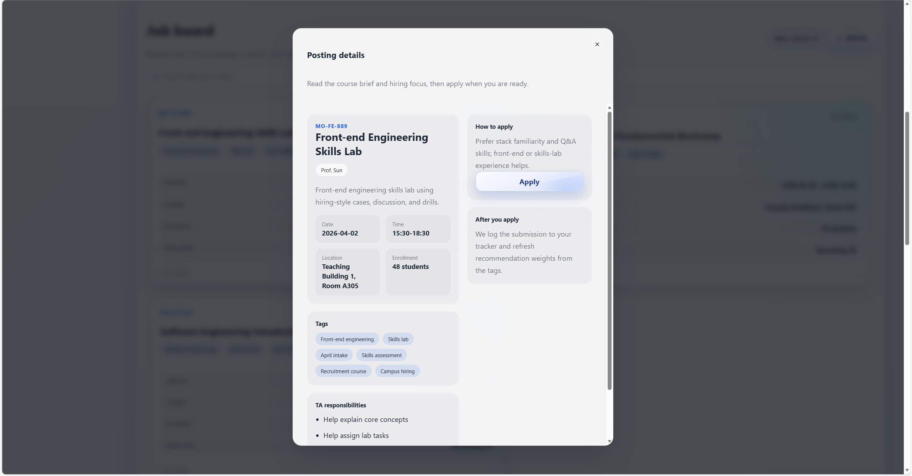

The course card is the core information unit of the Job Board. Each card contains at least:

- Course code
- MO identifier
- Course name
- Course tag list
- Course time
- Recruitment status or location information
- The prompt “Click to view details”

There are several obvious design characteristics in the details:

- The card supports mouse click and keyboard Enter/Space opening, indicating that the prototype also considers accessibility.
- The tag area compresses and displays the 2–3 most important semantic keywords, avoiding information overload on a single card.
- The bottom arrow prompt tells users that the card is not a static display, but an entry into the detail layer.
- The overall information density is moderate, making it easy to quickly scan and compare within the card grid.

##### 4. Refresh and Pagination Design

The Job Board is not a purely static list, but a dynamic view connected to backend recruitment data. In the existing code:

- Clicking the refresh button requests the TA jobs API.
- During loading, the button is disabled and displays a spinning/updating state.
- After the interface returns, the card list is replaced and the number of open courses is updated.
- Pagination buttons are dynamically generated according to the number of results.
- When switching pages, the page automatically scrolls back to the top of the job list.

This indicates that the prototype had already considered the real scenario of “medium-volume data browsing” during design, rather than displaying all courses at once.

##### 5. Course Detail Modal Design

Corresponding images:

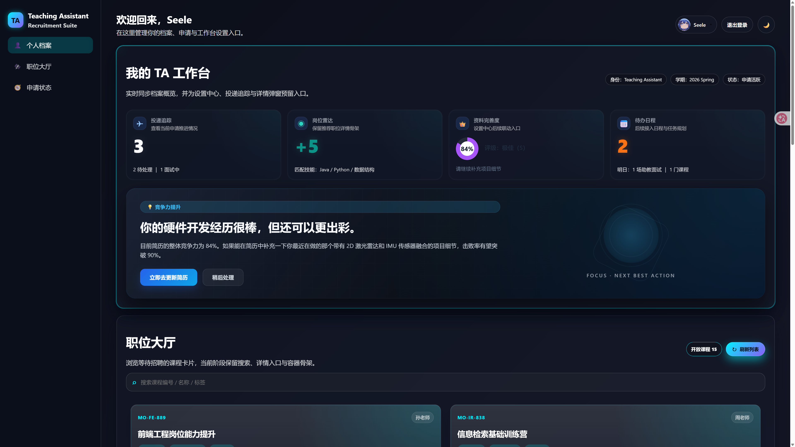

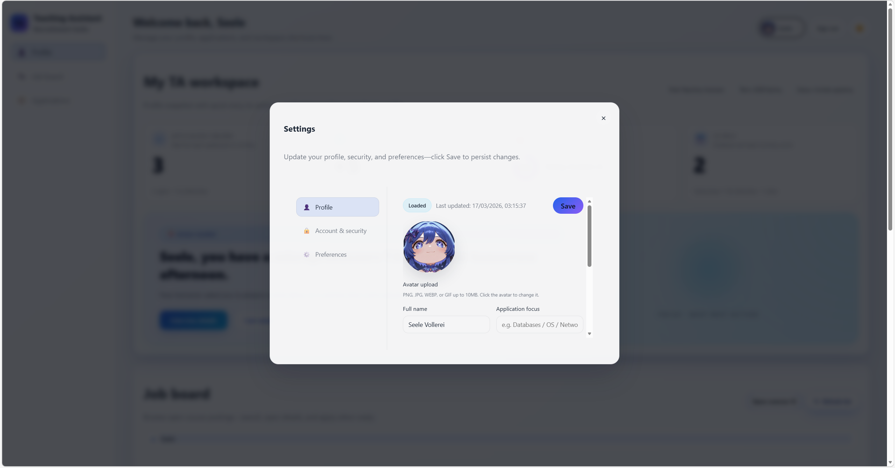

The course detail implementation corresponds to the `course-detail` modal in [`ta-modals.jspf`](src/main/webapp/pages/ta/partials/ta-modals.jspf).

This modal can be divided into left and right columns:

###### Left Main Information Area

- Course code, course name, and MO information
- Course introduction
- Metadata grid including date, time, location, number of students, etc.
- Course tag area
- TA duty checklist

###### Right Operation and Prompt Area

- Application suggestion copy
- Primary button “Apply for this course”
- Submission reminder description

The design value of this layout lies in the following:

- Presenting all core information needed to decide whether to apply in a single modal at once.
- Helping users judge position suitability through a checklist of TA duties.
- Using application suggestions to explain what type of TA the course is suitable for.
- Using submission reminders to inform users that submission will affect status tracking and matching weight, strengthening the sense of system linkage.

Even though the current “one-click apply” is still listed as a later enhancement in the product backlog, this detail modal has already reserved a clear entry for the complete application closed loop.

---

#### V. Application Status Module Prototype Design

Corresponding image:

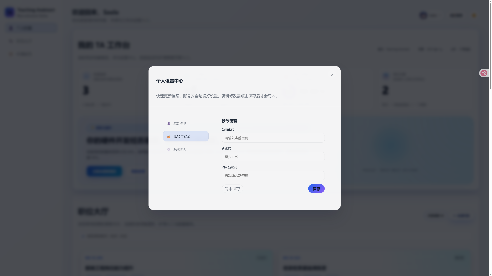

The Application Status module corresponds to the implementation in [`ta-route-status.jspf`](src/main/webapp/pages/ta/routes/ta-route-status.jspf) and [`status.js`](src/main/webapp/assets/ta/js/modules/status.js). The goal of this module is not to simply display results, but to help TAs understand overall application progress through a combination of “timeline + summary + notifications.”

##### 1. Page Structure Design

The page consists of three parts:

- Top explanation area
- Central timeline main area
- Right sidebar (status summary and notification center)

This two-column layout is very suitable for scenarios of “main content + auxiliary decision-making information.”

##### 2. Status Banner Design

There is a status banner at the top of the timeline, used to reflect the overall current state of the page, for example:

- How many application statuses have been synchronized
- No current application records
- Data loading in progress
- Failed to read the interface

This kind of banner is more suitable than a simple toast as state feedback for a list page, because it can persist until the data is refreshed or the page state changes.

##### 3. Timeline Main Area Design

Each application card in the timeline usually contains:

- Position/course name
- Current status
- Update time
- A summary description
- Next-step action prompt
- Tags
- Detailed field list
- Stage timeline nodes

Its interaction design is:

- Expandable/collapsible by default
- Clicking the card body expands more historical steps
- The first item can be expanded by default to highlight the most recent or most important application

The timeline model is especially suitable for the recruitment process because it can naturally express phased states such as applied, supplementary materials requested, written test, interview, pending offer, hired, and so on.

##### 4. Status Summary Sidebar Design

The “Status Summary” panel on the right is presented in a collapsible container form. Typical statistics include:

- Current application count
- Number in progress
- Number of interview invitations
- Number of pending supplementary materials
- Number hired
- Expected feedback time
- Latest status

The design intentions include:

- Helping TAs quickly grasp the overall situation without looking into timeline details.
- Supporting users in formulating next-step strategies through structured statistics.
- Reducing the default visual burden through the collapsible design, allowing the right-side information to expand on demand.

##### 5. Notification Center Design

The notification center is also a collapsible sidebar, used to aggregate:

- Global messages
- Status reminders for a certain application
- Interview, material, or feedback time prompts
- System-generated recent notifications

This kind of design avoids stuffing all reminders into the body of the timeline, keeping the main area focused on the application itself and the notification area focused on action reminders.

##### 6. Empty-State Design

When a TA has not yet applied for any position, the page does not appear blank, but instead displays a clear empty state:

- Icon
- Title “No application records yet”
- Guidance copy “Please go to the Job Board first to apply for a position”

This shows that the prototype design fully considers the scenario of first-time users and avoids the poor experience of “no data = no feedback.”

---

#### VI. Settings Center and Modal System Prototype Design

Corresponding images:

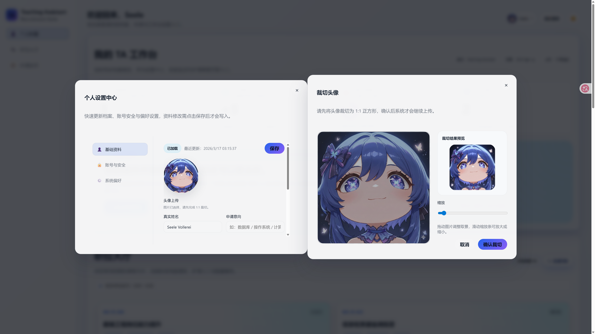

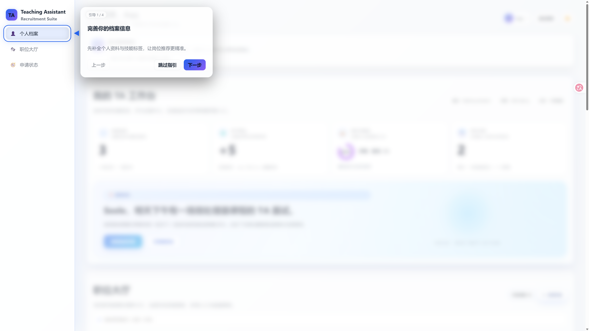

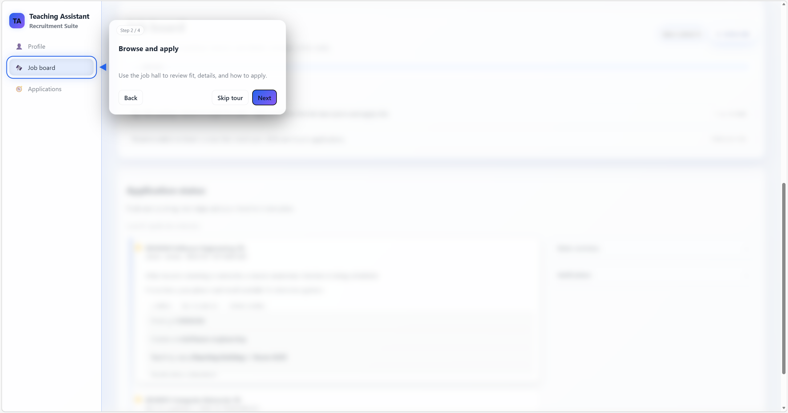

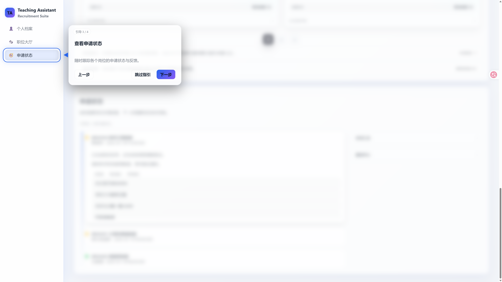

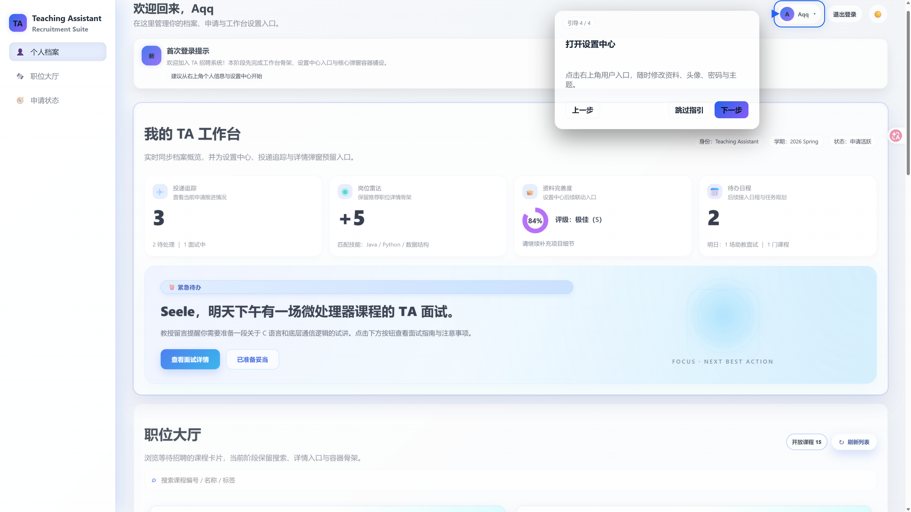

The settings center and related modals are the most deeply layered and interaction-heavy group of components in the TA prototype. Their corresponding implementation is concentrated in [`ta-modals.jspf`](src/main/webapp/pages/ta/partials/ta-modals.jspf), [`profile.js`](src/main/webapp/assets/ta/js/modules/profile.js), and [`TaProfileSettingsServlet.java`](src/main/java/com/bupt/tarecruit/ta/controller/TaProfileSettingsServlet.java).

##### 1. Overall Design Principles of the Modal System

The TA side does not stack all information on the main page, but instead extensively uses modals/drawers for layering. This prototype strategy is very reasonable:

- The main page remains overview-oriented and lightweight.
- Detailed information is opened only when needed, reducing continuous cognitive burden.
- Various editing behaviors are completed in controlled containers, preventing accidental operations from affecting the main page state.
- When functions are added later, the unified modal skeleton can continue to be reused.

The current modal system includes at least:

- Application-tracking detail modal
- Recommended-position list modal
- Resume-completion checklist modal
- Schedule and task-planning drawer
- Course recruitment detail modal
- Personal settings center modal
- Avatar cropping modal

##### 2. Structure of the Personal Settings Center

The settings center is the core deep-interaction container and adopts a layout of “left tab menu + right content area.” Its three first-level tabs are:

1. Basic Profile
2. Account & Security
3. System Preferences

The advantages of this structure are:

- Managing all personal settings through a single entry point.
- Avoiding overly deep paths caused by separate page jumps for each setting item.
- Ensuring clear boundaries among profile-related, security-related, and preference-related tasks through tab partitioning.

##### 3. Basic Profile Panel Design

The Basic Profile panel contains the following elements:

- Sync-status badge
- Latest update time
- Save button
- Clickable avatar area
- Hidden file-upload input
- Real name
- Application intention
- Student ID (read-only)
- Contact email
- Self-introduction
- Skill-tag input and display area

Its design focuses are as follows:

###### 3.1 Explicit Status Feedback

States such as “Loaded / Editing / Unsaved / Save Successful / Save Failed” are explicitly expressed through badges and update times instead of making users guess whether the data has been saved successfully. This is directly implemented in [`profile.js`](src/main/webapp/assets/ta/js/modules/profile.js) and is an example of excellent interaction design.

###### 3.2 Clickable Avatar Area

The avatar is both a display element and an upload entry. This reduces the need for extra buttons and improves intuitiveness. After clicking the avatar, users can choose an image directly, which matches the interaction habit of most modern personal profile pages.

###### 3.3 Read-Only Student ID Field

In the prototype, the “Student ID” field is read-only and disabled, indicating that it belongs to system identity data and cannot be modified arbitrarily by the user in the settings center. This constraint helps maintain consistency between the user profile and backend records.

###### 3.4 Skill Tag Interaction

Skills are not entered as traditional multi-line text, but use a tag-input mode:

- Enter a skill in the input box and press Enter to generate a tag.
- Added skills are displayed in pill/tag form.
- Each tag has a delete button on the right side.
- Before submission and saving, blanks and duplicate values are normalized.

This kind of interaction is very suitable for expressing a TA’s skill profile and also facilitates direct consumption by later job recommendation logic.

##### 4. Avatar Upload and Cropping Prototype Design

The avatar-related prototype is divided into two stages:

1. Select an avatar file
2. Open the cropping modal for 1:1 adjustment

The avatar cropping modal contains:

- Left cropping stage
- Central image preview area
- Cropping mask and square frame
- Right result-preview canvas
- Zoom slider
- Prompt copy
- Cancel / Confirm buttons

This design is very complete, indicating that the product hopes to:

- Let users see the final avatar effect before upload.
- Standardize platform avatars as squares to keep visual consistency between the top bar and profile page.
- Allow users to fine-tune avatar position through dragging and zooming.

The backend [`TaProfileSettingsServlet.java`](src/main/java/com/bupt/tarecruit/ta/controller/TaProfileSettingsServlet.java) further adds server-side constraints:

- Restrict formats to PNG / JPEG / WEBP / GIF
- Restrict size to no more than 10MB
- Uniformly crop/scale after upload and write into the TA image directory
- Output avatars through controlled resource paths to avoid directly exposing file system paths

This shows that both the prototype and the implementation attach great importance to the stability and security of avatar uploads.

##### 5. Account and Security Panel Design

The goal of the security panel is very focused: password change. It contains:

- Current password
- New password
- Confirm new password
- Status prompt text
- Save button

Its interaction rules should include:

- The current password cannot be empty.
- The new password length must meet the minimum requirement.
- The new password must not be the same as the old password.
- The confirmation password must match.
- A success message should be shown after successful update.
- The cause of error should be indicated when the update fails.

The current backend password update API already supports these constraints, so this prototype belongs to a “complete closed-loop settings design.”

##### 6. System Preferences Panel Design

System Preferences currently mainly carries theme settings, providing the following options in dropdown form:

- Follow System
- Light Mode
- Dark Mode

Although this panel is simple, it is important because it indicates that the theme is not switched only once on the login page, but should become a long-term preference at the account level or device level.

---

#### VII. Detail Modals and Auxiliary Function Prototype Design

In addition to the settings center, the prototype also designs various auxiliary detail modals to support TAs in understanding information and making decisions without leaving the main page.

##### 1. Application-Tracking Detail Modal

This modal unfolds the milestones of multiple positions in timeline form and is suitable for:

- Quickly reviewing all application progress from the homepage
- Comparing the current stage of different positions
- Identifying bottlenecks, such as pending material submission or pending interview arrangement

Compared with the main timeline on the status page, it is more like a “global condensed tracking center.”

##### 2. Recommended-Position List Modal

This modal mainly carries:

- Recommended position names
- Matching-degree tags
- One-click apply or add-to-candidate buttons

Its role is to structurally expand the opportunity list after clicking the “Job Radar” card on the homepage. It is a natural transition “from summary to list.”

##### 3. Resume-Completion Checklist Modal

This is an extension of the Profile Completion card. It lists in checklist form:

- Missing item name
- Degree of impact on completeness or pass rate
- Completion suggestions
- Jump links

This design can transform the abstract “84% completeness” into specific, executable completion tasks, which is a very mature product-design approach.

##### 4. Schedule and Task-Planning Drawer

This drawer contains:

- Weekly calendar view
- Occupied and free time slots
- Event-entry form
- Fields such as event type, start and end time, date, and notes

Although this capability is more of an extension at the current stage, the prototype has already clearly demonstrated its future value in carrying unified planning for “courses, TA tasks, and interviews/communications.”

---

#### VIII. Summary of Consistency Between the TA Prototype and Repository Implementation

Based on the prototype images, explanatory documents, and the current repository code, the following conclusions can be drawn:

##### 1. Prototype Capabilities Already Implemented to a High Degree

The following prototype capabilities already have clear implementation support in the repository:

- Dual-role switching on the login page
- Light/dark theme switching
- TA registration card and automatic TA ID
- Three-module skeleton of the TA workspace
- Left navigation and top bar
- First-login welcome card
- Onboarding overlay
- Four insight cards on the Personal Profile homepage
- Hero recommendation panel
- Job Board search, refresh, pagination, and detail modal
- Application status timeline, summary sidebar, notification sidebar, and empty state
- Settings center tab structure
- Skill-tag editing
- Avatar upload and cropping
- Password change
- Secure avatar reading and JSON persistence

##### 2. Prototype Capabilities That Already Have a UI Skeleton but Can Still Be Further Enhanced

The following capabilities already have a structure, but can still be further deepened:

- One-click-apply closed loop for recommended positions
- Real data persistence for schedule planning
- Real calculation logic for the resume checklist and completion scoring
- Visualization of job recommendation explanations and matching weights
- Automation of the notification center and interview reminders

##### 3. Overall Evaluation of the Prototype Design

This TA prototype is not a simple stack of pages, but is built around the complete user journey of “enter the system → improve profile → discover positions → apply for positions → track progress → continuously optimize profile.” Its design characteristics include:

- Clear information architecture and stable main flow
- A homepage that balances overview, reminders, and action guidance
- Deep editing unified into the settings center and modal system
- Unified visual style with complete light and dark modes
- Friendly to new users, with mature onboarding and empty-state design
- Strong implementability under the current Java Web + JSP + Servlet + JSON architecture

Therefore, the TA prototype design is not only suitable as presentation-document content, but can also directly serve as the design basis for subsequent iteration, acceptance, and function decomposition.

---

## Part B - MO-Side Prototype Design

#### 1. Purpose and Scope

This document describes the MO-side (Module Organizer side) prototype for the TA Recruitment System. It is revised based on:

- `prototypeEn.md` (existing English prototype writing style and structure),
- `EBU6304_GroupProjectHandout.md` (project requirements and constraints),
- current MO prototype screenshots in this folder (`img.png`, `img_1.png`, `img_2.png`, `img_3.png`).

The MO-side prototype focuses on three core tasks in the recruitment workflow:

1. Review recruitment overview data quickly.
2. Publish and manage TA job posts for courses.
3. Review candidates and make selection decisions.

This scope is intentionally aligned with the handout's core functionality and first-assessment expectations (functional, usable, and medium-fidelity prototype).

---

#### 2. Alignment with Handout Requirements

According to the handout, the system should support TA recruitment workflows and include key capabilities such as:

- MO can post jobs.
- MO can select applicants for jobs.
- TA application status should be trackable.

The current MO-side prototype directly supports these core goals through a practical workflow:

- job posting,
- candidate review,
- decision write-back to TA application status.

The implementation direction also follows mandatory technical constraints in the handout:

- Java Servlet/JSP web architecture,
- JSON/text-file based data storage (no database).

Therefore, this prototype is not only visually demonstrable, but also feasible for iterative implementation and acceptance testing.

---

#### 3. Information Architecture and Navigation

The MO workspace is designed as a focused recruitment console, not a full admin platform. Its navigation contains three primary routes:

- **Dashboard**: quick recruitment snapshot.
- **Job Publishing**: create and browse open course posts.
- **Applicant Screening**: review candidates and make decisions.

This architecture keeps MO interactions efficient and low-friction. Instead of exposing too many secondary menus, the prototype emphasizes a direct business path:

`Overview -> Post Jobs -> Screen Applicants -> Finalize Decision`

---

#### 4. Visual Style and UX Principles

The MO-side pages follow the same unified system language used by TA/Admin prototypes:

It uses a left sidebar for persistent navigation, a top utility bar for account/theme/logout actions, a card-based content layout for fast scanning, and high-contrast status pills and action buttons.

The style is intentionally consistent across roles, so users can immediately recognize that MO is another role view inside the same platform.

Core UX principles:

The design follows a **task-first layout** where important actions are visible without deep navigation, **progressive disclosure** where details open in modals instead of overloading one page, **status clarity** where key states (open/pending/accepted) are always visible, and **fast switching** where route switching remains lightweight to support continuous workflow.

---

#### 5. Screen-by-Screen Prototype Description

##### 5.1 MO Workspace Entry and Dashboard

The dashboard serves as the first working surface after login. It answers four immediate MO questions:

1. How many open jobs are available now?
2. How large is the current candidate pool?
3. How many applicants have been accepted?
4. How many applications are still pending decisions?

This page is designed for quick orientation before action. It avoids excessive details and keeps a "monitor first, act next" rhythm.

*Figure 1. MO workspace homepage and overview cards (`img.png`).*

---

##### 5.2 Job Publishing and Job Board

This page is the input center of MO operations. It includes:

a job publishing form (course name/date/time/location/tags/checklist/description), an open-jobs counter, a refresh action, and searchable, paginated job cards.

Design rationale:

The form keeps required fields simple and implementation-friendly for iteration, job cards provide scannable summaries before opening full detail, and search plus pagination reduce cognitive load when job volume grows.

The page supports both **creation** and **lightweight management** of open recruitment posts.

*Figure 2. Job publishing and job list layout (`img_1.png`).*

---

##### 5.3 Course Detail Modal and Workflow Bridging

When an MO opens a course card, a detail modal presents:

full course context, tags and task checklist, and an operational next step to jump to applicant screening.

This modal is a key workflow bridge:

it reduces back-and-forth navigation, connects job management directly to candidate screening, and improves action continuity in live demonstration.

Instead of treating pages as isolated screens, the prototype intentionally links them as one business flow.

*Figure 3. Course-detail modal and entry to applicant screening (`img_2.png`).*

---

##### 5.4 Applicant Screening and Decision Making

This is the decision page where MO reviews candidate profiles for a selected course and takes action.

Main elements:

course selector, candidate card list, status indicators, and "accept" / "reject" actions with optional comment.

Behavioral design highlights:

Candidate data is aggregated from TA account/profile/application status data; even without an existing application record, a TA can appear as "invitable" (active outreach scenario); and decision results are written back to application status data for cross-role consistency.

This page delivers the most important MO business value: turning candidate review into explicit recruitment outcomes.

*Figure 4. Applicant-screening list with accept/reject actions (`img_3.png`).*

---

#### 6. End-to-End User Flow (MO)

The current prototype supports a complete MO interaction loop:

1. Enter MO workspace.
2. Check dashboard indicators.
3. Publish a new recruitment post.
4. Open post details and verify requirements.
5. Navigate to applicant screening.
6. Accept or reject candidates.
7. Persist decision result to TA application status data.

This closed loop is critical for demonstrating that the prototype is not only visual, but also process-complete.

---

#### 7. Data and Interaction Consistency

The MO-side prototype is consistent with repository behavior in three key aspects:

- **Data model consistency**: course posts, candidate info, and status records are structured for operational use.
- **Interaction consistency**: route switching, modal behavior, and decision operations follow predictable UI patterns.
- **Cross-role consistency**: MO actions affect TA-visible status results, supporting an integrated system story.

This consistency improves confidence for later sprint implementation and viva demonstration.

---

#### 8. Prototype Strengths and Reasonable Next Iterations

##### Current strengths

- Clear and focused information architecture.
- Complete core MO recruitment workflow.
- Practical medium-fidelity interaction design.
- Strong alignment with handout constraints and role requirements.

##### Suggested next iterations (optional)

- richer candidate profile drill-down (availability/CV preview),
- dedicated decision confirmation modal (instead of simple prompt),
- edit/close job-post operations,
- dashboard trends and overdue decision reminders.

These enhancements can be planned as later sprints without changing the current core flow.

---

#### 9. Conclusion

The MO-side prototype is a **medium-fidelity recruitment workspace for Module Organizers**. It provides a coherent and implementable path from job posting to candidate decision-making, while staying aligned with handout requirements on scope, architecture, and data persistence.

In summary, the prototype already demonstrates the MO role's primary value:

**publish jobs efficiently, screen candidates clearly, and write recruitment decisions back to the shared TA recruitment lifecycle.**

---

## Part C - Admin-Side Prototype Design and Detailed Explanation

This document is the English version of the Admin-side prototype specification. It is prepared using the current prototype artifacts, repository implementation, and the coursework constraints in `EBU6304_GroupProjectHandout.md`.

The Admin module is currently in a **frontend-complete, backend-in-progress** stage: the console structure and major interactions are clear, while several write-back functions and service integrations are still planned for later iterations. This is acceptable under the handout because the first assessment emphasizes a complete prototype and clear iterative planning rather than full implementation of all advanced features.

---

#### 1. Scope and Handout Alignment

##### 1.1 Prototype Scope

The current Admin prototype focuses on five governance areas:

1. Dashboard overview
2. User management
3. Notice management
4. Permission management (reserved)
5. System settings (reserved)

These areas map directly to the current route structure in `admin-home.jsp` (`dashboard`, `users`, `notices`, `permissions`, `settings`).

##### 1.2 Why This Scope Is Reasonable

This scope aligns with the handout in three ways:

the handout provides high-level requirements and expects teams to define detailed scope, the first checkpoint requires a complete low-/medium-fidelity prototype plus core feature priorities, and Agile delivery expects incremental value rather than one-step completion of every module.

Therefore, this prototype emphasizes **core admin workflows first**, while advanced governance functions are clearly defined for subsequent iterations.

##### 1.3 Technical Constraint Awareness

The handout requires:

Java application or Java Servlet/JSP web app, and text-file data persistence (TXT/CSV/JSON/XML) without database dependency.

The current Admin prototype is compatible with this direction and can naturally evolve to JSON-backed servlet endpoints in later sprints.

---

#### 2. Entry Strategy and Role Positioning

The homepage currently treats Admin login as a controlled or hidden entry, while TA/MO remain the default visible roles. This is a practical product decision at this stage:

it keeps the main recruitment entry simple for ordinary users, supports governance demonstrations when needed, and preserves room for stricter role-based access in future versions.

> *Figure 5. Admin entry on the login page (hidden/expanded), `img.png`.*

---

#### 3. Overall Admin Workspace Architecture

The Admin workspace (`admin-home.jsp`) follows a classic management-console layout:

1. Left sidebar navigation
2. Topbar (title + global actions)
3. Main route content area
4. Route-local tables/cards/toolbars

This architecture is suitable for long-session management tasks because it keeps navigation and context stable while users inspect and operate on data.

> *Figure 6. Overall Admin workspace layout (sidebar + topbar + content area), `img_1.png`.*

---

#### 4. Visual and Interaction Language

The Admin module uses a dark-console visual language (`admin-layout.css`) with clear semantic colors:

primary action in blue/purple, success/warning/danger states, badge-driven role and status marking, and a card/table hybrid layout for readability and density.

Compared with user-facing TA/MO pages, the Admin side intentionally emphasizes authority, clarity, and operational efficiency.

---

#### 5. Dashboard Prototype

##### 5.1 Design Goal

The dashboard is designed to answer key questions quickly:

How many users exist, what the TA/MO distribution is, who logged in recently, and what notices are currently active.

##### 5.2 Layout Structure

The page includes:

a KPI card area (total users, TA users, MO users, active jobs), a recent login table, and a notice summary section.

This "overview first, details second" sequence supports fast decision orientation.

##### 5.3 Current Implementation Maturity

Current frontend logic already supports:

metric rendering from mock datasets, role-based counting, recent-login sorting, and notice-preview rendering.

The "active jobs" metric is currently simulated and will be connected to real data in the next implementation stage.

> *Figure 7. Dashboard KPI cards, recent logins, and notice summary, `img_2.png`.*

---

#### 6. User Management Prototype

##### 6.1 Design Goal

This route supports the core governance actions:

locating user accounts, inspecting role and account status, and triggering account-level operations.

##### 6.2 Information Structure

The page combines:

a top toolbar (search + role filter) and a user table (ID, username, email, role, status, actions).

This structure reflects a practical admin workflow: identify target first, then operate.

##### 6.3 Interaction Behavior

The current prototype already includes:

keyword filtering by username/email, role-based filtering, combined filtering logic, and debounce behavior for smoother search interaction.

Badge semantics for role/status establish a clear foundation for future approval and risk-control logic.

> *Figure 8. User Management page (search, filters, role/status badges), `img_3.png`.*

---

#### 7. Notice Management Prototype

##### 7.1 Design Goal

Notice management supports platform-wide communication:

maintenance notifications, recruitment-cycle announcements, policy/process updates, and operational reminders.

##### 7.2 Card-Based Notice Model

Each notice card includes:

title, publish time, priority (`high`, `medium`, `low`), content snippet, publisher info, and action buttons.

##### 7.3 Current State

The route already defines the complete operation contract:

create notice, edit notice, and delete notice.

Some actions remain mock-interaction in this iteration, but operation boundaries are explicit and ready for demonstration.

> *Figure 9. Notice Management page (priority tags and action buttons), `img_4.png` (if available).*

---

#### 8. Reserved Governance Routes

##### 8.1 Permission Management

The permission route is currently a reserved page in this sprint, clearly showing the intended governance scope.

Expected future focus:

role hierarchy, sensitive-operation authorization, and RBAC-oriented policy design.

##### 8.2 System Settings

The system-settings route is also reserved and can later include:

recruitment cycle/term settings, global notification and pagination defaults, upload constraints, and JSON path/backup/export policy settings.

Keeping these routes visible now prevents disruptive structural changes in later iterations.

> *Figure 10. Permission Management / System Settings page, `img_5.png` (if available).*

---

#### 9. End-to-End Admin Flow

From an Admin perspective, the current prototype supports a coherent journey:

1. Enter Admin area through controlled login entry
2. Open dashboard for platform awareness
3. Use user management for account governance
4. Use notice management for platform communication
5. Extend to permission/settings governance in later iterations

This is sufficient to demonstrate role value and operational logic in Iteration 1.

---

#### 10. Mapping to Existing Repository Artifacts

The prototype is directly aligned with current project files:

page shell and route scaffolding in `admin-home.jsp`, global layout and color semantics in `admin-layout.css`, dashboard visuals in `admin-dashboard.css`, user-management visuals in `admin-users.css`, notice-management visuals in `admin-notices.css`, and route/event logic in `admin-home.js`.

Current maturity profile:

- **implemented**: layout scaffold, navigation switching, dashboard skeleton, user filter behavior, notice rendering
- **partially implemented**: create/edit/write-back flows, persistent backend integration, advanced governance controls

---

#### 11. Strengths, Gaps, and Next Sprint Priorities

##### 11.1 Strengths

Clear admin information architecture, strong demonstration readability, stable semantic visual language, and good extensibility boundaries.

##### 11.2 Gaps

Admin authentication chain is not fully integrated, data still relies heavily on mock arrays, some operation buttons are still mock actions pending backend integration, and dashboard analytics depth is still basic.

##### 11.3 Recommended Sprint Priorities

1. Complete Admin authentication + session validation
2. Replace mock arrays with JSON-based servlet endpoints
3. Implement create/edit/delete notice persistence
4. Implement user status update persistence and audit-friendly logs
5. Keep permission/settings as controlled later-sprint scope

This order follows the handout's requirement: implement core value first, then expand iteratively.

---

#### 12. Conclusion

The Admin-side prototype has reached a coherent medium-fidelity level for coursework Stage 1: it clearly defines governance responsibilities, route organization, state semantics, and extension boundaries.

In practice, it is more than a set of screenshots. It is a structured design baseline that can be incrementally implemented into a real Servlet/JSP + text-file-backed management module under Agile delivery.

---

