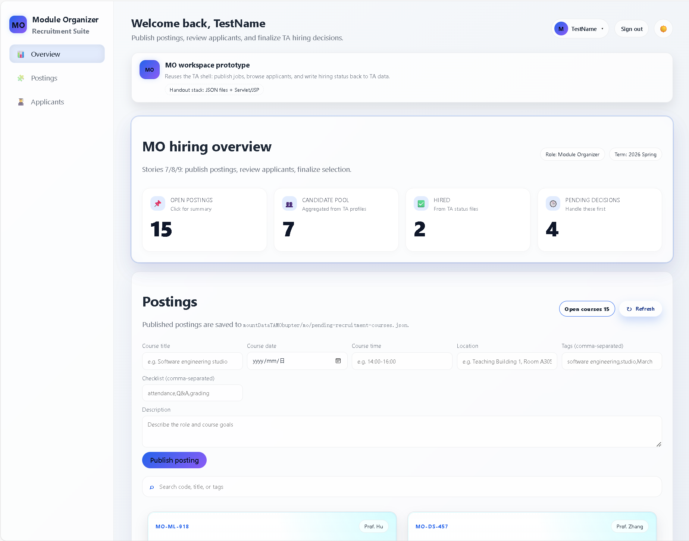
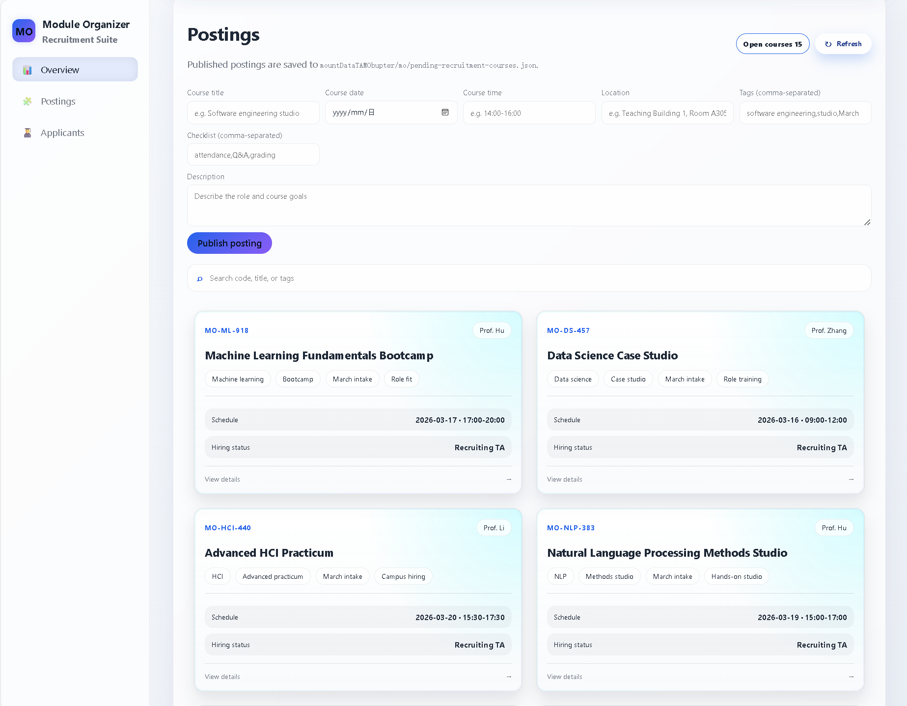
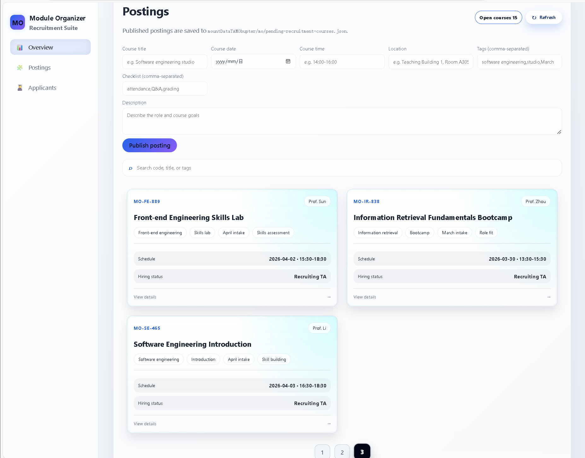
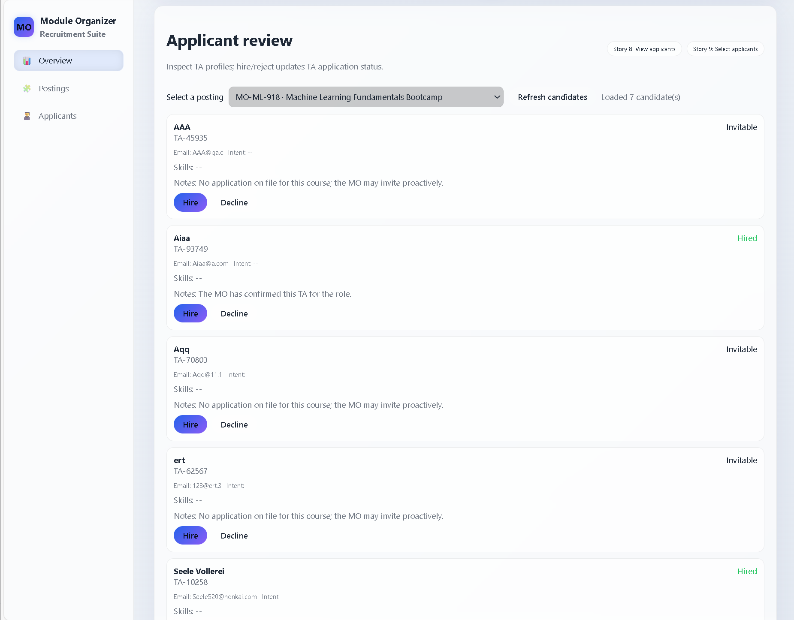

# MO-Side Prototype Design (English Version)

## 1. Purpose and Scope

This document describes the MO-side (Module Organizer side) prototype for the TA Recruitment System. It is revised based on:

- `prototypeEn.md` (existing English prototype writing style and structure),
- `EBU6304_GroupProjectHandout.md` (project requirements and constraints),
- current MO prototype screenshots in this folder (`img.png`, `img_1.png`, `img_2.png`, `img_3.png`).

The MO-side prototype focuses on three core tasks in the recruitment workflow:

1. Review recruitment overview data quickly.
2. Publish and manage TA job posts for courses.
3. Review candidates and make selection decisions.

This scope is intentionally aligned with the handout's core functionality and first-assessment expectations (functional, usable, and medium-fidelity prototype).

---

## 2. Alignment with Handout Requirements

According to the handout, the system should support TA recruitment workflows and include key capabilities such as:

- MO can post jobs.
- MO can select applicants for jobs.
- TA application status should be trackable.

The current MO-side prototype directly supports these core goals through a practical workflow:

- job posting,
- candidate review,
- decision write-back to TA application status.

The implementation direction also follows mandatory technical constraints in the handout:

- Java Servlet/JSP web architecture,
- JSON/text-file based data storage (no database).

Therefore, this prototype is not only visually demonstrable, but also feasible for iterative implementation and acceptance testing.

---

## 3. Information Architecture and Navigation

The MO workspace is designed as a focused recruitment console, not a full admin platform. Its navigation contains three primary routes:

- **Dashboard**: quick recruitment snapshot.
- **Job Publishing**: create and browse open course posts.
- **Applicant Screening**: review candidates and make decisions.

This architecture keeps MO interactions efficient and low-friction. Instead of exposing too many secondary menus, the prototype emphasizes a direct business path:

`Overview -> Post Jobs -> Screen Applicants -> Finalize Decision`

---

## 4. Visual Style and UX Principles

The MO-side pages follow the same unified system language used by TA/Admin prototypes:

- left sidebar for persistent navigation,
- top utility bar for account/theme/logout actions,
- card-based content layout for scanning,
- high-contrast status pills and action buttons.

The style is intentionally consistent across roles, so users can immediately recognize that MO is another role view inside the same platform.

Core UX principles:

- **Task-first layout**: important actions are visible without deep navigation.
- **Progressive disclosure**: details open in modals instead of overloading one page.
- **Status clarity**: key states (open/pending/accepted) are always visible.
- **Fast switching**: route switching is lightweight and supports continuous workflow.

---

## 5. Screen-by-Screen Prototype Description

### 5.1 MO Workspace Entry and Dashboard

The dashboard serves as the first working surface after login. It answers four immediate MO questions:

1. How many open jobs are available now?
2. How large is the current candidate pool?
3. How many applicants have been accepted?
4. How many applications are still pending decisions?

This page is designed for quick orientation before action. It avoids excessive details and keeps a "monitor first, act next" rhythm.

【截图插入提示：在此处插入 `img.png`，用于展示 MO 工作台首页与总览信息卡片。】

---

### 5.2 Job Publishing and Job Board

This page is the input center of MO operations. It includes:

- a job publishing form (course name/date/time/location/tags/checklist/description),
- an open-jobs counter,
- refresh action,
- searchable, paginated job cards.

Design rationale:

- The form keeps required fields simple and implementation-friendly for iteration.
- Job cards provide scannable summaries before opening full detail.
- Search and pagination reduce cognitive load when job volume grows.

The page supports both **creation** and **lightweight management** of open recruitment posts.

【截图插入提示：在此处插入 `img_1.png`，用于展示“岗位发布与岗位列表”页面整体布局。】

---

### 5.3 Course Detail Modal and Workflow Bridging

When an MO opens a course card, a detail modal presents:

- full course context,
- tags and task checklist,
- operational next step to jump to applicant screening.

This modal is a key workflow bridge:

- It reduces back-and-forth navigation.
- It connects job management directly to candidate screening.
- It improves action continuity in live demonstration.

Instead of treating pages as isolated screens, the prototype intentionally links them as one business flow.

【截图插入提示：在此处插入 `img_2.png`，用于展示课程详情弹窗与“跳转筛选”操作入口。】

---

### 5.4 Applicant Screening and Decision Making

This is the decision page where MO reviews candidate profiles for a selected course and takes action.

Main elements:

- course selector,
- candidate card list,
- status indicators,
- "accept" / "reject" actions with optional comment.

Behavioral design highlights:

- Candidate data is aggregated from TA account/profile/application status data.
- Even without an existing application record, a TA can appear as "invitable" (active outreach scenario).
- Decision results are written back to application status data for cross-role consistency.

This page delivers the most important MO business value: turning candidate review into explicit recruitment outcomes.

【截图插入提示：在此处插入 `img_3.png`，用于展示应聘筛选列表与录用/拒绝操作按钮。】

---

## 6. End-to-End User Flow (MO)

The current prototype supports a complete MO interaction loop:

1. Enter MO workspace.
2. Check dashboard indicators.
3. Publish a new recruitment post.
4. Open post details and verify requirements.
5. Navigate to applicant screening.
6. Accept or reject candidates.
7. Persist decision result to TA application status data.

This closed loop is critical for demonstrating that the prototype is not only visual, but also process-complete.

---

## 7. Data and Interaction Consistency

The MO-side prototype is consistent with repository behavior in three key aspects:

- **Data model consistency**: course posts, candidate info, and status records are structured for operational use.
- **Interaction consistency**: route switching, modal behavior, and decision operations follow predictable UI patterns.
- **Cross-role consistency**: MO actions affect TA-visible status results, supporting an integrated system story.

This consistency improves confidence for later sprint implementation and viva demonstration.

---

## 8. Prototype Strengths and Reasonable Next Iterations

### Current strengths

- Clear and focused information architecture.
- Complete core MO recruitment workflow.
- Practical medium-fidelity interaction design.
- Strong alignment with handout constraints and role requirements.

### Suggested next iterations (optional)

- richer candidate profile drill-down (availability/CV preview),
- dedicated decision confirmation modal (instead of simple prompt),
- edit/close job-post operations,
- dashboard trends and overdue decision reminders.

These enhancements can be planned as later sprints without changing the current core flow.

---

## 9. Conclusion

The MO-side prototype should be positioned as a **medium-fidelity recruitment workspace for Module Organizers**. It provides a coherent and implementable path from job posting to candidate decision-making, while remaining aligned with the handout's requirements on scope, architecture, and data persistence approach.

In summary, the prototype already demonstrates the MO role's primary value:

**publish jobs efficiently, screen candidates clearly, and write recruitment decisions back to the shared TA recruitment lifecycle.**
