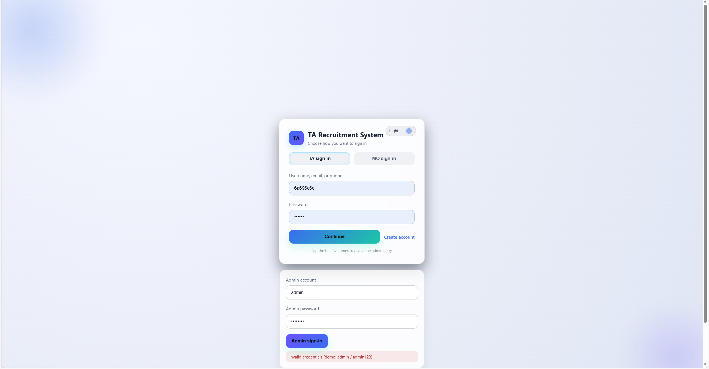
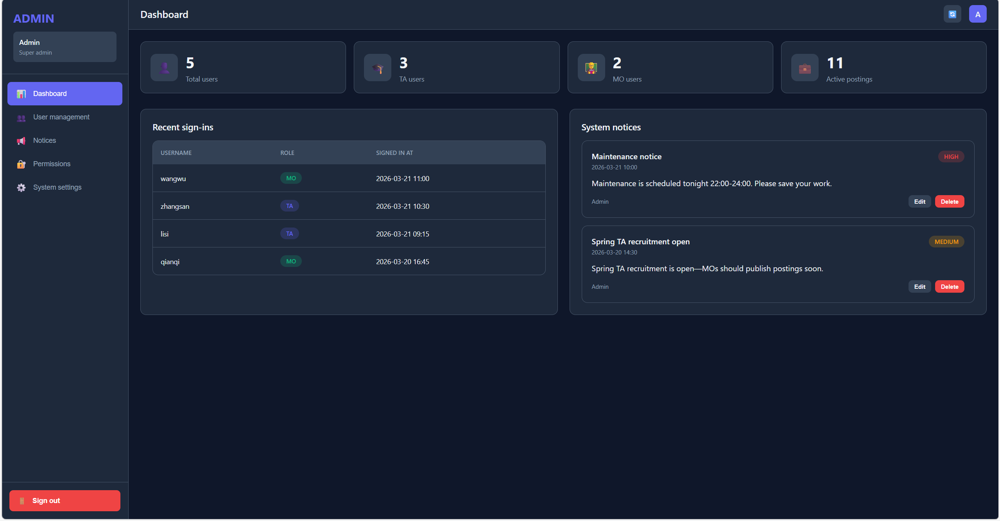
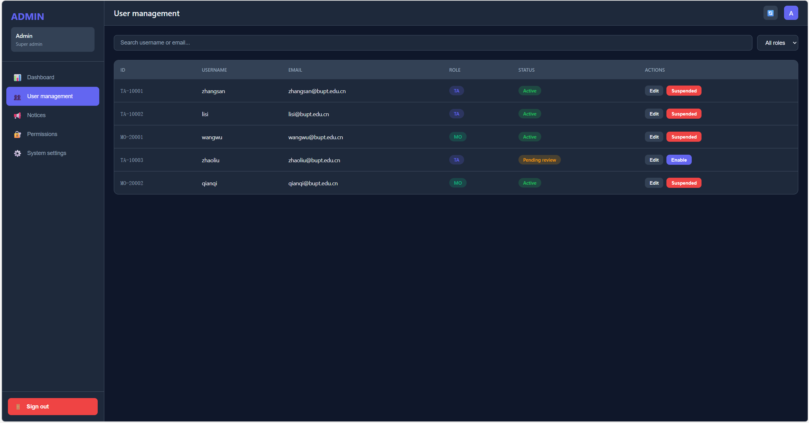
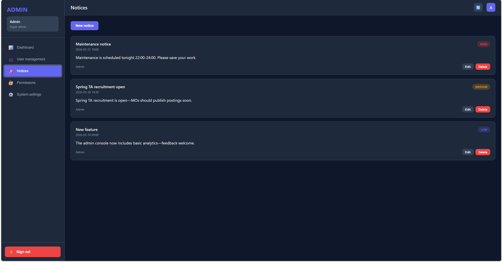
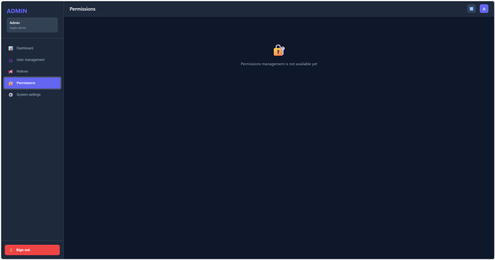
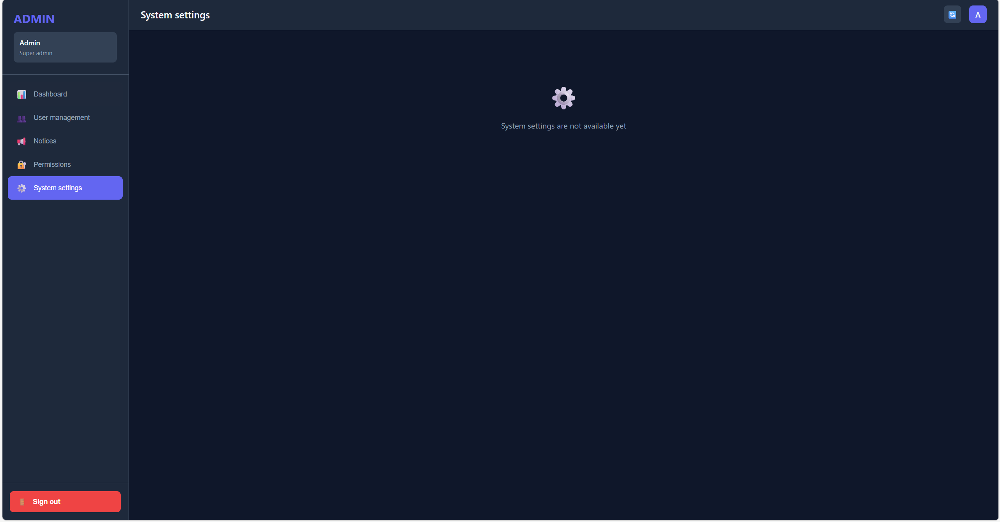

# Admin-Side Prototype Design and Detailed Explanation (English Version)

This document is the English version of the Admin-side prototype specification. It is prepared using the current prototype artifacts, repository implementation, and the coursework constraints in `EBU6304_GroupProjectHandout.md`.

The Admin module is currently in a **frontend-complete, backend-in-progress** stage: the console structure and major interactions are clear, while several write-back functions and service integrations are still planned for later iterations. This is acceptable under the handout because the first assessment emphasizes a complete prototype and clear iterative planning rather than full implementation of all advanced features.

---

## 1. Scope and Handout Alignment

### 1.1 Prototype Scope

The current Admin prototype focuses on five governance areas:

1. Dashboard overview
2. User management
3. Notice management
4. Permission management (reserved)
5. System settings (reserved)

These areas map directly to the current route structure in `admin-home.jsp` (`dashboard`, `users`, `notices`, `permissions`, `settings`).

### 1.2 Why This Scope Is Reasonable

This scope aligns with the handout in three ways:

- The handout provides high-level requirements and expects teams to define detailed scope.
- The first checkpoint requires a complete low-/medium-fidelity prototype plus core feature priorities.
- Agile delivery expects incremental value, not one-step completion of every module.

Therefore, this prototype intentionally emphasizes **core admin workflows first** and marks advanced governance features as planned placeholders.

### 1.3 Technical Constraint Awareness

The handout requires:

- Java application or Java Servlet/JSP web app
- Text-file data persistence (TXT/CSV/JSON/XML), without database dependency

The current Admin prototype is compatible with this direction and can naturally evolve to JSON-backed servlet endpoints in later sprints.

---

## 2. Entry Strategy and Role Positioning

The homepage currently treats Admin login as a controlled or hidden entry, while TA/MO remain the default visible roles. This is a practical product decision at this stage:

- It keeps the main recruitment entry simple for ordinary users.
- It supports governance demonstrations when needed.
- It preserves room for stricter role-based access in future versions.

> 【截图插入提示】此处插入“登录页中的 Admin 入口（隐藏/展开）”截图，建议使用 `img.png`。

---

## 3. Overall Admin Workspace Architecture

The Admin workspace (`admin-home.jsp`) follows a classic management-console layout:

1. Left sidebar navigation
2. Topbar (title + global actions)
3. Main route content area
4. Route-local tables/cards/toolbars

This architecture is suitable for long-session management tasks because it keeps navigation and context stable while users inspect and operate on data.

> 【截图插入提示】此处插入“Admin 工作台整体布局（侧边栏 + 顶栏 + 内容区）”截图，建议使用 `img_1.png`。

---

## 4. Visual and Interaction Language

The Admin module uses a dark-console visual language (`admin-layout.css`) with clear semantic colors:

- primary action: blue/purple
- success/warning/danger states
- badge-driven role and status marking
- card/table hybrid layout for readability and density

Compared with user-facing TA/MO pages, the Admin side intentionally emphasizes authority, clarity, and operational efficiency.

---

## 5. Dashboard Prototype

### 5.1 Design Goal

The dashboard is designed to answer key questions quickly:

- How many users exist?
- What is the TA/MO distribution?
- Who logged in recently?
- What notices are currently active?

### 5.2 Layout Structure

The page includes:

- KPI card area (total users, TA users, MO users, active jobs)
- recent login table
- notice summary section

This "overview first, details second" sequence supports fast decision orientation.

### 5.3 Current Implementation Maturity

Current frontend logic already supports:

- metric rendering from mock datasets
- role-based counting
- recent-login sorting
- notice-preview rendering

The "active jobs" metric is still simulated and should be connected to real data in future iterations.

> 【截图插入提示】此处插入“Dashboard 指标卡片 + 最近登录 + 公告摘要”截图，建议使用 `img_2.png`。

---

## 6. User Management Prototype

### 6.1 Design Goal

This route supports the core governance actions:

- locate user accounts
- inspect role and account status
- trigger account-level operations

### 6.2 Information Structure

The page combines:

- top toolbar (search + role filter)
- user table (ID, username, email, role, status, actions)

This structure reflects a practical admin workflow: identify target first, then operate.

### 6.3 Interaction Behavior

The current prototype already includes:

- keyword filtering by username/email
- role-based filtering
- combined filtering logic
- debounce behavior for smoother search interaction

Badge semantics for role/status establish a clear foundation for future approval and risk-control logic.

> 【截图插入提示】此处插入“用户管理页（搜索、筛选、角色/状态标签）”截图，建议使用 `img_3.png`。

---

## 7. Notice Management Prototype

### 7.1 Design Goal

Notice management supports platform-wide communication:

- maintenance notifications
- recruitment-cycle announcements
- policy/process updates
- operational reminders

### 7.2 Card-Based Notice Model

Each notice card includes:

- title
- publish time
- priority (`high`, `medium`, `low`)
- content snippet
- publisher info
- action buttons

### 7.3 Current State

The route already defines the complete operation contract:

- create notice
- edit notice
- delete notice

Some actions are still placeholder-level, but interaction boundaries are explicit and demo-ready.

> 【截图插入提示】此处插入“公告管理页（优先级标签 + 操作按钮）”截图，建议使用 `img_4.png`（如有）。

---

## 8. Reserved Governance Routes

### 8.1 Permission Management

The permission route is currently placeholder-based, which is acceptable in this sprint because it still communicates planned governance depth.

Expected future focus:

- role hierarchy
- sensitive-operation authorization
- RBAC-oriented policy design

### 8.2 System Settings

The system-settings route is also reserved and can later include:

- recruitment cycle/term settings
- global notification and pagination defaults
- upload constraints
- JSON path/backup/export policy settings

Keeping these routes visible now prevents disruptive structural changes in later iterations.

> 【截图插入提示】此处插入“权限管理/系统设置占位页面”截图，建议使用 `img_5.png`（如有）。

---

## 9. End-to-End Admin Flow

From an Admin perspective, the current prototype supports a coherent journey:

1. Enter Admin area through controlled login entry
2. Open dashboard for platform awareness
3. Use user management for account governance
4. Use notice management for platform communication
5. Extend to permission/settings governance in later iterations

This is sufficient to demonstrate role value and operational logic in Iteration 1.

---

## 10. Mapping to Existing Repository Artifacts

The prototype is directly aligned with current project files:

- page shell and route scaffolding: `admin-home.jsp`
- global layout and color semantics: `admin-layout.css`
- dashboard visuals: `admin-dashboard.css`
- user management visuals: `admin-users.css`
- notice management visuals: `admin-notices.css`
- route/event logic: `admin-home.js`

Current maturity profile:

- **implemented**: layout scaffold, navigation switching, dashboard skeleton, user filter behavior, notice rendering
- **partially implemented**: create/edit/write-back flows, persistent backend integration, advanced governance controls

---

## 11. Strengths, Gaps, and Next Sprint Priorities

### 11.1 Strengths

- Clear admin information architecture
- Strong demonstration readability
- Stable semantic visual language
- Good extensibility boundaries

### 11.2 Gaps

- Admin authentication chain is not fully integrated
- Data still relies heavily on mock arrays
- Some operation buttons are still prototype placeholders
- Dashboard analytics depth is still basic

### 11.3 Recommended Sprint Priorities

1. Complete Admin authentication + session validation
2. Replace mock arrays with JSON-based servlet endpoints
3. Implement create/edit/delete notice persistence
4. Implement user status update persistence and audit-friendly logs
5. Keep permission/settings as controlled later-sprint scope

This order follows the handout's requirement: implement core value first, then expand iteratively.

---

## 12. Conclusion

The Admin-side prototype has reached a coherent medium-fidelity level for coursework Stage 1: it clearly defines governance responsibilities, route organization, state semantics, and extension boundaries.

In practice, it is more than a set of screenshots. It is a structured design baseline that can be incrementally implemented into a real Servlet/JSP + text-file-backed management module under Agile delivery.

---

## Appendix: Image Placement References

> 【截图插入提示】以下截图可在最终 PDF 中按“入口 → 工作台 → 看板 → 用户管理 → 公告管理 → 占位页”的顺序排版。

# Admin 部分原型设计与详细说明

本文档基于图片原型 [`img.png`](projectFile/Liyufeng/imgStage1Prototype/img.png)、[`img_1.png`](projectFile/Liyufeng/imgStage1Prototype/img_1.png)、[`img_2.png`](projectFile/Liyufeng/imgStage1Prototype/img_2.png)、[`img_3.png`](projectFile/Liyufeng/imgStage1Prototype/img_3.png) 以及仓库中当前已存在的 Admin 端页面结构、样式与脚本实现整理而成，面向系统管理员（Admin）角色，对后台工作台的页面原型、信息架构、关键交互、功能边界与后续扩展方向进行详细描述。

当前仓库中，Admin 端虽然仍处于“前端工作台原型已搭建、后端接口尚未接入”的阶段，但已经完成了比较完整的后台页面骨架。最主要的入口页面是 [`admin-home.jsp`](src/main/webapp/pages/admin/admin-home.jsp)，核心交互脚本位于 [`admin-home.js`](src/main/webapp/assets/admin/js/admin-home.js)，整体布局与视觉变量定义位于 [`admin-layout.css`](src/main/webapp/assets/admin/css/admin-layout.css)，数据看板、用户管理、公告管理分别由 [`admin-dashboard.css`](src/main/webapp/assets/admin/css/admin-dashboard.css)、[`admin-users.css`](src/main/webapp/assets/admin/css/admin-users.css)、[`admin-notices.css`](src/main/webapp/assets/admin/css/admin-notices.css) 提供样式支持。

同时，从系统首页 [`index.jsp`](src/main/webapp/index.jsp:57) 到 [`index.jsp`](src/main/webapp/index.jsp:70) 可以看到，Admin 登录入口目前被设计为“隐藏式预留入口”：普通用户默认只会看到 TA 与 MO 的登录 tab，而管理员入口需要通过页面标题的彩蛋交互被解锁。这说明在整个产品定位中，Admin 端并不是面向大量普通用户的高频入口，而是服务于系统治理、内容维护、账号管控与平台运营的内部后台。

---

## 1. 原型范围与设计目标

Admin 原型的核心目标，不是提供招聘业务本身的细节操作，而是从全局视角对整个平台进行管理。结合图片与现有代码，当前 Admin 模块聚焦五类后台任务：

1. 查看平台整体运行情况；
2. 浏览并筛选系统内用户；
3. 维护系统公告内容；
4. 预留权限治理入口；
5. 预留系统配置入口。

这些任务在页面导航结构中被直接编码为五个主路由，定义于 [`admin-home.jsp`](src/main/webapp/pages/admin/admin-home.jsp:23) 到 [`admin-home.jsp`](src/main/webapp/pages/admin/admin-home.jsp:43)：

- 数据看板 `dashboard`
- 用户管理 `users`
- 公告管理 `notices`
- 权限管理 `permissions`
- 系统设置 `settings`

从产品职责上看，这五项设计非常符合管理员角色的典型工作流：

- 先通过数据看板把握系统总体状态；
- 再进入用户管理处理账号状态与用户治理；
- 然后进入公告管理进行运营广播；
- 最后在权限管理与系统设置中执行更高层级的治理动作。

因此，Admin 原型可以被定义为：**一个面向平台运营与治理的中保真后台控制台原型**。

---

## 2. 从图片原型得到的整体风格判断

### 2.1 视觉风格

结合图片原型可以看出，Admin 端采用了非常典型的后台系统界面风格：

- 左侧为固定垂直导航栏；
- 顶部为页面标题与快捷操作区；
- 主内容区由若干信息卡片、表格和列表组成；
- 深色背景承载主要内容，对比度较强；
- 核心操作按钮使用蓝紫色高亮；
- 危险动作使用红色；
- 状态与角色通过 badge 胶囊组件进行区分。

这一点可以直接从全局样式变量中得到印证，例如 [`admin-layout.css`](src/main/webapp/assets/admin/css/admin-layout.css:2) 到 [`admin-layout.css`](src/main/webapp/assets/admin/css/admin-layout.css:16) 定义了：

- 主品牌色 `--primary-color: #6366f1`
- 成功色 `--success-color: #22c55e`
- 警告色 `--warning-color: #f59e0b`
- 危险色 `--danger-color: #ef4444`
- 主背景色 `--bg-primary: #0f172a`
- 次级背景色 `--bg-secondary: #1e293b`
- 第三级背景色 `--bg-tertiary: #334155`

这种色彩系统说明 Admin 原型明确采用深色控制台视觉语言。与 TA、MO 模块偏“玻璃拟态 + 柔光白底”的体验相比，Admin 端更强调“稳定、权威、密集、专业”的后台管理气质。

### 2.2 信息组织风格

从图片和代码可以总结出 Admin 原型的信息组织具有以下特点：

- 一级导航非常明确，减少管理员迷失；
- 每个页面只承载一种主任务；
- 数据优先，装饰最少；
- 操作尽量紧贴数据对象本身；
- 预留未完成模块的占位态，保证整体结构完整。

这种设计方式适合课程招聘系统的后台原型阶段，因为它先把“管理员需要做什么”定义清楚，再逐步补充真实数据与高级功能。

---

## 3. Admin 模块的信息架构设计

### 3.1 页面入口与整体布局

Admin 端页面入口为 [`admin-home.jsp`](src/main/webapp/pages/admin/admin-home.jsp)。从结构上看，它由四个最核心的区域组成：

1. 左侧侧边栏；
2. 顶部栏；
3. 路由内容区；
4. 各页面内部的局部工具栏或卡片模块。

在代码上：

- 应用根容器是 [`#adminApp`](src/main/webapp/pages/admin/admin-home.jsp:14)
- 左侧导航使用 [`aside.sidebar`](src/main/webapp/pages/admin/admin-home.jsp:15)
- 主工作区使用 [`main.main`](src/main/webapp/pages/admin/admin-home.jsp:53)
- 顶部栏使用 [`header.topbar`](src/main/webapp/pages/admin/admin-home.jsp:54)
- 路由容器使用 [`section.routes`](src/main/webapp/pages/admin/admin-home.jsp:68)

布局实现由 [`admin-layout.css`](src/main/webapp/assets/admin/css/admin-layout.css:31) 到 [`admin-layout.css`](src/main/webapp/assets/admin/css/admin-layout.css:44) 驱动：

- `.app` 使用左右分栏 flex 布局；
- `.sidebar` 固定宽度为 260px；
- `.main` 占据剩余宽度并垂直分层；
- `.routes` 独立滚动，避免整个页面滚动造成导航和标题丢失。

这种布局非常适合后台操作，因为管理员在处理列表、表格、公告流时通常需要长时间停留在同一模块内，固定导航与固定顶栏能够显著提升定位效率。

### 3.2 左侧导航设计

导航区定义在 [`admin-home.jsp`](src/main/webapp/pages/admin/admin-home.jsp:15) 到 [`admin-home.jsp`](src/main/webapp/pages/admin/admin-home.jsp:50)。其设计包括三个层次：

#### 3.2.1 品牌与身份区

侧边栏顶部显示：

- 品牌字样 `ADMIN`
- 当前用户名称 `管理员`
- 当前角色 `超级管理员`

对应节点分别为：

- [`logo`](src/main/webapp/pages/admin/admin-home.jsp:17)
- [`adminName`](src/main/webapp/pages/admin/admin-home.jsp:19)
- [`adminRole`](src/main/webapp/pages/admin/admin-home.jsp:20)

这里的设计意图很明确：

- 先强调当前工作台属于管理员域；
- 再强调当前登录人的身份与权限级别；
- 使管理员始终处于“系统治理者”的心理上下文中。

#### 3.2.2 一级导航项

导航项总共五个，每项都采用“图标 + 文本”形式：

| 导航项 | 图标 | 作用说明 | 页面目标 |
|---|---|---|---|
| 数据看板 | 📊 | 查看系统概况 | 快速获知用户与岗位总体状态 |
| 用户管理 | 👥 | 管理账号 | 搜索、筛选、编辑、启停用户 |
| 公告管理 | 📢 | 管理公告内容 | 查看、新建、编辑、删除公告 |
| 权限管理 | 🔐 | 管理角色权限 | 预留未来权限分配能力 |
| 系统设置 | ⚙️ | 管理全局配置 | 预留未来系统配置能力 |

默认激活项是“数据看板”，见 [`admin-home.jsp`](src/main/webapp/pages/admin/admin-home.jsp:24)。

导航切换逻辑由 [`navigateTo()`](src/main/webapp/assets/admin/js/admin-home.js:47) 实现。该函数会同时完成三件事：

1. 更新左侧导航高亮；
2. 更新右侧路由内容显示；
3. 更新顶部页面标题。

这是一种典型的单页工作台式交互方式，能够避免管理员频繁跳页，提升后台原型的流畅性。

#### 3.2.3 退出登录区

侧边栏底部使用高对比的红色按钮作为退出入口，对应 [`logoutBtn`](src/main/webapp/pages/admin/admin-home.jsp:46)。

这一设计有两个优点：

- 退出操作和普通导航操作明显区分；
- 放在侧边栏底部，避免误触。

样式上由 [`logout-btn`](src/main/webapp/assets/admin/css/admin-layout.css:116) 到 [`admin-layout.css`](src/main/webapp/assets/admin/css/admin-layout.css:134) 控制，使用红底白字强化危险动作语义。

### 3.3 顶栏设计

顶栏定义在 [`admin-home.jsp`](src/main/webapp/pages/admin/admin-home.jsp:54) 到 [`admin-home.jsp`](src/main/webapp/pages/admin/admin-home.jsp:66)，包含：

- 左侧页面标题 [`pageTitle`](src/main/webapp/pages/admin/admin-home.jsp:56)
- 右侧刷新按钮 [`refreshBtn`](src/main/webapp/pages/admin/admin-home.jsp:59)
- 当前用户头像区域 [`avatar`](src/main/webapp/pages/admin/admin-home.jsp:63)

顶栏的设计目的不是承载复杂功能，而是承担全局操作与页面定位功能：

- 页面标题让管理员清楚当前所在模块；
- 刷新按钮提供“重新同步当前数据”的心理模型；
- 头像区强化当前身份；
- 顶栏固定在内容之上，确保长列表页面中仍能维持工作上下文。

在脚本层面，刷新按钮绑定到 [`refreshData()`](src/main/webapp/assets/admin/js/admin-home.js:194)。目前它以 `alert` 的形式提示“数据已刷新”，并重新调用看板、用户、公告三个加载函数。这虽然还是原型级实现，但已经把未来真实刷新接口的交互结构预留好了。

---

## 4. Admin 核心业务逻辑总览

结合现有代码，Admin 模块不是多页面跳转，而是同一工作台中的五段 route 切换。其初始化入口位于 [`init()`](src/main/webapp/assets/admin/js/admin-home.js:29)，启动后会依次执行：

1. [`setupNavigation()`](src/main/webapp/assets/admin/js/admin-home.js:38)
2. [`setupEventListeners()`](src/main/webapp/assets/admin/js/admin-home.js:70)
3. [`loadDashboardData()`](src/main/webapp/assets/admin/js/admin-home.js:79)
4. [`loadUsers()`](src/main/webapp/assets/admin/js/admin-home.js:110)
5. [`loadNotices()`](src/main/webapp/assets/admin/js/admin-home.js:160)

这说明当前 Admin 原型已经具备一个完整后台应用的基本执行顺序：

- 先建立导航；
- 再绑定事件；
- 然后填充各类数据模块；
- 最后等待管理员进一步操作。

尽管当前数据来自前端 mock 数据，而非后端 Servlet/DAO，但结构已经非常接近真实后台系统。

其中最重要的两个 mock 数据源是：

- 用户数据 [`mockUsers`](src/main/webapp/assets/admin/js/admin-home.js:14)
- 公告数据 [`mockNotices`](src/main/webapp/assets/admin/js/admin-home.js:22)

从这些数据结构可以看出，未来 Admin 端至少会围绕以下实体展开：

- 用户：ID、用户名、邮箱、角色、状态、最后登录时间；
- 公告：ID、标题、正文、优先级、发布时间。

这与仓库 README 中对未来 Admin 模块的规划也是一致的，例如 [`README.md`](README.md:206) 到 [`README.md`](README.md:220) 已经预留了管理端控制器、服务和 DAO 的模块结构，说明本原型页面后续是有明确落地方向的。

---

## 5. 页面一：数据看板原型设计

### 5.1 页面目标

数据看板页面对应 [`route-dashboard`](src/main/webapp/pages/admin/admin-home.jsp:70)。它的设计目标是帮助管理员在最短时间内回答以下问题：

1. 系统中总共有多少用户？
2. 其中有多少 TA 用户？
3. 其中有多少 MO 用户？
4. 当前平台上有多少活跃岗位？
5. 最近是谁在使用系统？
6. 当前有哪些系统公告正在生效？

这是一个典型的“系统概览页”定位，强调先看全局，再下钻处理具体事务。

### 5.2 页面结构

该页面由两大模块构成：

1. 统计卡片区 [`dashboard-stats`](src/main/webapp/pages/admin/admin-home.jsp:71)
2. 信息分区区 [`dashboard-sections`](src/main/webapp/pages/admin/admin-home.jsp:102)

统计卡片区包括四张卡片：

- 总用户数 [`totalUsers`](src/main/webapp/pages/admin/admin-home.jsp:75)
- TA 用户 [`taUsers`](src/main/webapp/pages/admin/admin-home.jsp:82)
- MO 用户 [`moUsers`](src/main/webapp/pages/admin/admin-home.jsp:89)
- 活跃岗位 [`activeJobs`](src/main/webapp/pages/admin/admin-home.jsp:96)

信息分区区包括两块内容：

- 最近登录用户表格 [`recentLogins`](src/main/webapp/pages/admin/admin-home.jsp:114)
- 系统公告列表 [`noticeList`](src/main/webapp/pages/admin/admin-home.jsp:123)

这套结构非常合理，因为它遵循“指标 + 明细”的后台阅读顺序：

- 先通过数字感知规模；
- 再通过列表理解细节；
- 再决定是否切换去其他模块处理。

### 5.3 统计卡片设计说明

统计卡片的布局与样式定义在 [`admin-dashboard.css`](src/main/webapp/assets/admin/css/admin-dashboard.css:3) 到 [`admin-dashboard.css`](src/main/webapp/assets/admin/css/admin-dashboard.css:44)。其特征包括：

- 响应式网格排列；
- 左侧图标、右侧文字的横向信息组织；
- 大号数字突出核心指标；
- 小字号标签解释指标含义。

每张卡片采用统一信息结构：

- 图标：帮助管理员快速建立视觉分类；
- 数值：作为页面主焦点；
- 标签：解释指标业务意义。

这样的设计对管理后台非常有效，因为管理员在很多时候不需要看复杂图表，只需要在进入页面的 3 秒内抓到关键数量变化即可。

### 5.4 数据来源与当前实现逻辑

统计逻辑由 [`loadDashboardData()`](src/main/webapp/assets/admin/js/admin-home.js:79) 实现：

- 总用户数通过 `mockUsers.length` 得到；
- TA 用户数通过筛选 `role === 'TA'` 得到；
- MO 用户数通过筛选 `role === 'MO'` 得到；
- 活跃岗位数暂时用随机数模拟，见 [`admin-home.js`](src/main/webapp/assets/admin/js/admin-home.js:83)。

这说明当前数据看板原型的成熟度并不完全一致：

- 用户类指标已经有明确的数据结构基础；
- 岗位指标仍处于占位模拟阶段；
- 后续接入真实 MO/TA 端数据后，可以将“活跃岗位”替换为真实统计结果。

### 5.5 最近登录用户模块设计

最近登录用户模块使用标准数据表格展示，字段包括：

- 用户名
- 角色
- 登录时间

表格结构定义在 [`admin-home.jsp`](src/main/webapp/pages/admin/admin-home.jsp:106) 到 [`admin-home.jsp`](src/main/webapp/pages/admin/admin-home.jsp:117)。填充逻辑同样在 [`loadDashboardData()`](src/main/webapp/assets/admin/js/admin-home.js:85) 中完成：

1. 过滤掉 `lastLogin` 为空的用户；
2. 按登录时间倒序排序；
3. 截取最近 5 条；
4. 渲染为表格行。

这一模块体现了管理员关注的“系统活跃度”视角：

- 哪些用户最近在使用系统；
- 当前系统是否有人持续活跃；
- 可为后续审计、风险提醒和行为分析打基础。

### 5.6 系统公告模块设计

数据看板右侧同时嵌入“系统公告”摘要列表，用于让管理员快速掌握平台当前对外发布的信息。

当前实现从全部公告中截取前两条展示，见 [`admin-home.js`](src/main/webapp/assets/admin/js/admin-home.js:104) 到 [`admin-home.js`](src/main/webapp/assets/admin/js/admin-home.js:106)。这说明看板页里的公告模块被设计为“摘要视图”，而不是完整管理页。其作用是：

- 让管理员进入后台时即可看到当前重要公告；
- 避免必须跳转到公告管理页才能确认内容；
- 形成“运营内容概览”的第一视角。

---

## 6. 页面二：用户管理原型设计

### 6.1 页面目标

用户管理页面对应 [`route-users`](src/main/webapp/pages/admin/admin-home.jsp:131)。它解决的是管理员最基础、最核心的后台工作：**查找用户、识别角色、查看状态、执行治理操作**。

对课程招聘系统而言，用户管理页至少承担以下职责：

1. 浏览 TA、MO、管理员三类账号；
2. 根据用户名或邮箱搜索具体对象；
3. 按角色过滤用户范围；
4. 判断用户状态是否正常；
5. 执行编辑或启用/禁用操作。

### 6.2 页面结构

该页面由两个区域构成：

1. 顶部工具栏 [`toolbar`](src/main/webapp/pages/admin/admin-home.jsp:132)
2. 用户表格 [`userTable`](src/main/webapp/pages/admin/admin-home.jsp:153)

工具栏包含：

- 搜索框 [`userSearch`](src/main/webapp/pages/admin/admin-home.jsp:133)
- 角色过滤下拉框 [`roleFilter`](src/main/webapp/pages/admin/admin-home.jsp:134)

表格字段包括：

- ID
- 用户名
- 邮箱
- 角色
- 状态
- 操作

这是后台管理最常见、也最有效的信息组织方式，因为管理员处理账号时首先要做的不是“编辑表单”，而是“定位对象”。因此搜索和筛选必须置于表格之前。

### 6.3 搜索与筛选交互设计

搜索逻辑由 [`filterUsers()`](src/main/webapp/assets/admin/js/admin-home.js:115) 实现，支持：

- 按用户名模糊搜索；
- 按邮箱模糊搜索；
- 按角色精确过滤；
- 搜索与角色过滤可叠加使用。

为了避免频繁触发过滤，搜索输入事件通过 [`debounce()`](src/main/webapp/assets/admin/js/admin-home.js:227) 做了 300ms 防抖，这说明该原型已经考虑了一定的交互性能体验，而不是简单的即时每键渲染。

从原型设计角度，这一细节很重要，因为它体现出后台页面并不只是“能看”，而是已经开始按真实使用场景优化交互节奏。

### 6.4 用户表格信息设计

用户行的渲染由 [`createUserRow()`](src/main/webapp/assets/admin/js/admin-home.js:136) 完成。每一行至少呈现以下业务信息：

- 系统唯一 ID
- 登录用户名
- 邮箱联系方式
- 角色归属
- 状态语义
- 可执行动作

其中，角色通过 [`role-badge`](src/main/webapp/assets/admin/css/admin-users.css:67) 样式显示，颜色区分如下：

- TA：蓝紫色
- MO：绿色
- Admin：橙黄色

状态通过 [`status-badge`](src/main/webapp/assets/admin/css/admin-users.css:43) 样式显示，当前支持：

- `active` → 正常
- `pending` → 待审核
- `inactive` → 禁用

这说明 Admin 页面已经具备最基本的账号治理语义：

- 不只是展示用户；
- 还会判断账号当前是否可用；
- 并为后续审批、封禁、恢复等动作打基础。

### 6.5 用户操作设计

每一行右侧都有操作按钮组 [`action-buttons`](src/main/webapp/assets/admin/css/admin-users.css:91)，目前包含两个动作：

1. 编辑
2. 启用/禁用

对应脚本行为：

- 点击“编辑”会调用 [`editUser()`](src/main/webapp/assets/admin/js/admin-home.js:206)
- 点击“启用/禁用”会调用 [`toggleUserStatus()`](src/main/webapp/assets/admin/js/admin-home.js:210)

目前这些动作仍然以 `alert` 和 `confirm` 为主，说明它们处于原型交互阶段；但从后台产品设计来看，这已经明确给出了未来能力边界：

- 编辑用户：可能扩展到账号资料修改、角色调整、审核意见填写；
- 启用/禁用：可能扩展到冻结账号、恢复账号、限制权限；
- 待审核状态：可能与未来 TA/MO 注册审批工作流打通。

因此，用户管理页虽然目前是 mock 原型，但其结构已经具备进一步演进为真实后台账号治理页面的条件。

---

## 7. 页面三：公告管理原型设计

### 7.1 页面目标

公告管理页面对应 [`route-notices`](src/main/webapp/pages/admin/admin-home.jsp:161)。它承载的是系统级内容运营能力，即管理员向平台各类用户发布统一消息。

在课程招聘系统场景下，公告管理的价值非常直接：

- 发布系统维护通知；
- 发布 TA 招募启动信息；
- 发布功能更新说明；
- 向 TA、MO、管理员传达统一规则变更。

### 7.2 页面结构

该页面由两部分组成：

1. 顶部工具栏，仅含“新建公告”按钮 [`createNoticeBtn`](src/main/webapp/pages/admin/admin-home.jsp:163)
2. 公告列表容器 [`allNotices`](src/main/webapp/pages/admin/admin-home.jsp:165)

这种设计非常符合公告管理场景，因为公告本身是卡片型内容，而不是强结构化表格数据。卡片化设计能够更完整地展示：

- 标题
- 时间
- 优先级
- 正文摘要
- 发布者
- 操作按钮

### 7.3 公告卡片信息设计

单张公告卡片由 [`createNoticeCard()`](src/main/webapp/assets/admin/js/admin-home.js:165) 生成，包含以下信息层次：

- 标题 [`notice-title`](src/main/webapp/assets/admin/css/admin-notices.css:23)
- 发布时间 [`notice-meta`](src/main/webapp/assets/admin/css/admin-notices.css:29)
- 优先级标签 [`notice-priority`](src/main/webapp/assets/admin/css/admin-notices.css:51)
- 公告正文 [`notice-content`](src/main/webapp/assets/admin/css/admin-notices.css:34)
- 发布者与操作区 [`notice-footer`](src/main/webapp/assets/admin/css/admin-notices.css:40)

优先级分为三档：

- `high`
- `medium`
- `low`

并分别使用红、黄、蓝三类视觉语义色进行区分。这种设计使管理员与普通运营人员都能非常直观地判断内容紧急程度。

### 7.4 公告交互设计

当前公告管理页支持三个核心动作：

1. 新建公告
2. 编辑公告
3. 删除公告

脚本入口分别是：

- [`showCreateNoticeModal()`](src/main/webapp/assets/admin/js/admin-home.js:201)
- [`editNotice()`](src/main/webapp/assets/admin/js/admin-home.js:216)
- [`deleteNotice()`](src/main/webapp/assets/admin/js/admin-home.js:220)

当前状态下：

- 新建公告仍显示“开发中”；
- 编辑公告仍显示“开发中”；
- 删除公告已有确认提示，但未真正回写数据。

这说明原型已经明确了后台内容生命周期：

- 公告可创建；
- 公告可修改；
- 公告可删除；
- 删除前必须二次确认。

从产品设计角度看，这一页已经足够支撑一期后台演示，因为它把公告管理的结构、卡片形式、优先级表达与操作入口全部定义清楚了。

---

## 8. 页面四：权限管理原型设计

### 8.1 页面定位

权限管理页面对应 [`route-permissions`](src/main/webapp/pages/admin/admin-home.jsp:171)。当前它尚未进入真实功能开发，而是以空状态占位卡片形式展示：

- 图标：🔐
- 文案：权限管理功能开发中

这一设计说明，团队已经明确意识到：后台管理员最终不仅要能看数据、管用户、发公告，还要承担权限控制职责。

### 8.2 原型意义

尽管此页尚未落地，但它在原型中仍然非常重要，因为它提前声明了系统治理的未来边界：

- 不同管理员可能存在权限层级差异；
- TA、MO、Admin 的系统能力边界未来可能需要更细粒度控制；
- 公告管理、用户封禁、系统配置等敏感动作，需要角色授权；
- 后续可以引入 RBAC（基于角色的访问控制）模型。

结合仓库规划结构 [`README.md`](README.md:209) 到 [`README.md`](README.md:214) 中预留的管理员控制器命名，也能看出未来可能会存在：

- 用户管理接口
- 公告管理接口
- 看板接口
- 权限接口

因此，权限页当前虽然只是占位，但在原型层面已经具备“功能地图锚点”的作用。

---

## 9. 页面五：系统设置原型设计

### 9.1 页面定位

系统设置页面对应 [`route-settings`](src/main/webapp/pages/admin/admin-home.jsp:179)，目前同样以空状态卡片呈现：

- 图标：⚙️
- 文案：系统设置功能开发中

### 9.2 预期职责

从后台产品逻辑看，系统设置页未来可以自然扩展为以下内容：

- 招聘周期与学期配置；
- 系统默认主题、通知开关、分页数量设置；
- 文件上传大小限制；
- JSON 数据目录、备份策略与导出策略；
- 管理端全局文案配置。

其在当前原型中的价值主要体现在两点：

1. 补全了后台导航闭环，使系统看起来不是“只有局部 demo”；
2. 给后续 Sprint 留出了明确扩展接口，不会让前端结构推倒重来。

---

## 10. 原型中的状态设计与视觉语义

Admin 原型虽然功能量还不算庞大，但已经有比较清晰的状态语义系统。

### 10.1 角色状态

用户角色通过 badge 颜色区分：

- TA：教学助理候选/用户
- MO：课程负责人/教师
- ADMIN：平台管理员

这一设计可以帮助管理员在用户表中快速分群，而不需要逐行阅读文本。

### 10.2 账号状态

账号状态目前有三种：

- 正常
- 待审核
- 禁用

其产品含义分别可解释为：

- 正常：账号已启用，可正常使用系统；
- 待审核：注册或申请信息尚未完成后台确认；
- 禁用：账号被暂停使用。

这为未来接入真实审批流和风控策略奠定了语义基础。

### 10.3 公告优先级

公告优先级采用 high / medium / low 三档，这是后台公告系统中非常常见且有效的设计。其意义在于：

- 高优先级：维护通知、紧急规则变更；
- 中优先级：招聘启动、流程提醒；
- 低优先级：功能更新、一般说明。

### 10.4 空状态设计

权限管理和系统设置页面都使用了空状态组件，这种做法非常适合原型阶段：

- 不隐藏未完成模块；
- 明确告诉评审“这里有规划，但尚未实现”；
- 保持页面结构完整；
- 防止用户误解为页面加载失败。

---

## 11. Admin 原型的用户流程设计

如果从管理员视角出发，当前原型隐含了一条比较清晰的操作流程：

1. 在登录页通过隐藏入口进入管理员登录区；
2. 进入 Admin 控制台首页；
3. 先看数据看板，了解总用户数、角色结构、最近登录与系统公告；
4. 如果需要治理账号，则切换到用户管理页；
5. 在用户管理页中按用户名/邮箱搜索目标，并通过角色过滤缩小范围；
6. 对具体用户执行编辑或启用/禁用操作；
7. 如果需要发布或维护平台广播信息，则切换到公告管理页；
8. 在公告页查看已有公告、执行编辑/删除，或准备创建新公告；
9. 后续版本中再进入权限管理或系统设置进行更深层治理。

这条流程说明 Admin 原型已经具备基本业务闭环：

- 先看；
- 再查；
- 再管；
- 再发布；
- 再治理。

对于一阶段原型展示而言，这样的闭环已经足够支撑“管理员角色存在且职责明确”的论证。

---

## 12. 与现有仓库代码的对应关系

为了说明该原型不是纯图片想象，而是与仓库代码高度一致，下面给出主要映射关系：

| 原型能力 | 前端页面/脚本对应 | 当前状态 |
|---|---|---|
| Admin 主工作台布局 | [`admin-home.jsp`](src/main/webapp/pages/admin/admin-home.jsp) | 已实现 |
| 深色后台布局与通用样式 | [`admin-layout.css`](src/main/webapp/assets/admin/css/admin-layout.css) | 已实现 |
| 数据看板卡片与分区布局 | [`admin-dashboard.css`](src/main/webapp/assets/admin/css/admin-dashboard.css) | 已实现 |
| 用户表格与 badge 风格 | [`admin-users.css`](src/main/webapp/assets/admin/css/admin-users.css) | 已实现 |
| 公告卡片与优先级样式 | [`admin-notices.css`](src/main/webapp/assets/admin/css/admin-notices.css) | 已实现 |
| 导航切换、页面标题同步 | [`navigateTo()`](src/main/webapp/assets/admin/js/admin-home.js:47) | 已实现 |
| 看板 mock 数据加载 | [`loadDashboardData()`](src/main/webapp/assets/admin/js/admin-home.js:79) | 已实现 |
| 用户列表加载与过滤 | [`loadUsers()`](src/main/webapp/assets/admin/js/admin-home.js:110)、[`filterUsers()`](src/main/webapp/assets/admin/js/admin-home.js:115) | 已实现 |
| 公告卡片加载 | [`loadNotices()`](src/main/webapp/assets/admin/js/admin-home.js:160) | 已实现 |
| 退出登录、刷新、编辑、删除等操作入口 | [`setupEventListeners()`](src/main/webapp/assets/admin/js/admin-home.js:70) 与各类全局函数 | 原型态 |
| 权限管理与系统设置 | [`route-permissions`](src/main/webapp/pages/admin/admin-home.jsp:171)、[`route-settings`](src/main/webapp/pages/admin/admin-home.jsp:179) | 占位实现 |

从这个映射表可以看出，Admin 模块目前最成熟的是前端信息架构与交互骨架，最需要补充的是：

- 真正的管理员认证；
- 后端接口接入；
- 数据持久化；
- 权限分配与系统配置的实际表单。

---

## 13. 当前原型的优点分析

### 13.1 结构清晰

Admin 原型没有一开始就堆叠复杂功能，而是先把后台最基础的五块能力定义清楚，结构非常清晰，便于后续分阶段开发。

### 13.2 可演示性强

数据看板、用户管理、公告管理三页都已经具备可见、可点、可切换、可筛选的演示效果，适合课程汇报与阶段展示。

### 13.3 视觉语义明确

深色工作台、颜色 badge、危险按钮、卡片与表格混合布局，都符合后台系统的常见认知，不会让评审者产生理解成本。

### 13.4 具备扩展空间

权限管理和系统设置虽然还未完成，但导航、路由与占位页面已经搭好，后续扩展不会破坏现有结构。

---

## 14. 当前原型的不足与可扩展方向

### 14.1 登录链路尚未真正打通

虽然首页预留了管理员登录入口，但当前更偏向彩蛋式展示，尚未与真正的认证接口和会话鉴权联动。

### 14.2 数据仍以 mock 为主

当前用户与公告主要来自 [`mockUsers`](src/main/webapp/assets/admin/js/admin-home.js:14) 和 [`mockNotices`](src/main/webapp/assets/admin/js/admin-home.js:22)，尚未接入真实 JSON 存储或 Servlet API。

### 14.3 操作仍为占位行为

编辑用户、创建公告、编辑公告、删除公告、权限管理、系统设置都还没有真正回写数据，只完成了原型级入口定义。

### 14.4 看板可视化程度仍较基础

当前看板以数字卡片与简单列表为主，未来可以增加：

- 角色分布图；
- 学期维度统计；
- 岗位开放趋势图；
- 公告阅读量或点击量；
- 最近异常行为提醒。

---

## 15. 结论

综合图片原型与仓库现有代码来看，Admin 部分已经形成了一套比较完整的后台控制台原型方案。其核心特点是：

- 采用深色后台工作台视觉；
- 使用固定侧边栏 + 顶栏 + 路由内容区的经典布局；
- 已经清晰定义“数据看板、用户管理、公告管理、权限管理、系统设置”五大能力板块；
- 在用户管理和公告管理中提供了较明确的对象级操作入口；
- 通过 mock 数据和前端脚本验证了后台信息架构的可行性；
- 为后续真实后端接入、权限控制与系统治理扩展留足了空间。

如果将其作为一阶段 Admin 原型成果来看，这一方案已经能够较好地回答“管理员在系统中做什么”“后台页面如何组织”“后续如何从原型演进为真实系统”这三个关键问题。因此，当前 Admin 原型不仅是一组页面截图，更是一份已经与仓库结构对齐、具备实现路径的后台设计说明。

---

## 附：原型图片引用

