# TA 页面复用指导 README

## 1. 文档目标

本文档用于把你提供的 TA 页面能力，结合当前仓库既有架构，规划出一套可直接执行的复用迁移清单。重点不是空泛描述原页面，而是明确：

- 哪些内容可以直接复用
- 哪些内容需要按本项目结构重组
- 哪些目录应沿用现有目录
- 哪些后端接口与 JSON 数据结构应复用或扩展
- 哪些模块必须裁剪
- 后续切换到实现模式时应按什么顺序落地

本文档默认目标是：

- 在当前项目内复用 TA 页面视觉与交互思路
- 工作区只保留 3 个模块：个人档案、职位大厅、申请状态
- 尽量在现有文件夹内构建，必要时只创建子文件夹
- 兼容当前项目的 JSP + Servlet + JSON 挂载数据架构

---

## 2. 先看当前项目现状

结合当前仓库，已经确认以下事实：

### 2.1 前端页面现状

当前 TA 端页面只有一个占位页 [`ta-home.jsp`](src/main/webapp/pages/ta/ta-home.jsp)，说明：

- 现仓库还没有完整的 TA 工作台页面
- 你提供的复用说明应被视为目标蓝图
- 本次规划的核心任务不是局部替换，而是把目标页面拆解后映射到本项目现有目录中

### 2.2 后端架构现状

当前 TA 侧后端已经有基础账号与资料数据访问层 [`TaAccountDao.java`](src/main/java/com/bupt/tarecruit/ta/dao/TaAccountDao.java)，并已接通：

- 注册写入 [`tas.json`](mountDataTAMObupter/ta/tas.json)
- 初始化 [`profiles.json`](mountDataTAMObupter/ta/profiles.json)
- 初始化 [`settings.json`](mountDataTAMObupter/ta/settings.json)

这意味着复用规划必须尽量围绕既有结构扩展，而不是重造一套完全不同的数据层。

### 2.3 部署与视图技术栈现状

Web 配置仍是标准 JSP/Servlet 结构，见 [`web.xml`](src/main/webapp/WEB-INF/web.xml)。因此后续复用应采用：

- JSP 页面承载 UI
- Servlet 提供接口
- JSON 文件作为过渡数据源
- 前端 JS 负责交互与局部渲染

### 2.4 可直接承载的现有目录

建议优先复用以下目录，而不是另起平级大目录：

- 页面：[`src/main/webapp/pages/ta/`](src/main/webapp/pages/ta/)
- TA 样式：[`src/main/webapp/assets/ta/css/`](src/main/webapp/assets/ta/css/)
- TA 脚本：[`src/main/webapp/assets/ta/js/`](src/main/webapp/assets/ta/js/)
- TA 图片：[`src/main/webapp/assets/ta/images/`](src/main/webapp/assets/ta/images/)
- TA 控制器：[`src/main/java/com/bupt/tarecruit/ta/controller/`](src/main/java/com/bupt/tarecruit/ta/controller/)
- TA DAO：[`src/main/java/com/bupt/tarecruit/ta/dao/`](src/main/java/com/bupt/tarecruit/ta/dao/)
- TA 数据：[`mountDataTAMObupter/ta/`](mountDataTAMObupter/ta/)
- MO 招聘数据：[`mountDataTAMObupter/mo/`](mountDataTAMObupter/mo/)

---

## 3. 复用目标与边界

### 3.1 必须保留的模块

本次 TA 页面复用应保留以下 3 个工作区：

1. 个人档案
2. 职位大厅
3. 申请状态

同时必须保留这些体验：

- 深色玻璃拟态工作台风格
- 左侧导航 + 顶部信息条
- 首次登录欢迎卡片
- 三步新手引导
- 个人简介设置
- 头像上传与裁切
- 技能标签维护
- 职位搜索、分页、详情、申请
- 申请状态时间线与汇总展示

### 3.2 必须删除的模块

以下模块不应进入新实现范围：

- 当前在职工作区
- 聊天模块
- AI 赋能工作区
- 与上述模块强耦合的脚本、弹窗、接口和文案

### 3.3 可选保留但需弱化的模块

以下能力不应作为首批实现主链路，但可保留扩展位：

- 推荐岗位提示
- 简历检查清单
- 待办提醒卡片
- 主题偏好设置

---

## 4. 与本项目目录的映射方案

由于你给出的原始 TA 页面说明中涉及大量参考型 [`jspf`](src/main/webapp/pages/ta/ta-home.jsp) 拆分，而本项目目前还没有这套目录，因此建议在现有目录里做兼容映射，而不是机械照搬。

### 4.1 页面层映射

建议将目标页面拆成以下 JSP 文件并放入现有 TA 页面目录子结构：

```text
src/main/webapp/pages/ta/
├─ ta-home.jsp
├─ partials/
│  ├─ ta-layout-sidebar.jspf
│  ├─ ta-layout-topbar.jspf
│  ├─ ta-welcome-card.jspf
│  ├─ ta-onboarding.jspf
│  └─ ta-modals.jspf
└─ routes/
   ├─ ta-route-profile.jspf
   ├─ ta-route-jobs.jspf
   └─ ta-route-status.jspf
```

说明：

- 保留现有页面根目录 [`src/main/webapp/pages/ta/`](src/main/webapp/pages/ta/)
- 只在其下增加 [`partials/`](src/main/webapp/pages/ta/) 与 [`routes/`](src/main/webapp/pages/ta/) 子目录
- 这样既符合你提供的模块拆分思路，也不破坏本项目现有结构

### 4.2 样式层映射

建议在 [`src/main/webapp/assets/ta/css/`](src/main/webapp/assets/ta/css/) 下拆分子文件：

```text
src/main/webapp/assets/ta/css/
├─ ta-layout.css
├─ ta-components.css
├─ ta-profile.css
├─ ta-jobs.css
└─ ta-status.css
```

复用重点：

- 主题变量体系
- 布局栅格
- 导航样式
- 卡片样式
- 表单样式
- 模态框样式
- onboarding 样式

不建议把所有样式继续塞回一个大内联 `style`，因为后续维护成本会高。

### 4.3 脚本层映射

建议在 [`src/main/webapp/assets/ta/js/`](src/main/webapp/assets/ta/js/) 下拆分为：

```text
src/main/webapp/assets/ta/js/
├─ ta-home.js
├─ modules/
│  ├─ route-nav.js
│  ├─ modal.js
│  ├─ profile.js
│  ├─ job-board.js
│  ├─ onboarding.js
│  └─ status.js
```

说明：

- 保留模块化拆分思路
- 不引入前端框架
- 采用原生 JS 与当前 JSP 结构兼容

### 4.4 后端映射

建议在现有控制器目录新增以下 Servlet：

- [`TaProfileSettingsServlet.java`](src/main/java/com/bupt/tarecruit/ta/controller/)：负责个人资料读取、保存、头像上传
- [`TaJobBoardServlet.java`](src/main/java/com/bupt/tarecruit/ta/controller/)：负责职位大厅列表返回
- [`TaApplicationStatusServlet.java`](src/main/java/com/bupt/tarecruit/ta/controller/)：负责申请状态列表与汇总
- [`TaAssetServlet.java`](src/main/java/com/bupt/tarecruit/ta/controller/)：负责头像等受控资源输出，可选

说明：

- 登录与注册继续沿用 [`TaLoginServlet.java`](src/main/java/com/bupt/tarecruit/ta/controller/TaLoginServlet.java) 和 [`TaRegisterServlet.java`](src/main/java/com/bupt/tarecruit/ta/controller/TaRegisterServlet.java)
- 新增功能尽量继续挂在 TA 控制器目录，而不是散落到其它模块

---

## 5. 详细复用清单：样式层

### 5.1 必复用样式资产

建议优先完整复用以下视觉能力：

1. 主题变量系统
   - 背景渐变
   - 卡片背景
   - 描边颜色
   - 文本层级颜色
   - 主高亮色
   - 状态色

2. 布局壳样式
   - 左侧固定导航
   - 右侧主内容区
   - 顶部信息栏
   - 页面整体留白与卡片间距

3. 卡片体系
   - 毛玻璃背景
   - 半透明边框
   - 柔光阴影
   - hover 上浮与高亮

4. 表单体系
   - 浮动标签输入框
   - 文本域样式
   - 技能标签输入与删除样式
   - 上传触发区样式

5. 模态框体系
   - 统一遮罩层
   - 居中面板
   - 关闭按钮
   - 弹窗切换动效

6. onboarding 体系
   - 高亮描边
   - 引导卡片
   - 箭头定位
   - dimmed 背景弱化

### 5.2 需按本项目裁剪的样式

以下样式不建议首批接入：

- 当前在职模块聊天面板样式
- AI 分析模块专属样式
- 安全中心专属样式
- 偏好设置过深的主题切换细节

### 5.3 本项目中的推荐落地方式

样式迁移应按顺序执行：

1. 先建立 [`ta-layout.css`](src/main/webapp/assets/ta/css/ta-layout.css) 承载变量、基础布局、导航、topbar
2. 再建立 [`ta-components.css`](src/main/webapp/assets/ta/css/ta-components.css) 承载卡片、按钮、modal、badge、tag
3. 最后按页面拆 [`ta-profile.css`](src/main/webapp/assets/ta/css/ta-profile.css)、[`ta-jobs.css`](src/main/webapp/assets/ta/css/ta-jobs.css)、[`ta-status.css`](src/main/webapp/assets/ta/css/ta-status.css)

这样可以避免样式失控，也方便后续分模块迭代。

---

## 6. 详细复用清单：页面与功能层

## 6.1 个人档案模块复用清单

### 建议保留内容

- 页面标题与欢迎区
- 统计概览卡片
- 个人资料设置入口
- 设置中心中的基础资料页
- 头像上传与头像预览
- 头像裁切弹层
- 自我介绍
- 技能标签输入
- 资料保存按钮
- 资料脏状态提示

### 建议裁剪内容

- 安全设置 Tab
- 系统偏好 Tab
- 密码修改能力
- 与 AI 强绑定的竞争力分析文案

### 与本项目结构的对应关系

- 页面承载：[`routes/ta-route-profile.jspf`](src/main/webapp/pages/ta/)
- 交互脚本：[`modules/profile.js`](src/main/webapp/assets/ta/js/)
- 接口承载：[`TaProfileSettingsServlet.java`](src/main/java/com/bupt/tarecruit/ta/controller/)
- 数据来源：[`profiles.json`](mountDataTAMObupter/ta/profiles.json)、[`tas.json`](mountDataTAMObupter/ta/tas.json)、[`settings.json`](mountDataTAMObupter/ta/settings.json)

### 建议实施步骤

1. 先搭建 profile route 的静态布局
2. 再建立 settings modal
3. 接入资料 GET 接口做回填
4. 接入本地编辑态与 dirty state
5. 接入保存接口
6. 最后补头像上传与裁切

---

## 6.2 首次登录欢迎卡片与引导复用清单

### 建议保留内容

- 首次登录欢迎卡片
- 可点击跳转到个人资料设置
- 三步 onboarding 引导
- localStorage 或 settings 数据持久化

### 三步引导建议改造为

1. 完善个人档案
2. 浏览职位大厅并申请岗位
3. 查看申请状态与反馈

### 与本项目结构的对应关系

- 欢迎卡片放入 [`ta-welcome-card.jspf`](src/main/webapp/pages/ta/)
- 引导遮罩放入 [`ta-onboarding.jspf`](src/main/webapp/pages/ta/)
- 引导逻辑放入 [`modules/onboarding.js`](src/main/webapp/assets/ta/js/)
- 首登状态建议同时参考 session 登录态与 [`settings.json`](mountDataTAMObupter/ta/settings.json)

### 推荐持久化策略

优先级建议如下：

1. 登录态里有 `isFirstLogin` 时优先使用
2. 若无则读 [`settings.json`](mountDataTAMObupter/ta/settings.json) 中的 `guideCompleted`
3. 前端仍保留 localStorage 作为兜底，防止重复弹层

---

## 6.3 职位大厅模块复用清单

### 建议保留内容

- 顶部标题与数量统计
- 搜索框
- 刷新按钮
- 列表卡片
- 分页
- 职位详情弹窗
- 一键申请按钮

### 建议保留的数据字段

- `courseCode`
- `courseName`
- `moName`
- `courseDate`
- `courseTime`
- `courseLocation`
- `studentCount`
- `status`
- `workload`
- `courseDescription`
- `keywordTags`
- `checklist`
- `suggestion`

### 本项目中的推荐承载位置

- 页面：[`routes/ta-route-jobs.jspf`](src/main/webapp/pages/ta/)
- 样式：[`ta-jobs.css`](src/main/webapp/assets/ta/css/ta-jobs.css)
- 脚本：[`modules/job-board.js`](src/main/webapp/assets/ta/js/)
- 数据源：[`mountDataTAMObupter/mo/`](mountDataTAMObupter/mo/)
- 接口：[`TaJobBoardServlet.java`](src/main/java/com/bupt/tarecruit/ta/controller/)

### 推荐后端策略

现阶段不建议一开始就接复杂数据库，建议先延续当前 JSON 数据代理思路：

- 在 [`mountDataTAMObupter/mo/`](mountDataTAMObupter/mo/) 下建立待招聘课程 JSON
- Servlet 负责读取并返回统一 `items` 结构
- 前端仅消费接口，不直接读文件

### 推荐实施步骤

1. 先做静态卡片布局
2. 接搜索与分页
3. 再接刷新接口
4. 接详情弹窗
5. 最后接申请动作与状态联动

---

## 6.4 申请状态模块复用清单

### 建议保留内容

- 时间线列表
- 状态色区分
- 展开详情
- 状态汇总卡片
- 消息提醒列表

### 建议字段结构

- `applicationId`
- `courseCode`
- `courseName`
- `status`
- `statusTone`
- `reviewComment`
- `nextAction`
- `updatedAt`

汇总区建议字段：

- `interviewCount`
- `pendingMaterialsCount`
- `estimatedFeedbackWindow`
- `notifications`

### 本项目中的推荐承载位置

- 页面：[`routes/ta-route-status.jspf`](src/main/webapp/pages/ta/)
- 样式：[`ta-status.css`](src/main/webapp/assets/ta/css/ta-status.css)
- 脚本：[`modules/status.js`](src/main/webapp/assets/ta/js/)
- 接口：[`TaApplicationStatusServlet.java`](src/main/java/com/bupt/tarecruit/ta/controller/)
- 数据：建议新增 [`mountDataTAMObupter/ta/`](mountDataTAMObupter/ta/) 下的申请状态 JSON 文件

### 推荐实施方式

建议第一版先静态化结构，再逐步接口化，避免阻塞主链路页面搭建。

---

## 7. 详细复用清单：后端接入层

## 7.1 个人资料接口复用规划

### 当前可复用基础

[`TaAccountDao.java`](src/main/java/com/bupt/tarecruit/ta/dao/TaAccountDao.java) 已经具备：

- TA 主账号读写
- Profile 初始化
- Settings 初始化

### 需要补齐的接口能力

建议新增资料接口，最少包括：

1. `GET /api/ta/profile-settings`
   - 按 `taId` 读取资料
   - 返回 profile + account 聚合字段

2. `POST /api/ta/profile-settings`
   - 保存 `realName`
   - 保存 `applicationIntent`
   - 保存 `contactEmail`
   - 保存 `bio`
   - 保存 `skills`
   - 可选保存 `avatarFile`

### DAO 层建议补充的方法

建议在 [`TaAccountDao.java`](src/main/java/com/bupt/tarecruit/ta/dao/TaAccountDao.java) 扩展：

- `getProfileSettings taId`
- `saveProfileSettings profileData`
- `getSettings taId`
- `saveGuideState taId`

说明：

- 不建议新建完全平行的 DAO，优先延续现有 TA 数据访问聚合点
- 只有当 [`TaAccountDao.java`](src/main/java/com/bupt/tarecruit/ta/dao/TaAccountDao.java) 变得过大时，再拆出 profile/settings 子 DAO

## 7.2 头像上传与资源访问规划

### 建议保留的能力

- 文件类型校验
- 文件大小限制
- 服务端兜底裁切与压缩
- 统一相对路径存储
- 受控资源访问路径

### 本项目建议目录

头像原图和结果图建议不要放进 [`src/main/webapp/uploads/avatars/`](src/main/webapp/uploads/avatars/)，而是优先放入挂载数据目录：

- [`mountDataTAMObupter/ta/image/`](mountDataTAMObupter/ta/image/)

理由：

- 与当前 JSON 数据同属挂载资源
- 避免部署产物目录与业务数据混放
- 更符合后续迁移与数据备份需求

### 建议的保存策略

- 数据层中只存相对路径，如 `image/xxx.png`
- 前端统一通过资源接口拼接访问
- 资源输出由 [`TaAssetServlet.java`](src/main/java/com/bupt/tarecruit/ta/controller/) 或统一资源映射提供

## 7.3 职位大厅接口规划

建议新增：

- `GET /api/ta/jobs/pending`

而不是把接口继续写成带 war 名的硬编码路径。前端应基于当前站点 contextPath 自动拼接。

## 7.4 申请状态接口规划

建议新增两个方向的接口之一：

### 方案 A：单接口返回全部

- `GET /api/ta/application-status`

返回：

- timeline items
- summary
- notifications

### 方案 B：拆分接口

- `GET /api/ta/application-status/timeline`
- `GET /api/ta/application-status/summary`

当前项目体量下，推荐方案 A，结构更简单。

---

## 8. 详细复用清单：数据结构层

## 8.1 建议继续沿用的现有数据文件

- [`tas.json`](mountDataTAMObupter/ta/tas.json)
- [`profiles.json`](mountDataTAMObupter/ta/profiles.json)
- [`settings.json`](mountDataTAMObupter/ta/settings.json)

## 8.2 建议新增的数据文件

为兼容新页面，建议新增：

- `mountDataTAMObupter/mo/pending-jobs.json`
- `mountDataTAMObupter/ta/application-status.json`

这样与当前项目的挂载目录风格保持一致。

## 8.3 profile 字段建议

建议兼容以下字段：

- `taId`
- `realName`
- `applicationIntent`
- `studentId`
- `contactEmail`
- `bio`
- `avatar`
- `skills`
- `lastUpdatedAt`

## 8.4 settings 字段建议

建议在现有 [`settings.json`](mountDataTAMObupter/ta/settings.json) 基础上明确支持：

- `theme`
- `onboardingStep`
- `guideCompleted`
- `updatedAt`

## 8.5 申请状态字段建议

建议每条申请记录包括：

- `applicationId`
- `taId`
- `courseCode`
- `courseName`
- `status`
- `statusTone`
- `reviewComment`
- `nextAction`
- `updatedAt`

---

## 9. 分步骤落地规划

下面给出适合后续切换到实现模式的详细步骤。

## 第一步：重构 TA 首页骨架

目标：把当前占位页 [`ta-home.jsp`](src/main/webapp/pages/ta/ta-home.jsp) 升级为可承载工作台的主壳。

任务：

1. 将 [`ta-home.jsp`](src/main/webapp/pages/ta/ta-home.jsp) 改为主布局入口
2. 引入侧边栏、topbar、welcome card、routes、modal 容器
3. 将页面结构拆分到 [`partials/`](src/main/webapp/pages/ta/) 与 [`routes/`](src/main/webapp/pages/ta/) 子目录
4. 接入基础样式文件与脚本文件

交付结果：

- TA 首页从占位卡片变成工作台主壳

## 第二步：先完成静态三工作区

目标：先不接后端，完成结构与视觉复现。

任务：

1. 建立 profile route 静态块
2. 建立 jobs route 静态块
3. 建立 status route 静态块
4. 建立 settings modal 与 course detail modal 静态块
5. 建立 route-nav 的三路由切换逻辑

交付结果：

- 三个工作区可切换
- 页面视觉接近目标 TA 风格

## 第三步：接个人资料链路

目标：先打通最核心的资料中心。

任务：

1. 在 [`TaAccountDao.java`](src/main/java/com/bupt/tarecruit/ta/dao/TaAccountDao.java) 增补 profile/settings 查询与保存方法
2. 新增资料 Servlet
3. 前端打开 settings modal 时读取资料
4. 回填表单
5. 维护 dirty state
6. 保存资料到 JSON

交付结果：

- 个人简介、意向、邮箱、技能标签可以读写

## 第四步：接头像上传与裁切

目标：完成高复用价值功能。

任务：

1. 前端完成文件选择与前置校验
2. 增加头像裁切弹层
3. 生成裁切预览
4. 提交 `multipart/form-data`
5. 服务端保存头像文件到 [`mountDataTAMObupter/ta/image/`](mountDataTAMObupter/ta/image/)
6. 更新 profile 中的 `avatar`
7. 提供统一访问路径

交付结果：

- 头像上传、裁切、预览、保存完整可用

## 第五步：接职位大厅

目标：打通第二条核心业务链路。

任务：

1. 在 [`mountDataTAMObupter/mo/`](mountDataTAMObupter/mo/) 准备岗位 JSON
2. 新增职位大厅 Servlet
3. 前端接刷新按钮
4. 列表渲染与搜索
5. 分页
6. 详情弹窗
7. 一键申请动作留出接口位

交付结果：

- 职位大厅完整可浏览

## 第六步：接申请状态

目标：形成第三条闭环链路。

任务：

1. 增加申请状态 JSON 或服务层
2. 新增申请状态接口
3. 前端渲染时间线
4. 渲染汇总卡片与消息列表
5. 和职位申请行为建立状态更新关系

交付结果：

- 用户可查看投递后状态进展

## 第七步：接首次登录欢迎卡片与三步引导

目标：补齐产品体验。

任务：

1. 根据登录态与 settings 判断是否首登
2. 显示 welcome card
3. 渲染三步 onboarding
4. 用户完成或跳过后写回 guideCompleted
5. 前端 localStorage 保留兜底状态

交付结果：

- 首次登录链路可完整闭环

## 第八步：做删除项清理

目标：确保只保留你需要的三大工作区。

任务：

1. 不创建当前在职相关页面
2. 不创建 AI 赋能相关页面
3. 不引入聊天接口与轮询脚本
4. 不在导航和 onboarding 中出现已删除路由

交付结果：

- 最终页面聚焦且无历史模块残留

---

## 10. 删除与裁剪总清单

### 必删

- 当前在职页面
- 当前在职脚本
- 聊天接口
- AI 页面
- AI 专属脚本
- onboarding 中的在职与 AI 步骤

### 只保留骨架或弱化

- 推荐岗位卡片
- 简历建议卡片
- 待办卡片
- 偏好设置

### 可后续再评估

- 主题切换
- 密码修改
- 简历上传
- 推荐算法

---

## 11. 风险点与注意事项

### 11.1 当前仓库并无原始 TA 页面源码

风险：你给出的参考中提到的许多参考型 [`jspf`](src/main/webapp/pages/ta/ta-home.jsp) 文件在当前仓库不存在。

应对：

- 本项目只能按“目标结构复刻”方式落地
- 文档中所有原始文件名应作为参考来源，而不是当前仓库中的既有文件

### 11.2 现有 TA 首页是占位页

风险：从占位页升级到工作台会涉及整页重构。

应对：

- 先拆静态壳
- 再逐步接入业务模块

### 11.3 当前 DAO 还未具备 profile 完整读写接口

风险：直接接前端会遇到接口缺口。

应对：

- 先扩展 [`TaAccountDao.java`](src/main/java/com/bupt/tarecruit/ta/dao/TaAccountDao.java)
- 再补 Servlet

### 11.4 头像功能涉及 multipart 与资源映射

风险：前后端耦合较强。

应对：

- 将其放在资料中心链路后半段实现
- 先打通文本字段，再补文件上传

### 11.5 首登状态目前仅有初始字段预留

风险：[`settings.json`](mountDataTAMObupter/ta/settings.json) 中已有引导字段，但尚未形成完整状态机。

应对：

- 前端 localStorage 兜底
- 后端 settings 落盘作为正式状态来源

---

## 12. 推荐的最小可执行复用方案

如果后续要快速进入开发，建议优先做如下最小闭环：

1. 完成新的 [`ta-home.jsp`](src/main/webapp/pages/ta/ta-home.jsp) 工作台布局
2. 做三工作区静态页面
3. 实现 settings modal 的基础资料读写
4. 实现头像上传与裁切
5. 实现职位大厅搜索、分页、详情
6. 实现申请状态静态展示后再接口化
7. 最后补 welcome card 与 onboarding

这样最符合当前项目成熟度，也最适合逐步验证。

---

## 13. Mermaid 架构映射图

```mermaid
flowchart TD
    A[TA 工作台入口 ta-home.jsp] --> B[页面子结构 partials routes]
    A --> C[TA 样式 css 子目录]
    A --> D[TA 脚本 js 子目录]

    B --> B1[个人档案]
    B --> B2[职位大厅]
    B --> B3[申请状态]
    B --> B4[欢迎卡片与引导]
    B --> B5[统一弹窗]

    D --> D1[route-nav]
    D --> D2[profile]
    D --> D3[job-board]
    D --> D4[status]
    D --> D5[onboarding]
    D --> D6[modal]

    E[TA Controller] --> E1[profile settings servlet]
    E --> E2[job board servlet]
    E --> E3[application status servlet]
    E --> E4[asset servlet]

    F[mountDataTAMObupter ta] --> F1[tas.json]
    F --> F2[profiles.json]
    F --> F3[settings.json]
    F --> F4[image]

    G[mountDataTAMObupter mo] --> G1[pending jobs json]

    E1 --> F1
    E1 --> F2
    E1 --> F3
    E1 --> F4
    E2 --> G1
    E3 --> F2
    E3 --> F3
```



---

## 14. 建议结论

结合当前项目架构，最佳复用策略不是原样搬运一个完整外部 TA 页面，而是：

- 在 [`src/main/webapp/pages/ta/`](src/main/webapp/pages/ta/) 下重建 TA 工作台主壳
- 在 [`src/main/webapp/assets/ta/`](src/main/webapp/assets/ta/) 下建立独立样式与脚本子模块
- 在 [`src/main/java/com/bupt/tarecruit/ta/controller/`](src/main/java/com/bupt/tarecruit/ta/controller/) 与 [`TaAccountDao.java`](src/main/java/com/bupt/tarecruit/ta/dao/TaAccountDao.java) 基础上扩展资料、职位、状态接口
- 继续沿用 [`mountDataTAMObupter/ta/`](mountDataTAMObupter/ta/) 与 [`mountDataTAMObupter/mo/`](mountDataTAMObupter/mo/) 的 JSON 挂载方案
- 只保留个人档案、职位大厅、申请状态三条主链路
- 删除当前在职、聊天、AI 赋能及其耦合逻辑

这份方案既贴合你给出的目标 TA 页面，也尽量尊重了当前仓库已存在的目录与数据组织方式。
