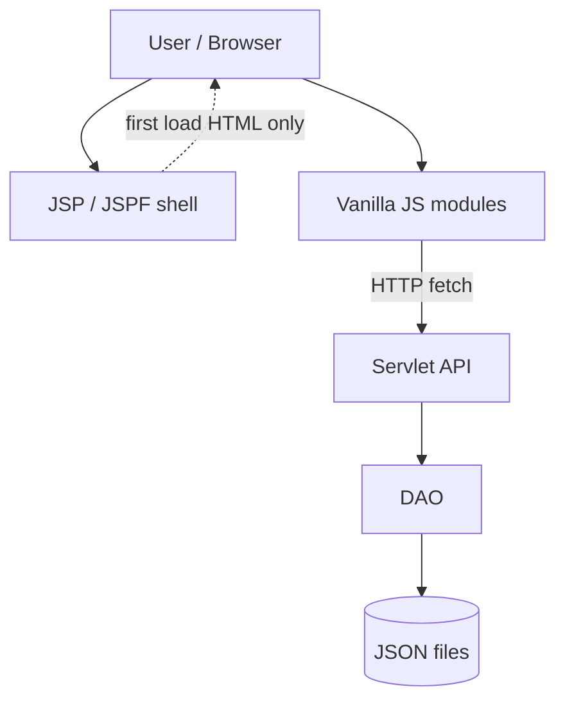
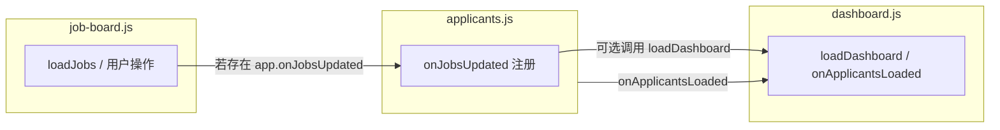

# MO 侧架构与技术栈学习笔记（中期评估前准备）

> 适用范围：本仓库中 `MO (Module Organizer)` 相关前后端代码  
> 目标：用简单语言快速理解“它是什么、怎么跑、为什么这样设计、有哪些局限”

---

## 0. 与课程要求（EBU6304 Handout）对齐

本作业 **`Other Requirements (mandatory)`**（见 `projectFile/EBU6304_GroupProjectHandout.md` §2.2）要求：

- **实现形态**：**轻量级 `Java Servlet` / `JSP` Web 应用**（或独立 Java 程序；本仓库为前者）。
- **持久化**：**所有输入输出以简单文本格式存储**——如 **`.txt` / `CSV` / `JSON` / `XML`**；**不得使用数据库（Do not use a database）**。
- **课程意图**：讲义明确说明，引入 **`Spring Boot`、数据库集成等高级工具** 易偏离本模块以**软件工程基础能力**为主的学习目标；因此本项目的 **`JSON` 文件 + `Servlet`/`JSP` + 原生 `JS`** 属于**符合要求的刻意取舍**，而非“临时凑合”。

**本文档说明**：下文若提到与 `RDBMS`、集群部署等的对比，仅用于**理解 trade-off**；**中期评估（Demo & Viva）**应强调：**当前架构与课程强制约束一致**，不将“上数据库、上框架”作为本项目既定目标。

---

## 1. 一句话看懂 MO 系统

这个项目的 `MO` 侧是基于 **`JSP (JavaServer Pages)` + `Servlet (Jakarta Servlet)`** 的轻量级 `Web` 应用（符合课程要求）；**未使用** `Spring Boot` 等全栈框架，也**未使用** `Vue`/`React` 等前端框架（页面内交互为 **`Vanilla JS`**）。  
页面由服务端 `JSP` 组装，前端用原生 `JavaScript` 处理交互；**持久化**为挂载目录下的 **`JSON` 等文本文件**（**无数据库**）。

---

## 2. 技术栈总览（Tech Stack）

## 后端（Backend）

- 语言：`Java 17`
- Web 标准：`Jakarta Servlet 6.0`（**轻量 Web**，符合作业 §2.2 对 **`Servlet`/`JSP`** 的要求）
- 页面模板：`JSP / JSPF`
- JSON 库：`Gson`（配合 **文本文件**持久化，**无 JDBC/ORM**）
- 构建工具：`Maven`
- 打包方式：`WAR (Web Application Archive)`
- 本地运行：`Jetty Maven Plugin`（默认 `8080`）

## 前端（Frontend）

- 结构：`JSP + HTML + CSS + Vanilla JavaScript`
- 通信：`fetch API`
- 模块组织：全局 `window.MOApp` + `modules.*`
- 样式：MO 页面复用大量 TA 的 `CSS`，再叠加 `mo-home.css`

## 数据层（Data Layer）

- **课程约束**：**不使用数据库**；数据以 **文本文件**形式存放（本仓库主要为 **`JSON`**，亦符合讲义允许的格式）。
- 根目录由 **`DataMountPaths`** / 环境变量指向 `mountDataTAMObupter/`，其下含 `mo/*.json`、`ta/*.json`、`common/*.json` 等。

---

## 3. 项目分层（Architecture Layers）

### 简化视图（MO 侧常用说法）

可以把 MO 侧看成 4 层：

1. **视图层 (View Layer)**：`JSP/JSPF`
2. **前端逻辑层 (Client Logic Layer)**：`assets/mo/js/modules/*.js`
3. **接口层 (API Layer)**：`com.bupt.tarecruit.mo.controller` 下的 `Servlet`
4. **数据访问层 (DAO Layer)**：`com.bupt.tarecruit.mo.dao` + `common.dao`

### 3.0 端到端全栈分层（从浏览器到 JSON）

下面按 **「自下而上」** 说明每一层**下接谁、上接谁**；**`DAO` 上面主要是 `Servlet` 在调用**，**`JSP` 不直接调用 `DAO`**。

| 层次（Layer） | 典型位置 / 技术 | 下接（向下） | 上接（向上） | 做什么 |
| --- | --- | --- | --- | --- |
| **① 持久化层 (Persistence)** | `mountDataTAMObupter/` 下各类 **`.json`**、简历文件等 | 磁盘 / 挂载目录 | **`DAO`** 读写 | 真正存数据（**课程要求：不得使用数据库**，仅用文本文件）；根路径由 **`DataMountPaths`** / 环境变量解析 |
| **② 数据访问层 (`DAO`)** | `com.bupt.tarecruit.mo.dao`、`common.dao` | **JSON 等文件** | **`Servlet`**（及少数 **`Service`** 被 `DAO` 内部调用） | 序列化/反序列化（常 **`Gson`**）、文件路径、**`synchronized`** 等并发控制 |
| **③ 服务层 (`Service`) — 可选** | 如 `MoTaApplicationReadService` | 读 TA 侧 JSON / 拼装视图 | 被 **`DAO`** 或 **`Servlet`** 使用 | 把复杂读逻辑从巨型 `DAO` 拆出；标明「只读 TA」等边界（非所有接口都有独立 `Service`） |
| **④ 控制器 / 接口层 (`Controller` / API)** | `com.bupt.tarecruit.mo.controller.*Servlet`，**`@WebServlet`** | 调 **`DAO` / `Service`** | **`HTTP` 请求**（浏览器 **`fetch`**） | 解析 **`GET` query / `POST` body**，调业务，写 **`JSON` 响应** |
| **⑤ 表现层 — 服务端 (Server-side view)** | **`JSP` / `JSPF`** | 通过容器生成 **HTML** | **用户浏览器首次请求页面** | 拼页面壳、**`<script>` / `<link>`**、注入 **`contextPath`**；**不**直接访问 `DAO` |
| **⑥ 表现层 — 客户端 (Client-side)** | **`assets/mo/js`** 等 | **`HTTP`** 调 `/api/...` | **用户操作**、`DOM` | **`fetch`**、`DOM` 更新、主题/`i18n` 等 |
| **⑦ 用户代理 (Client / User agent)** | 浏览器 | — | — | 发 **HTTP**、渲染 **HTML** |

**典型一次业务请求链路（MO 举例）**：

```text
用户操作 → 浏览器 JS（fetch）→ HTTP → MoXxxServlet
       → MoXxxDao（± Service）→ 读写 JSON 文件
       → Servlet 返回 JSON → JS 更新 DOM
```



**关于「单实例 / 多实例」与分层**：**`synchronized`** 等主要保护**同一 JVM 进程内**多线程写文件；**多台机器 / 多个 JVM 各跑一份应用**才叫 **multi-instance**，与「一台服务器上多用户同时访问」不是同一概念。

**English（EN）**: **Persistence** is file-backed JSON; **DAO** reads/writes it; **Servlets** expose HTTP/JSON APIs; **JSP + browser JS** are presentation—**JSP does not call DAO directly**; data flows **JS → Servlet → DAO → files**.

### 3.1 `JSP` 与 `JavaScript`（JS）：区别与联系（Difference & relationship）

**区别（Difference）—— 谁跑在哪、干什么**

| 维度 | `JSP (JavaServer Pages)` | `JavaScript`（本项目指浏览器里执行的脚本） |
| --- | --- | --- |
| **运行位置（Where it runs）** | **服务端（server）**：在 `Servlet` 容器里先执行，生成响应 | **客户端（client）**：浏览器下载页面后再执行 |
| **主要产物（Main output）** | 拼出 **`HTML` 文档骨架**：标签、`include` 进来的片段、`<link>` / `<script src>` | **操作已有 DOM**、绑定事件、`fetch` 调 API、改文案/主题等 |
| **能否直接访问业务 API 文件** | 服务端可配合 `Java` 类；页面里通常用 `EL` 等输出路径（如 `contextPath`） | 通过 **`HTTP`** 调 `/api/...`，不直接读服务器本地 `json` 文件 |
| **刷新页面会怎样** | 再向服务器要一次 `mo-home.jsp`，重新生成 HTML | 内存里的 `JS` 状态会丢（除非用 `localStorage` 等持久化） |

**联系（Relationship）—— 同一张工作台怎么拼起来**

1. **先 `JSP` 后 `JS`（Order）**  
   `mo-home.jsp` 先把侧栏、主内容区、弹窗 DOM、以及 `<script src=".../mo-home.js">` 等**写进响应**；浏览器解析 HTML 时按顺序下载并执行 `JS`，`mo-home.js` 再调用各 `modules.*` 做初始化。没有 `JSP` 输出的 DOM，`JS` 的 `getElementById` 就无从挂载。

2. **`JSP` 提供「壳」，`JS` 提供「行为」（Shell vs behavior）**  
   `JSP/JSPF` 负责**结构**与静态占位；交互（导航高亮、列表分页、弹窗、`i18n` 切换、`fetch`）在 **`assets/mo/js`** 里完成。

3. **数据分工（Data split）**  
   首屏展示所需的大块结构来自 `JSP`；**业务数据**（岗位列表、应聘人员等）一般由 **`JS` 在页面加载后请求** `/api/mo/...` 拿到 `JSON` 再填进页面（与 `Servlet` + `DAO` 配合）。

**一句话（ZH）**：`JSP` 在服务器上**生成带钩子的页面**；`JS` 在浏览器里**挂钩子、拉数据、响应用户**。

**One-liner（EN）**: `JSP` renders the HTML shell on the **server**; **browser `JS`** attaches behavior, calls APIs, and updates the DOM after load.

### 3.2 `DOM` 是什么？（Document Object Model）

**中文（ZH）**

`DOM` 的全称是 **Document Object Model（文档对象模型）**。可以把它理解成：浏览器把 `HTML` 解析成的一棵**树状结构（tree）**，里面的每一个标签、每一段文字，都是树上的**节点（node）**。

- **从哪来**：服务器返回的 `HTML` 字符串，经浏览器解析后，就变成内存里的 `DOM`。
- **`JS` 怎么用**：通过 `document.getElementById(...)`、`querySelector(...)` 等找到节点，再改 `textContent`、加 `class`、绑 `click`——你们在 `job-board.js`、`applicants.js` 里做的主要就是**读写在操作 DOM**。
- **和「源码」的区别**：你在编辑器里看到的 `JSP`/`HTML` 是**文本**；用户浏览器里参与交互、被脚本修改的，是**已经实例化后的 DOM**（改 DOM 会立刻影响屏幕上的界面，除非被 `CSS` 隐藏等）。

**English（EN）**

The **DOM** is the browser’s **in-memory tree representation** of an HTML document—elements and text are **nodes**. JavaScript interacts with the live page by querying and mutating that tree (`getElementById`, `textContent`, event listeners, etc.).

---

## 4. MO 页面如何被组装（JSP Composition）

核心入口是：`src/main/webapp/pages/mo/mo-home.jsp`

它做了三件事：

1. 通过 `<%@ include %>` 拼接侧栏、顶栏、欢迎区、路由区、弹窗区
2. 引入共享 `CSS`（TA）和 MO 自有 `CSS`
3. 按固定顺序加载 MO JS 模块，最后执行 `mo-home.js` 完成 bootstrap（引导初始化）

这说明它不是前端路由框架（如 `Vue Router` / `React Router`），而是“单页内分区切换”。

### 4.1 CSS 由谁引入？`JSP` 还是 `JS`？（Stylesheet loading）

MO 工作台主页面里，**样式表是在 `mo-home.jsp` 的 `<head>` 中用 `<link rel="stylesheet">` 写死的**，由服务端拼好的 `HTML` 发给浏览器加载，**不是**由 `JavaScript` 去 `import` 或运行时插入 `<link>`（常规路径如此）。

**English（EN）**: Stylesheets are declared in `mo-home.jsp` via `<link rel="stylesheet">`; they are not loaded by JS modules in the normal MO home flow.

`JS`（例如 `settings.js`）会改 **`data-theme`**、语言相关的 **`document.documentElement.lang`** 等，从而影响已加载 `CSS` 的呈现，但**`.css` 文件本身的引用位置仍在 `JSP`**。

### 4.2 `i18n` 是在 `CSS` 里实现的吗？（Internationalization）

**不是。** 本项目里的 **`i18n`（internationalization，国际化）主要是 `JavaScript` + `HTML`/`JSP` 里的 DOM 属性实现的**，**不是**用 `CSS` 切换界面文案。

- **静态/半静态文案**：在 `JSP/JSPF` 生成的元素上使用 `data-i18n*`（如 `data-i18n`、`data-i18n-html`、`data-i18n-placeholder` 等），由 **`settings.js`** 的 `applyLanguage` / `applyI18nToElement` 根据当前语言写入 `textContent`、`innerHTML`、`placeholder` 等。
- **写在逻辑里的句子**：在各模块用 **`app.t('中文','English')`**（由 `settings` 注册到 `MOApp`），按当前语言返回字符串。
- **`CSS` 的职责**：布局、颜色、主题变量等；**暗色/亮色**可与 `data-theme` + `CSS` 有关，但**换语言、换文字内容**属于 **`JS` 改 DOM**，不是样式表里的「翻译」。

**English（EN）**: i18n is driven by JS (`settings.js`) and `data-i18n*` attributes on the DOM, plus `app.t(zh, en)` for strings in code. CSS handles styling (including theme via `data-theme`), not text translation.

---

## 5. 前端模块架构（Frontend Module Architecture）

这一节按「文件 → 启动顺序 → 每个模块干什么 → 它们怎么互相调用」来讲，对应代码主要在 `src/main/webapp/assets/mo/js/`。

## 5.1 先看清楚：有哪些文件、谁先执行？

`mo-home.jsp` 里按**固定顺序**引入脚本（顺序很重要，因为后面的模块会用到前面挂到 `MOApp` 上的函数）：

1. `mo-api-prefix.js`：定义 `window.moApiPath`，给所有 API 自动加 `context path`。
2. `modules/settings.js` → `route-nav.js` → `modal.js` → `job-board.js` → `applicants.js` → `dashboard.js` → `profile.js` → `onboarding.js`
3. 最后：`mo-home.js`：**真正执行**上面各文件里注册的初始化函数。

每个 `modules/*.js` 的模式都一样：向 `window.MOApp.modules` 上挂一个函数，例如：

```js
modules.settings = function initSettings(app) { ... };
modules.jobBoard = function initJobBoard(app) { ... };
```

而 `mo-home.js` 做的事可以概括成三行伪代码：

```js
window.MOApp = window.MOApp || {};
MOApp.state = MOApp.state || {};
['settings','routeNav',...].forEach(name => MOApp.modules[name](MOApp));
```

另外 `mo-home.js` 里有 `__MO_HOME_BOOTSTRAPPED__`：防止重复初始化（double init guard）。

## 5.2 `MOApp` 到底是什么？（namespace pattern）

可以把 `window.MOApp` 理解成一个**全局命名空间（namespace）**，三块东西：

| 成员 | 含义 |
| --- | --- |
| `MOApp.state` | 少量跨模块共享状态，例如 `routeNav` 当前区块、`settings` 里的语言、新手引导是否进行中 |
| `MOApp.modules` | 各模块的 `init(app)` 工厂函数注册表（registry） |
| 直接挂在 `MOApp` 上的方法 | 各模块在初始化时往同一个 `app` 对象上「挂载」的工具函数，例如 `app.openModal`、`app.loadJobs`，供其他模块调用 |

这不是 `React` 那种组件树，也**没有**集中式 `store`；数据大多在各模块自己的闭包变量里（例如 `job-board.js` 里的 `state.jobs`），通过 `app.getJobs()` 这类 getter 暴露出去。

### 5.2.1 详解：`window.MOApp.modules` 是什么意思？（What does it mean?）

分三部分理解（对应英文术语）：

1. **`window`（global object，全局对象）**  
   浏览器里页面脚本共享的顶层对象。挂在它上面的属性，全页任意脚本都能访问（例如 `window.MOApp`）。

2. **`MOApp`（namespace，命名空间）**  
   项目自己建的一个全局对象，用来把 MO 工作台相关的东西收拢在一处，减少「全局函数名互相覆盖」的问题。常见写法：`window.MOApp = window.MOApp || {}`（没有就新建空对象）。

3. **`modules`（module registry，模块注册表）**  
   `MOApp` 上的一个**普通对象**：**键（key）**是模块名字符串（如 `'settings'`、`'jobBoard'`），**值（value）**是对应的初始化函数 `function init(app) { ... }`。  
   各 `modules/*.js` 里会写 `modules.xxx = function init...`，这里的 `modules` 实际就是 `MOApp.modules`。最后由 `mo-home.js` 按固定数组顺序依次调用，例如 `MOApp.modules['settings'](MOApp)`。

**一句话（ZH）**：`window.MOApp.modules` = 挂在全局上的「子模块初始化函数注册表」，不是 `npm` 包管理，也不是 `ES6 import` 自动生成的表，而是**手写对象 + 手动挨个执行**。

**One-liner（EN）**: `window.MOApp.modules` is a **plain-object registry** mapping module names to `init(app)` functions; `mo-home.js` invokes them in order—it is not the Node/npm module system.

## 5.3 启动顺序为什么要这样排？（dependency order）

粗略依赖关系（谁依赖谁）：

- **`settings`** 最先：提供 `app.getMoUser`、`app.t`（中英切换）、`app.applyLanguage`，未登录会跳回 `index.jsp`。
- **`modal`** 要在 **`job-board` / `applicants`** 之前：`settings` 打开设置弹窗会调用 `app.openModal('settings')`。
- **`job-board`** 在 **`applicants`** 之前：应聘人员下拉的课程列表来自岗位数据；`applicants` 会注册 `app.onJobsUpdated`，在岗位列表刷新后更新界面。
- **`dashboard`** 在 **`job-board` + `applicants`** 之后：它需要 `app.getJobs`、`app.loadJobs`、`app.onApplicantsLoaded` 等，用来算总览数字。
- **`onboarding`** 放最后：要用到 `app.activateRoute`、`app.onGuideRouteNav` 等，且通过 `app.state.settings.guideActive` 与导航协作。

## 5.4 每个模块负责什么？（按执行顺序）

### ① `mo-api-prefix.js`（不是 module，但是基础设施）

- **职责**：把相对路径 `/api/...` 变成带部署前缀的绝对路径，避免线上挂在子路径（如 `/myapp`）时请求 404。
- **对外**：`window.moApiPath('/api/mo/jobs')`。

### ② `settings.js` → `modules.settings`

- **职责（中文）**：工作台「壳」行为——登录校验、主题（`data-theme` / `localStorage mo-theme`）、语言（`localStorage mo-language`，默认偏英文）、欢迎区用户名、退出登录、打开设置弹窗入口、设置页 Tab 切换；并把 **i18n** 应用到带 `data-i18n*` 的 DOM 上。
- **职责（English）**: Shell behaviors—auth gate, theme, language, welcome text, logout, settings entry, settings tabs, and applying i18n attributes to the DOM.
- **挂到 `app` 上的常用 API**：`getMoUser`、`setUserData`、`t(zh,en)`、`applyLanguage`、`getCurrentLanguage`、`openSettingsModal`、`activateSettingsTab`。
- **和其它模块的关系**：切语言时会调用（若存在）`refreshJobBoardLanguage`、`refreshApplicantsLanguage`、`refreshOnboardingLanguage`、`loadDashboard` 等——所以它是「总开关」。

### ③ `route-nav.js` → `modules.routeNav`

- **职责**：左侧导航对应的**三个主区块**（`dashboard` / `jobs` / `applicants`）之间切换；**不是**改浏览器 URL 的 `router`。
- **实现要点**：
  - 点击 `.nav-item` → `activateRoute(name)`：给导航项和 `.route` 面板加 `active` class，并 `scrollIntoView` 滚到 `#route-<name>`。
  - 监听 `window.scroll`：根据当前视口里哪块 `.route` 更「居中/可见」，自动高亮侧栏（长页面滚动时侧栏会跟着变）。
  - 切到 `applicants` 时会调用 `app.onApplicantsRouteActivate()`（若存在），用于应聘人员区激活时刷新。
- **新手引导时**：若 `app.state.settings.guideActive`，点击导航会先走 `app.onGuideRouteNav(route)`，避免用户随意跳出引导步骤。
- **挂到 `app` 上**：`activateRoute`、`syncNavByScroll`。

### ④ `modal.js` → `modules.modal`

- **职责**：统一管理 `#taModalOverlay` 里的多个 `.ta-modal-panel`（复用 TA 的弹窗 DOM 结构）。
- **行为**：`openModal(name)` / `closeAllModals()`；点击遮罩空白关闭；`Escape` 关闭；`data-modal-target` 按钮打开对应面板。
- **挂到 `app` 上**：`openModal`、`closeAllModals`。
- **典型用法**：发布岗位、课程详情、设置、应聘人员详情等弹窗都走这一套。

### ⑤ `job-board.js` → `modules.jobBoard`（体量最大）

- **职责**：MO 的「课程/岗位」主功能——拉取并展示岗位列表、搜索与分页、打开发布/编辑表单、教学周与技能标签等复杂表单、与 `/api/mo/jobs` 交互。
- **内部状态**：例如 `state.jobs` 缓存当前 MO 名下的岗位数组。
- **挂到 `app` 上（节选）**：
  - `getJobs()` / `loadJobs()`：给 dashboard、applicants 下拉用。
  - `showMoCourseJobDetail(item)`：打开课程详情弹窗。
  - `refreshJobBoardLanguage()`：语言切换时重绘文案。
  - 若干 `syncPublishJobNav` / `scrollPublishJobToSection` 等与发布向导 UI 相关的辅助函数。
- **协作点**：岗位数据更新后会调用 `app.onJobsUpdated(jobs)`（如果 dashboard/applicants 已注册回调），让总览和应聘人员列表跟着更新。

### ⑥ `applicants.js` → `modules.applicants`

- **职责**：应聘人员列表、按课程筛选、分页、未读徽标（调用 `/api/mo/applicants/unread-count`）、打开详情模态框、标记已读、评论、录用/拒绝等（具体 API 见后端 README）。
- **挂到 `app` 上（节选）**：
  - `onJobsUpdated`：**在这里注册**——岗位列表一变，就重填课程下拉、并可触发 `loadDashboard`。
  - `navigateToApplicantsWithCourse` / `setApplicantCourse`：从岗位详情「跳到应聘人员并预选课程」。
  - `onApplicantsRouteActivate`：给 `routeNav` 用，进入应聘人员区时刷新列表/徽标。
  - `formatApplicantStatusDisplay`：把后端返回的中文状态映射成当前语言展示（dashboard 也会用）。
  - `refreshApplicantsLanguage`、`refreshMoApplicantUnreadBadge`、`openMoApplicantDetail` 等。
- **协作点**：拉完应聘人员后调用 `app.onApplicantsLoaded(items)`，供 **dashboard** 做统计。

### ⑦ `dashboard.js` → `modules.dashboard`

- **职责**：「招聘总览」数字卡片与摘要——开放岗位数、候选规模、已录用/待决策等；从 `getJobs()` + 应聘人员数据聚合计算；提供刷新按钮与提示文案（例如有待决策申请时提示去应聘人员区处理）。
- **挂到 `app` 上（节选）**：`loadDashboard`（内部会拉数据并渲染）、`onApplicantsLoaded`（**在这里注册**）、`refreshMoWorkspaceAll`（一键刷新多模块）。
- **和其它模块的关系**：依赖 `job-board` 提供的 `getJobs` / `loadJobs`，依赖 `applicants` 提供的加载/未读接口；并用 `formatApplicantStatusDisplay` 统一状态文案。

### ⑧ `profile.js` → `modules.profile`

- **职责**：设置弹窗里「个人资料」表单——`GET/POST /api/mo/profile-settings` 加载与保存资料、头像选择与上传、`/mo-assets` 静态头像路径、修改密码。
- **挂到 `app` 上**：主要是 `refreshProfileLanguage`（语言切换时刷新保存状态文案）。
- **注意**：文件底部也向 `MOApp.modules.profile` 注册；与 `mo-home.js` 的命名一致即可被 bootstrap 调用。

### ⑨ `onboarding.js` → `modules.onboarding`

- **职责**：首次进入工作台的新手引导（高亮、步骤文案、上一步/下一步、跳过）；步骤里会调用 `activateRoute` 带你去 `dashboard` → `jobs` → `applicants` → 用户菜单。
- **状态**：通过 `app.state.settings.guideActive = true/false` 告诉 `routeNav`：引导进行中时，滚动自动同步导航等行为要受限或走 `onGuideRouteNav`。

## 5.5 模块之间怎么协作？（不是 Redux，是「回调 + 共享 app」）

可以把它想成：**每个模块往同一个 `app` 对象上挂函数，别的模块 later 调用**。常见链路：



再加上 **`settings`** 切语言 → 调用各模块的 `refresh*Language` 和 `loadDashboard`，以及 **`routeNav`** → 调用 `onApplicantsRouteActivate`。

**优点**：实现快、调试时可以在控制台直接看 `MOApp` 上挂了什么。  
**缺点**：依赖关系靠约定（convention），没有类型检查；模块多时容易出现「隐式顺序依赖」。

## 5.6 和「路由」相关的再强调一句

- **URL 不会变**成 `#/jobs` 这种；刷新浏览器会回到 `mo-home.jsp` 默认状态。
- 「路由」= **哪一个 `.route` 面板处于 `active`** + **侧栏哪一项高亮** + **页面滚到哪里**。

---

## 6. 认证与会话（Authentication & Session）

## 6.1 登录流程

入口页：`src/main/webapp/index.jsp`（登录/注册）  
登录脚本：`assets/common/js/index.js`

- MO 登录请求：`POST /api/mo/login`
- 登录成功：前端保存 `mo-user`（`sessionStorage/localStorage`）
- 页面跳转：`pages/mo/mo-home.jsp`

## 6.2 会话特征

当前架构并未看到典型服务端会话绑定（如严格依赖 `HttpSession` + 后端鉴权上下文），而是前端每次请求带 `moId`。  
后端通过“资源归属校验（ownership check）”做授权判断，例如课程 `ownerMoId` 是否等于传入 `moId`。

---

## 7. API 设计（MO Servlet APIs）

MO API 由 **`@WebServlet`** 暴露，实现类在包 `com.bupt.tarecruit.mo.controller`；**更细的契约**见源码内注释与 `src/main/java/com/bupt/tarecruit/mo/controller/README.md`。

**前端路径**：通过 `mo-api-prefix.js` 的 `window.moApiPath('/api/mo/...')` 自动拼接 **`context path`（应用部署前缀）**，避免应用挂在子路径（如 `/myapp`）时请求缺前缀导致 **404**。

### 7.0 MO 接口一览（路径 · 方法 · 作用）

| 路径 `URL path` | `HTTP` 方法（常用） | 作用说明（中文） | 对应 `Servlet`（类名） |
| --- | --- | --- | --- |
| `/api/mo/login` | `POST` | **MO 登录**：用标识符（MO ID / 用户名 / 邮箱 / 手机号）+ 密码校验；成功返回用户基本信息（供前端存 `mo-user`）。 | `MoLoginServlet` |
| `/api/mo/register` | `POST` | **MO 注册**：创建新账号；校验字段后在 `mountData.../mo/` 下初始化 `mos.json`、`profiles.json`、`settings.json` 等。 | `MoRegisterServlet` |
| `/api/mo/jobs` | `GET` | **岗位列表**：按查询参数 **`moId`** 只返回**当前 MO 名下**的岗位（匹配 `ownerMoId`）。 | `MoJobBoardServlet` |
| `/api/mo/jobs` | `POST` | **发布新课程/岗位**：请求体为 JSON；**归属 MO** 以查询参数或 body 里的 **`moId`** 为准（防伪造 `ownerMoId`）。 | `MoJobBoardServlet` |
| `/api/mo/jobs` | `PUT` | **更新已有岗位**：JSON 补丁式更新；**不能**随意改归属，需校验本人管理该课程。 | `MoJobBoardServlet` |
| `/api/mo/skill-tags` 或 `/api/common/skill-tags` | `GET` | **技能标签列表**：给发布/编辑岗位时的技能选择器用（两端路径等价、便于复用）。 | `MoSkillTagsServlet` |
| `/api/mo/applicants` | `GET` | **应聘人员列表**：需 **`moId`**；可选 **`courseCode`** 只查一门课；返回 `items`、`count`、`unreadCount`（未读数）。 | `MoApplicantsServlet` |
| `/api/mo/applicants/detail` | `GET` | **单条申请详情**：需 **`moId` + `applicationId`**；含 TA 快照、课程快照、简历元数据、事件、MO 评论、决策信息等。 | `MoApplicantDetailServlet` |
| `/api/mo/applicants/unread-count` | `GET` | **未读申请条数**：需 **`moId`**；供侧栏徽标、总览等展示。 | `MoApplicantsUnreadServlet` |
| `/api/mo/applications/mark-read` | `POST` | **标记已读**： body JSON 含 `moId`、`applicationId`；MO 侧记已读，并可将 TA 申请同步为审核中等（见后端实现）。 | `MoApplicationMarkReadServlet` |
| `/api/mo/applications/comment` | `POST` | **MO 评论**： body JSON 含 `moId`、`applicationId`、`text`；追加仅 MO 侧维护的评论线程。 | `MoApplicationCommentServlet` |
| `/api/mo/applications/resume` | `GET` | **下载/查看简历文件流**：需 **`moId` + `applicationId`**，先校验岗位归属再返回文件（前端可用新标签打开链接）。 | `MoApplicantResumeServlet` |
| `/api/mo/applications/select` | `POST` | **招聘决策**： body JSON 含 `courseCode`、`taId`、`moId`、`decision`（如录用 / 拒绝 / 撤回等）及可选备注；写入 TA 侧 `application-status.json` 等并参与统计同步。 | `MoApplicationDecisionServlet` |
| `/api/mo/profile-settings` | `GET` | **读取 MO 资料与设置**：查询参数 **`moId`**；合并账号、资料、主题等用于设置弹窗展示。 | `MoProfileSettingsServlet` |
| `/api/mo/profile-settings` | `POST` | **保存资料或改密码**：多为 `multipart/form-data`（`FormData`），可带头像上传；`action=password` 时表示改密。 | `MoProfileSettingsServlet` |
| `/mo-assets/*` | `GET`（静态） | **头像等静态资源路径**（由 `MoProfileSettingsServlet` 映射说明）；具体以服务端实现为准。 | 同 `README` 中与 profile 一并说明 |

**English（EN）**: Each row is a **JSON-oriented servlet endpoint**: auth (`login`/`register`), job board CRUD-like (`jobs`), applicant screening (`applicants*`, `applications/*`), and profile (`profile-settings` / `mo-assets`).

### 7.1 MO 侧交互请求用的 `HTTP` 方法（GET / POST / PUT）

本节按 **HTTP 方法**归类；**每个路径具体干什么**以 **§7.0 一览表**为准。

**规律**：**读数据多用 `GET`**（参数多在 **query string**）；**新建 / 提交动作用 `POST`**；**更新已有岗位用 `PUT`**。并非「全是 `POST`」。

#### `GET`（`fetch` 未写 `method` 时默认为 `GET`）

用于查询类接口，例如：

| 用途 | 路径（示例） |
| --- | --- |
| 技能标签 | `/api/mo/skill-tags` |
| 岗位列表 | `/api/mo/jobs?moId=...` |
| 应聘人员列表 | `/api/mo/applicants?moId=...`（可选 `&courseCode=...`） |
| 未读条数 | `/api/mo/applicants/unread-count?moId=...` |
| 申请人详情 | `/api/mo/applicants/detail?moId=...&applicationId=...` |
| 加载个人资料 | `/api/mo/profile-settings?moId=...`（`profile.js`） |

**简历下载**：详情里「查看简历」使用 `<a href=".../api/mo/applications/resume?...">` 在新标签打开，浏览器请求为 **`GET`**（非 `fetch`）。

#### `POST`

- **登录 / 注册**（`index.jsp` → `assets/common/js/index.js`）：`POST`，`Content-Type: application/x-www-form-urlencoded`，body 为表单字段（如 `identifier`、`password`）。
- **新建岗位**（`job-board.js`）：`POST /api/mo/jobs?moId=...`，`Content-Type: application/json`。
- **标记已读、评论、录用/拒绝/撤回**（`applicants.js`）：`POST` 对应 `/api/mo/applications/*`，body 多为 **JSON**。
- **保存资料 / 改密码**（`profile.js`）：`POST /api/mo/profile-settings`，body 为 **`FormData`**（`multipart/form-data`，可带头像文件）。

#### `PUT`

- **更新已有岗位**（`job-board.js`）：`PUT /api/mo/jobs?moId=...`，`Content-Type: application/json`。

**English（EN）**: MO client uses **`GET`** for reads (often with query params), **`POST`** for creates and workflow actions (JSON, form-urlencoded, or `FormData`), and **`PUT`** for updating an existing job posting.

---

## 8. 数据存储设计（Data Persistence）

## 8.1 数据根目录解析

`DataMountPaths` 使用环境变量 `mountDataTAMObupter` 定位数据根目录。  
若没设置，就回退到项目相对目录 `mountDataTAMObupter`。

## 8.2 MO 关键数据文件

MO 账户域：

- `mo/mos.json`：账号、认证信息（含盐值 `salt` 与哈希 `hash`）
- `mo/profiles.json`：资料
- `mo/settings.json`：设置

MO 流程域：

- `mo/mo-application-read-state.json`：已读状态
- `mo/mo-application-comments.json`：评论线程

跨域共享：

- `common/recruitment-courses.json`：岗位板主数据
- `ta/applications.json`、`ta/application-status.json`、`ta/application-events.json`：MO 读取并参与状态流转
- `ta/resume/...`：简历文件

## 8.3 DAO 特点

`MoAccountDao`、`MoRecruitmentDao` 大量方法使用 `synchronized`，通过 **JVM 内锁**控制对同一文件的并发写，适合**本课程单机部署**场景。  
（**说明**：「多实例」指多个应用进程同时写同一批文件；与「一台服务器上多用户并发」不是同一概念，见 §3.0。）

---

## 9. 典型请求链路（Request Flow）

## 9.1 登录链路

1. `index.jsp` 提交登录表单
2. `POST /api/mo/login`
3. `MoLoginServlet -> MoAccountDao.login()`
4. DAO 读取 `mos.json` 校验密码哈希
5. 返回用户对象
6. 前端保存 `mo-user` 并跳转 `mo-home.jsp`

## 9.2 岗位管理链路（发布/编辑）

1. `job-board.js` 发起 `/api/mo/jobs`
2. `MoJobBoardServlet -> MoRecruitmentDao`
3. DAO 读写 `common/recruitment-courses.json`
4. 根据 `ownerMoId` 过滤或更新，仅允许本人管理自己的岗位

## 9.3 申请人链路（列表/详情/决策）

1. `applicants.js` 调用 `/api/mo/applicants*`
2. `MoApplicantsServlet / MoApplicantDetailServlet`
3. `MoRecruitmentDao` 聚合 TA 投递数据 + MO 已读状态 + 评论
4. 决策接口 `/api/mo/applications/select` 更新申请状态并回写统计

---

## 10. 前端核心模块职责（中期评估前最该熟悉）

## `settings.js`

- 登录用户信息读取与缓存
- 主题（theme）、国际化文本（i18n）等基础能力
- 常作为其他模块的依赖来源（例如 `app.getMoUser()`）

## `route-nav.js`

- 左侧导航与页面分区切换
- 激活态同步与滚动定位

## `modal.js`

- 全局弹窗开关逻辑（open/close）
- 给 `job-board`、`applicants`、`profile` 提供基础弹窗能力

## `job-board.js`

- 岗位列表、分页、检索
- 发布/编辑岗位表单
- 技能标签、教学周、考核节点等复杂 UI 逻辑
- 与 `/api/mo/jobs`、`/api/mo/skill-tags` 高频交互

## `applicants.js`

- 申请人列表、分页、筛选
- 未读数徽标（badge）刷新
- 详情、标记已读、评论、录用/拒绝等操作

## `dashboard.js`

- 汇总指标展示（指标通常来自 jobs/applicants 数据）

## `profile.js`

- 资料与密码设置相关界面逻辑

## `onboarding.js`

- 新手引导（guide）流程控制

---

## 11. 架构优点（Strengths）

- **符合课程强制要求**：轻量 **`Servlet`/`JSP`** + **文本文件（JSON）** 持久化，与讲义 §2.2 一致
- **链路可讲解**：从页面 → `fetch` → `Servlet` → `DAO` → 文件，适合演示与 Viva
- **部署简单**：`WAR` 打包、`Jetty`/`Tomcat` 即可运行
- **刻意避免框架依赖**：不把精力耗在 `Spring` 配置或 ORM 上，聚焦需求、设计与模块划分

---

## 12. 架构风险与局限（Risks / Limitations）

> 下列局限在**课程原型**语境下可接受；说明它们是为了在 Viva 中展示你**理解 trade-off**，而非暗示必须改用数据库或现代框架。

## 12.1 安全（Security）

- 会话更多依赖前端携带 `moId`，**后端必须**做好资源归属（`ownerMoId` 等）校验
- 若校验不完整，存在越权（authorization bypass）**风险**——应在设计与测试中说明已做哪些检查

## 12.2 并发与一致性（Concurrency & consistency）

- **`JSON` 文件 + `synchronized`**：主要保证**同一 JVM 进程内**多线程写入时的基本安全
- **跨多文件写入**无数据库级 **transaction**：异常时可能出现部分写入；课程范围内可通过写入顺序与测试说明缓解
- **多 JVM / 多机部署**不在本课程强制范围；讲义数据以**单机文件**为主

## 12.3 可维护性（Maintainability）

- 前端以**全局 `MOApp` + 脚本加载顺序**组织，模块间为**约定式**依赖，需在文档与命名上保持清晰
- 单文件（如 `job-board.js`）较大时，可在**不引入构建工具**前提下拆分为更多 `*.js` 并由 `JSP` 按序加载

---

## 13. 中期评估前建议这样复习（Practical Study Plan）

按下面顺序读代码，效率最高：

1. `pages/mo/mo-home.jsp`（先看页面骨架和脚本加载顺序）
2. `assets/mo/js/mo-home.js`（看模块启动器）
3. `assets/mo/js/modules/settings.js`（看用户与全局状态来源）
4. `assets/mo/js/modules/job-board.js`（看岗位主流程）
5. `assets/mo/js/modules/applicants.js`（看申请人主流程）
6. `src/main/java/com/bupt/tarecruit/mo/controller/README.md`（对照接口）
7. `src/main/java/com/bupt/tarecruit/mo/dao/MoRecruitmentDao.java`（看业务聚合核心）
8. `src/main/java/com/bupt/tarecruit/mo/dao/MoAccountDao.java`（看登录注册与资料）
9. `src/main/java/com/bupt/tarecruit/common/config/DataMountPaths.java`（看数据文件映射）

---

## 14. 面向中期评估 / Viva 的“可讲清楚版本”（你可以直接口述）

可以用这段话在 **Demo / Viva** 时解释（中英双语）：

**中文（ZH）**

> 我们的 MO 侧按照 **EBU6304** 要求采用轻量 **`JSP + Servlet`**。页面由 `mo-home.jsp` 组装，前端用原生 **`JavaScript`** 和 **`MOApp`** 管理模块（如 **`job-board`**、**`applicants`**）。接口由 **`@WebServlet`** 暴露，持久化由 **`DAO`** 读写 **`JSON` 文本文件**（**不使用数据库**），路径由 **`DataMountPaths`** 解析。  
> 该方案满足课程对「简单文本存储 + 基础 Web 技术」的约束，便于在演示中讲清分层与数据流。

**English（EN）**

> The MO workspace follows the **EBU6304** constraint: a lightweight **`JSP + Servlet`** web app. The shell is composed in `mo-home.jsp`; the client uses vanilla **`JavaScript`** and **`MOApp`** for modules such as **`job-board`** and **`applicants`**. APIs are **`@WebServlet`** endpoints; persistence is **`DAO`** reading/writing **`JSON` files** (**no database**), with paths resolved by **`DataMountPaths`**.  
> This matches the coursework requirement for plain-text storage and fundamental Java web technologies, and makes the layer/data flow easy to demonstrate.

---

## 15. 术语表（Glossary）

- `EBU6304 Handout`：课程项目说明文档（`projectFile/EBU6304_GroupProjectHandout.md`）；§2.2 规定 **`Servlet`/`JSP`** + **文本文件存储**、**不得使用数据库**、避免以高级框架喧宾夺主
- `JSP (JavaServer Pages)`：服务端页面模板技术
- `Servlet (Jakarta Servlet)`：Java Web 接口处理标准
- `WAR (Web Application Archive)`：Java Web 打包格式
- `DAO (Data Access Object)`：数据访问对象
- `Bootstrap (module bootstrap)`：模块初始化引导过程
- `Context Path`：应用部署路径前缀
- `DOM (Document Object Model)`：浏览器把 HTML 解析成的文档树；JS 通过操作 DOM 节点来改页面内容与行为
- `Fetch API`：浏览器异步请求接口
- `Session Storage / Local Storage`：浏览器本地存储
- `Authentication`：身份认证（你是谁）
- `Authorization`：权限控制（你能做什么）
- `Scalability`：系统扩展能力
- `Consistency`：数据一致性
- `Coupling`：模块耦合度

---

## 16. 小结（Summary）

MO 侧本质是「**课程规定的技术栈** + **文本文件持久化**」的实现：

- 分层清晰，便于 **中期评估 Demo 与 Viva** 讲解；
- **不使用数据库、不依赖 Spring 等现代框架**，与讲义目标一致；
- 局限（鉴权模型、文件并发等）属于**原型级**取舍，可在迭代报告/说明中阐述测试与校验策略。

**English（EN）**

The MO side implements the **mandatory coursework stack**: **Servlet/JSP** plus **file-based JSON** persistence—no database, no Spring-style framework. Layering supports the **intermediate demo and viva**; limitations are acceptable prototype trade-offs to document and test.

如果你要准备**中期评估**，重点抓住三件事：

1. 页面如何初始化模块（`mo-home.jsp` + `mo-home.js`）
2. 业务如何走 API（`job-board.js` / `applicants.js` -> `Mo*Servlet`）
3. 数据最终写到哪里（`DataMountPaths` + 各类 `json`）

**English（EN）**

1. How the page bootstraps modules (`mo-home.jsp` + `mo-home.js`).
2. How features call APIs (`job-board.js` / `applicants.js` → `Mo*Servlet`).
3. Where data is persisted (`DataMountPaths` + JSON files).

---

## 17. 5 分钟速记版（Quick Revision in 5 Minutes）

## 第 1 分钟：说清架构类型

**中文（ZH）**

- 这是传统 `Java Web` 架构：`JSP + Servlet + DAO`。
- 不是 `Spring Boot` / 全栈框架；不是 `Vue/React SPA`（前端为原生 `JS`）。
- 数据层按课程要求为 **文本文件**（本仓库以 **`JSON`** 为主），**不使用数据库**。

**English（EN）**

- It is a classic `Java Web` stack: `JSP + Servlet + DAO`.
- It is not `Spring Boot` / a full-stack framework; not a `Vue/React SPA` (vanilla JS).
- Persistence is **text files** (here mainly **`JSON`**), **no database**, per coursework rules.

## 第 2 分钟：说清页面如何启动

**中文（ZH）**

- 登录页是 `index.jsp`，成功后跳 `pages/mo/mo-home.jsp`。
- `mo-home.jsp` include 各个 `jspf` 片段，形成完整页面。
- JS 按顺序加载，最终由 `mo-home.js` 初始化 `MOApp.modules`。

**English（EN）**

- Login lives in `index.jsp`, then we navigate to `pages/mo/mo-home.jsp`.
- `mo-home.jsp` includes `jspf` fragments to assemble the full page.
- Scripts load in order; `mo-home.js` finally bootstraps `MOApp.modules`.

## 第 3 分钟：说清两个核心前端模块

**中文（ZH）**

- `job-board.js`：岗位发布、编辑、搜索、分页、技能标签等。
- `applicants.js`：申请人列表、详情、未读、评论、录用/拒绝。

**English（EN）**

- `job-board.js`: publish/edit jobs, search, pagination, skill tags, etc.
- `applicants.js`: applicant list, details, unread badges, comments, hire/reject flows.

## 第 4 分钟：说清后端接口与业务入口

**中文（ZH）**

- 后端接口是 `@WebServlet`，URL 以 `/api/mo/*` 为主。
- 核心 Servlet：`MoJobBoardServlet`、`MoApplicantsServlet`、`MoLoginServlet` 等。
- 核心业务在 DAO：`MoRecruitmentDao`、`MoAccountDao`。

**English（EN）**

- APIs are `@WebServlet` mappings, mostly under `/api/mo/*`.
- Key servlets include `MoJobBoardServlet`, `MoApplicantsServlet`, `MoLoginServlet`, etc.
- Core logic sits in DAOs such as `MoRecruitmentDao` and `MoAccountDao`.

## 第 5 分钟：说清局限与**课程范围内**的改进

**中文（ZH）**

- 前端传 `moId`：**后端归属校验**必须严谨（可在 Viva 中列举检查点）。
- **文件存储**是讲义要求，不是缺陷；多机扩展不在本课强制范围。
- **改进**仍须在约束内：如加强校验与异常处理、拆分 `JS` 模块、补充自动化测试与文档——**不**将「上数据库 / Spring」作为本项目必做项。

**English（EN）**

- **`moId` on the client** requires strict **server-side ownership checks** (list them in viva).
- **File storage** is **mandatory** for this module—not a workaround; clustered deployment is out of scope.
- **Improvements within rules**: validation, error handling, splitting JS files, tests, docs—not adopting a **database** or **Spring** as a project requirement.

---

## 18. 中期评估高频追问与参考回答（Q&A）

> 说明：每题先给中文口述稿，再给英文口述稿（适合 **Viva** 英文提问）。

## Q1：你们为什么选 `JSP + Servlet`，而不是 `Spring Boot`？

**中文（ZH）**  
**EBU6304** 要求轻量 **`Servlet`/`JSP`**，且讲义明确说明 **`Spring Boot`、数据库等**易占用大量时间在框架配置上、偏离软件工程基础目标。我们选择 **`JSP + Servlet`**，是为了把精力放在需求、分层、文件持久化与测试上；**不使用 `Spring Boot` 是符合作业要求的选择**，不是技术能力不足。

**English（EN）**  
**EBU6304** mandates a lightweight **`Servlet`/`JSP`** web app; the handout states that **`Spring Boot` and databases** can distract from core SE learning. We use **`JSP + Servlet`** to focus on requirements, layering, JSON file persistence, and testing—**avoiding Spring is coursework-compliant**, not a skill gap.

## Q2：MO 页面是不是单页应用（SPA）？

**中文（ZH）**  
不是典型 `SPA framework`。MO 更像“单页工作台”：由 `mo-home.jsp` 一次性渲染，再用 `Vanilla JS` 做区块切换与数据刷新。

**English（EN）**  
Not in the usual sense of a `SPA framework`. MO is a single-page workspace: `mo-home.jsp` renders once, then vanilla JavaScript swaps sections and refreshes data—no client-side router library.

## Q3：MO 的“路由”怎么实现？

**中文（ZH）**  
不是 URL 路由，而是 DOM 区块切换。侧栏点击触发 `route-nav.js`，用 `data-route` 和 class 控制激活，并用 `scrollIntoView` 滚到对应区域。

**English（EN）**  
It is not URL routing; it is in-page section switching. Sidebar clicks run `route-nav.js`, which toggles active classes using `data-route` and scrolls the target panel into view.

## Q4：登录态怎么保持？

**中文（ZH）**  
前端把登录返回的用户信息存到 `sessionStorage/localStorage`（如 `mo-user`），后续请求携带 `moId`。后端通过资源归属（例如 `ownerMoId`）做授权校验。

**English（EN）**  
The client stores the signed-in user in `sessionStorage`/`localStorage` (e.g. `mo-user`) and sends `moId` on later calls. The server authorizes by ownership checks such as matching `ownerMoId` on jobs.

## Q5：没有数据库会不会有问题？

**中文（ZH）**  
**课程禁止使用数据库**（讲义 §2.2），所以 **`JSON` 文本文件**是**规定方案**，不是偷懒。局限在于无 SQL 查询、无 DB 事务；我们在设计里用 **`DAO` 封装读写、必要时 `synchronized`**，并在报告中说明边界与测试——这正好体现软件工程里的 **trade-off 论证**。

**English（EN）**  
The **handout forbids a database** (§2.2), so **`JSON` files** are the **required** persistence style. Limits include no SQL and no DB transactions; we mitigate with **`DAO`** encapsulation and **`synchronized`** where needed, and we document trade-offs—matching the module’s learning goals.

## Q6：如何保证数据并发安全？

**中文（ZH）**  
在**单机、单 JVM**（课程常规部署）下，主要靠 **`DAO` 的 `synchronized`** 与顺序化写文件，避免多线程同时破坏同一 **`JSON`**。**多进程同时写同一文件**不在本作业必达场景；若 Viva 问到，说明**课程约束为文本文件存储**，我们已在实现范围内做进程内同步。

**English（EN）**  
For a **single JVM** (typical for this module), we use **`synchronized` DAO methods** and careful writes to protect shared **JSON** files. Multi-process file locking is **out of coursework scope**; we explain the **file-based constraint** and what we actually guarantee.

## Q7：`job-board.js` 文件很大，怎么解释可维护性？

**中文（ZH）**  
它把岗位主流程集中在一个文件，迭代开发时改动集中、易跟踪；若继续膨胀，可在**不引入打包工具**的前提下拆成多个 **`*.js`** 并由 **`JSP` 按序加载**，或按功能块抽函数，降低单文件复杂度。

**English（EN）**  
It keeps the job workflow in one file for fast iteration and traceability. If it grows further, we can split into more **vanilla `*.js`** files loaded in order from **`JSP`**—no build toolchain required by the coursework.

## Q8：MO 和 TA 的数据如何关联？

**中文（ZH）**  
MO 通过课程与岗位归属（`courseCode`、`ownerMoId`）读取 TA 的投递与状态文件，并维护 MO 侧的已读与评论 JSON，实现跨角色联动。

**English（EN）**  
MO links to TA data via course ownership (`courseCode`, `ownerMoId`), reads TA application/status/event files, and stores MO-specific read states and comment threads in separate JSON files.

## Q9：你们的 API 规范化程度如何？

**中文（ZH）**  
接口由 **`@WebServlet` 路径** + **`mo/controller/README.md`** 对照说明；前端统一 **`fetch`** 与 **`moApiPath`**。对 **6 人小组与课程里程碑**已足够；若需更形式化，可在不引入重型工具前提下维护**表格或注释**（讲义未要求 `OpenAPI` 工具链）。

**English（EN）**  
We document endpoints via **`@WebServlet`** and **`README.md`**; the client uses **`fetch`** and **`moApiPath`**. That is adequate for the team and module milestones; optional extra docs can stay lightweight—no **`OpenAPI` toolchain** is required by the handout.

## Q10：在**不违反课程约束**的前提下，你会优先改进哪三件事？

**中文（ZH）**

1. **安全与校验**：收紧 **`moId` / `ownerMoId`** 相关校验、错误提示与日志，必要时加强密码与输入校验（仍用文件存储）。  
2. **结构与可测性**：在不引入前端构建工具的前提下，**拆分过大 `JS` 文件**、补充 **`JUnit`** 与关键路径的手动/自动化测试说明。  
3. **文档与可运维性**：完善 **README 部署步骤**、数据目录说明、已知限制列表——便于助教检查与小组交接。

**English（EN）**

1. **Security & validation**: tighten **`moId`/`ownerMoId`** checks and error handling (still **file-backed**).  
2. **Structure & testing**: split large **vanilla JS** files where helpful; add **`JUnit`** and describe tests—**no new frameworks required**.  
3. **Docs & operability**: improve **README**, data mount instructions, and known limitations for reviewers.

（**注意**：**不能**将「引入数据库 / `Spring Boot`」作为符合 **EBU6304 §2.2** 的答题方向。）

---

## 19. 30 秒电梯陈述（Elevator Pitch）

**中文（ZH）**

MO 侧满足 **EBU6304**：轻量 **`JSP + Servlet`**，页面由 `JSP` 组装，**`Vanilla JS` + `MOApp`** 管理岗位与应聘人员流程，**`@WebServlet`** 提供 `/api/mo/*`，**`DAO`** 读写 **`JSON` 文本文件**（**无数据库**）。链路短、可演示、与讲义强制要求一致。

**English（EN）**

The MO side matches **EBU6304**: lightweight **`JSP + Servlet`**, **`Vanilla JS` + `MOApp`** for jobs and applicants, **`@WebServlet`** for `/api/mo/*`, and **`DAO`** over **`JSON` files** (**no database**). Short stack, demo-friendly, and aligned with the mandatory handout constraints.

---

## 20. 中期评估（Intermediate assessment）与 MO 话术清单

> 依据：`projectFile/EBU6304_GroupProjectHandout.md` **§5.2 Intermediate assessment（20%）** 与 **§4 Timeline**（**BUPT Week 6 / 12 April 2026**：**Demonstration and Viva**）。**本文档仅覆盖中期评估**；**不**展开期末（Final）提交与评分细节。本节整理 **MO 侧架构讲解**相关准备；**Git 协作、小组分工**以讲义全文为准。

### 20.1 讲义里中期评估要做什么？

| 项目 | 说明 |
| --- | --- |
| **形式** | **Demo & Viva**：向「客户」汇报进度并演示**当前可运行版本**（模拟真实评审场景）。 |
| **全员** | **所有组员参加**；每人建议准备约 **2 分钟**陈述（讲义用语：*ideally with each member speaking for 2 minutes*）。 |
| **提问** | 每人 **1～2 个**问题（*1 or 2 questions during the viva*）。 |
| **GitHub** | 检查**最新代码**与**个人贡献**；截止日前各分支应 **merge 到 `master` / `main`**（以讲义表述为准）。 |
| **权重** | **20%**（小组分 × 个人系数，详见讲义 **§5.2** 与 **§6** 中 *Intermediate assessment* 一行）。 |

### 20.2 演示前自检（与 MO 相关）

1. **能跑通**：`mvn` 启动或按 **README** 部署；数据目录 **`mountDataTAMObupter`**（或环境变量）可读可写。  
2. **MO 路径**：从 **`index.jsp`** 登录 MO → 进入 **`pages/mo/mo-home.jsp`** → 至少演示 **岗位（jobs）** 与 **应聘人员（applicants）** 一条完整路径。  
3. **口径一致**：强调 **无数据库**、**`Servlet`/`JSP` + `JSON` 文件**（见 **§0**），避免在答辩中主动提出「应改用 Spring/MySQL」（与 **§2.2 强制要求**冲突）。  
4. **英文**：若现场要求 **English Q&A**，可直接使用本文 **§18**；主流程说明可用 **§19 电梯陈述** 扩成约 1～2 分钟。

### 20.3 MO 负责人「约 2 分钟」口述结构（建议）

**中文（ZH）**（可按角色删减）

1. **角色与目标（20s）**：MO（Module Organizer）负责发布课程岗位、筛选 TA 申请人；我们 MO 工作台在 **`mo-home.jsp`** 单页内完成。  
2. **技术栈合规（30s）**：前端 **`Vanilla JS`**（**`MOApp.modules`**），后端 **`@WebServlet`**，数据 **`DAO` → JSON 文件**，**符合 EBU6304 §2.2**（无数据库、无 Spring）。  
3. **模块与数据流（40s）**：**`job-board.js`** 调 **`/api/mo/jobs`**；**`applicants.js`** 调 **`/api/mo/applicants*`**；导航由 **`route-nav.js`** 做区块切换；请求经 **`moApiPath`** 处理 **`context path`**。  
4. **局限与测试（30s）**：鉴权依赖 **`moId` + 后端归属校验**；文件并发用 **`synchronized`**；我们已做××测试/校验（按实际填写）。

**English（EN）**（same structure, ~2 min）

1. **Role**: MO posts module openings and screens TA applicants; the workspace is **`mo-home.jsp`** with in-page sections.  
2. **Stack**: **`Vanilla JS`** + **`MOApp`**, **`@WebServlet`** APIs, **`DAO`** persisting to **`JSON` files**—**no database**, **no Spring**, per **EBU6304 §2.2**.  
3. **Flow**: **`job-board.js`** → **`/api/mo/jobs`**; **`applicants.js`** → applicant endpoints; **`route-nav.js`** for section switching; **`moApiPath`** for **`context path`**.  
4. **Limits**: **`moId`** must be checked server-side; **`synchronized`** for file writes; we tested/validated … (fill in).

### 20.4 与本文其他章节的索引

| 场景 | 建议阅读 |
| --- | --- |
| 总览与课程对齐 | **§0、§1、§2** |
| 全栈分层 | **§3.0** |
| 前端模块 | **§5** |
| 接口列表 | **§7.0** |
| 口述稿 / 英文 | **§14、§18、§19** |

